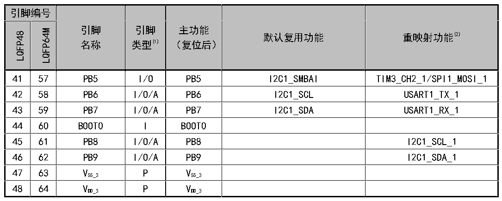

<!-- source-page: 16 -->

[← p.15](0015.md) · [index](../README.md) · [PDF p.16](https://ch32-riscv-ug.github.io/CH32V103/datasheet_zh/CH32V103DS0.PDF#page=16) · [p.17 →](0017.md)

<!-- header: CH32V103数据手册 http://wch.cn -->

 <!-- p16-cluster-01 uncaptioned graphics, rendered from the PDF; verify at https://ch32-riscv-ug.github.io/CH32V103/datasheet_zh/CH32V103DS0.PDF#page=16 -->

🖼 Text parsed from the figure above

> ⬆ **Table continued** — rendered in full at [page 14](0014.md). <!-- p16-table-001 -->

注1：表格缩写解释：  
I = TTL/CMOS 电平斯密特输入；O = CMOS 电平三态输出；  
A = 模拟信号输入或输出；P = 电源。  
注2：重映射功能下划线后的数值表示AFIO寄存器中相对应位的配置值。例如：TIM1_BKIN_1表示AFIO  
寄存器相应位配置为01b。  
注3：当备份区域由VDD（内部模拟开关连到VDD）供电时：PC14和PC15可用于GPIO或LSE引脚、PC13可作  
为通用I/O口、TAMPER引脚、RTC校准时钟、RTC闹钟或秒输出；作为输出脚时只能工作在2MHz模式下，  
最大驱动负载为30pF；当后备区域由VBAT（VDD 消失后模拟开关连到BAT）：PC14和PC15只能用于LSE引脚、  
PC13可作为TAMPER引脚、RTC闹钟或秒输出。  
注4：对于CH32V103芯片，引脚5和引脚6在芯片复位后默认配置为OSC_IN和OSC_OUT功能脚。软  
件可以重新设置这两个引脚为PD0和PD1功能。更多详细信息请参考CH32xRM手册的复用功能I/O章  
节和调试设置章节。  
注5：对于CH32V103R8T6芯片，引脚46和引脚49在芯片复位后默认配置为SWDIO和SWCLK功能脚。  
软件可以重新设置这两个引脚为PA13和PA14功能；对于CH32V103C6T6、CH32V103C8T6和CH32V103C8U6  
芯片，引脚34和引脚37在芯片复位后默认配置为SWDIO和SWCLK功能脚。软件可以重新设置这两个  
引脚为PA13和PA14功能。更多详细信息请参考CH32xRM手册的复用功能I/O章节和调试设置章节。  
<!-- image: p16-draw-image-00001 bbox=[501.0, 779.28, 520.44, 789.6] -->
<!-- footer: V1.2 15 -->
