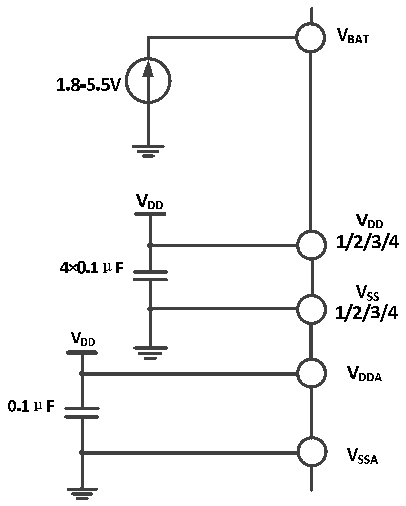

<!-- source-page: 19 -->

[← p.18](0018.md) · [index](../README.md) · [PDF p.19](https://ch32-riscv-ug.github.io/CH32V103/datasheet_zh/CH32V103DS0.PDF#page=19) · [p.20 →](0020.md)

<!-- header: CH32V103数据手册 http://wch.cn -->

# 第 3 章 电气特性

## 3.1 测试条件

除非特殊说明和标注，所有电压都以VSS 为基准。  
所有最小值和最大值将在最坏的环境温度、供电电压和时钟频率条件下得到保证。典型数值是基  
于常温25℃和VDD= 3.3V环境下用于设计指导。  
对于通过综合评估、设计模拟或工艺特性得到的数据，不会在生产线进行测试。在综合评估的基  
础上，最小和最大值是通过样本测试后统计得到。除非特殊说明为实测值，否则特性参数以综合评估  
或设计保证。  
供电方案：  

图3-1 常规供电典型电路  
 <!-- rendered from the PDF; verify at https://ch32-riscv-ug.github.io/CH32V103/datasheet_zh/CH32V103DS0.PDF#page=19 -->

🖼 Text parsed from the figure above

<!-- image: p19-draw-image-00019 inside the figure -->
<!-- image: p19-draw-image-00020 inside the figure -->
<!-- image: p19-draw-image-00023 inside the figure -->
<!-- image: p19-draw-image-00021 inside the figure -->
<!-- image: p19-draw-image-00025 inside the figure -->
<!-- image: p19-draw-image-00027 inside the figure -->
<!-- image: p19-draw-image-00028 inside the figure -->
<!-- image: p19-draw-image-00024 inside the figure -->
<!-- image: p19-draw-image-00022 inside the figure -->
<!-- image: p19-draw-image-00026 inside the figure -->
<!-- image: p19-draw-image-00007 inside the figure -->
<!-- image: p19-draw-image-00008 inside the figure -->
<!-- image: p19-draw-image-00015 inside the figure -->
<!-- image: p19-draw-image-00016 inside the figure -->
<!-- image: p19-draw-image-00030 inside the figure -->
<!-- image: p19-draw-image-00032 inside the figure -->
<!-- image: p19-draw-image-00034 inside the figure -->
<!-- image: p19-draw-image-00031 inside the figure -->
<!-- image: p19-draw-image-00033 inside the figure -->
<!-- image: p19-draw-image-00029 inside the figure -->
<!-- image: p19-draw-image-00035 inside the figure -->
<!-- image: p19-draw-image-00045 inside the figure -->
<!-- image: p19-draw-image-00043 inside the figure -->
<!-- image: p19-draw-image-00047 inside the figure -->
<!-- image: p19-draw-image-00049 inside the figure -->
<!-- image: p19-draw-image-00048 inside the figure -->
<!-- image: p19-draw-image-00044 inside the figure -->
<!-- image: p19-draw-image-00046 inside the figure -->
<!-- image: p19-draw-image-00017 inside the figure -->
<!-- image: p19-draw-image-00018 inside the figure -->
<!-- image: p19-draw-image-00037 inside the figure -->
<!-- image: p19-draw-image-00039 inside the figure -->
<!-- image: p19-draw-image-00041 inside the figure -->
<!-- image: p19-draw-image-00038 inside the figure -->
<!-- image: p19-draw-image-00040 inside the figure -->
<!-- image: p19-draw-image-00036 inside the figure -->
<!-- image: p19-draw-image-00042 inside the figure -->
<!-- image: p19-draw-image-00009 inside the figure -->
<!-- image: p19-draw-image-00010 inside the figure -->
<!-- image: p19-draw-image-00011 inside the figure -->
<!-- image: p19-draw-image-00012 inside the figure -->
<!-- image: p19-draw-image-00002 inside the figure -->
<!-- image: p19-draw-image-00004 inside the figure -->
<!-- image: p19-draw-image-00006 inside the figure -->
<!-- image: p19-draw-image-00005 inside the figure -->
<!-- image: p19-draw-image-00003 inside the figure -->
<!-- image: p19-draw-image-00013 inside the figure -->
<!-- image: p19-draw-image-00014 inside the figure -->

## 3.2 绝对最大值

临界或者超过绝对最大值将可能导致芯片工作不正常甚至损坏。  

<!-- p19-table-001 (table-3-1@1) -->
<table><caption>表3-1 绝对最大值参数表</caption><tr><th>符号</th><th>描述</th><th>最小值</th><th>最大值</th><th>单位</th></tr><tr><td style="text-align:left">T（1） A</td><td>工作时的环境温度</td><td>-40</td><td>85</td><td>℃</td></tr><tr><td style="text-align:left">TS</td><td>存储时的环境温度</td><td>-40</td><td>105</td><td>℃</td></tr><tr><td style="text-align:left">V -V （1） DD SS</td><td style="text-align:left">外部主供电电压（包含V 和V ） DDA DD</td><td>-0.3</td><td>5.5</td><td>V</td></tr><tr><td style="text-align:left">V （1） IN</td><td>引脚上的输入电压</td><td style="text-align:left">V -0.3SS</td><td>5.5</td><td>V</td></tr><tr><td style="text-align:left">|△V |（1） DDx</td><td>不同供电引脚之间的电压差</td><td></td><td>50</td><td>mV</td></tr><tr><td style="text-align:left">|V -V |（1） SSx SS</td><td>不同接地引脚之间的电压差</td><td></td><td>50</td><td>mV</td></tr><tr><td style="text-align:left">V （1） ESD(HBM)</td><td>ESD静电放电电压（人体模型，非接触式）</td><td>4000</td><td></td><td>V</td></tr><tr><td style="text-align:left">I （2） VDD</td><td style="text-align:left">经过V /V 电源线的总电流（供应电流） DD DDA</td><td></td><td>50</td><td rowspan="4">mA</td></tr><tr><td style="text-align:left">I （2） Vss</td><td style="text-align:left">经过V 地线的总电流（流出电流） SS</td><td></td><td>50</td></tr><tr><td rowspan="2" style="text-align:left">I （1） IO</td><td>任意I/O和控制引脚上的吸入电流</td><td></td><td>-25</td></tr><tr><td>任意I/O和控制引脚上的输出电流</td><td></td><td>25</td></tr></table>

注：1.设计参数。  
2.正常工作能达到最大电流值。  
<!-- image: p19-draw-image-00001 bbox=[502.92, 786.36, 522.36, 796.68] -->
<!-- footer: V1.2 18 -->
