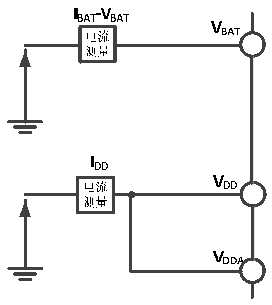

<!-- source-page: 21 -->

[← p.20](0020.md) · [index](../README.md) · [PDF p.21](https://ch32-riscv-ug.github.io/CH32V103/datasheet_zh/CH32V103DS0.PDF#page=21) · [p.22 →](0022.md)

<!-- header: CH32V103数据手册 http://wch.cn -->

> ⬆ **Table continued** — rendered in full at [page 20](0020.md). <!-- p21-table-001 -->

注：1.设计参数  
2.常温测试值。  

### 3.3.3 内置的参考电压

<!-- p21-table-002 (table-3-5@1) -->
<table><caption>表3-5 内置参考电压</caption><tr><th>符号</th><th>参数</th><th>条件</th><th>最小值</th><th>最大值</th><th>单位</th></tr><tr><td style="text-align:left">VREFINT</td><td>内置参考电压</td><td style="text-align:left">T = -40℃～85℃ A</td><td>1.12</td><td>1.28</td><td>V</td></tr><tr><td style="text-align:left">TS_vrefint</td><td style="text-align:left">当读出内部参考电压时， ADC的采样时间</td><td>建议慢速采样</td><td>0.107</td><td>17.1</td><td style="text-align:left">1/f ADC</td></tr></table>

### 3.3.4 供电电流特性

电流消耗是多种参数和因素的综合指标，这些参数和因素包括工作电压、环境温度、I/O 引脚的  
负载、产品的软件配置、工作频率、I/O 脚的翻转速率、程序在存储器中的位置以及执行的代码等。  
电流消耗测量方法如下图：  

图3-2 电流消耗测量  
 <!-- rendered from the PDF; verify at https://ch32-riscv-ug.github.io/CH32V103/datasheet_zh/CH32V103DS0.PDF#page=21 -->

🖼 Text parsed from the figure above

<!-- image: p21-draw-image-00002 inside the figure -->
<!-- image: p21-draw-image-00005 inside the figure -->
<!-- image: p21-draw-image-00004 inside the figure -->
<!-- image: p21-draw-image-00003 inside the figure -->
<!-- image: p21-draw-image-00006 inside the figure -->
<!-- image: p21-draw-image-00007 inside the figure -->
<!-- image: p21-draw-image-00008 inside the figure -->
<!-- image: p21-draw-image-00017 inside the figure -->
<!-- image: p21-draw-image-00018 inside the figure -->
<!-- image: p21-draw-image-00013 inside the figure -->
<!-- image: p21-draw-image-00014 inside the figure -->
<!-- image: p21-draw-image-00009 inside the figure -->
<!-- image: p21-draw-image-00015 inside the figure -->
<!-- image: p21-draw-image-00010 inside the figure -->
<!-- image: p21-draw-image-00016 inside the figure -->
<!-- image: p21-draw-image-00011 inside the figure -->
<!-- image: p21-draw-image-00012 inside the figure -->

微控制器处于下列条件：  
常温 VDD= 3.3V 情况下，测试时：所有 IO 端口配置上拉输入，使能或关闭所有外设时钟（不包  
括GPIO外设），没有初始化外设功能。  

<!-- p21-table-003 (table-3-6@1) pages 21-22 -->
<table><caption>表3-6 运行模式下典型的电流消耗，数据处理代码从内部闪存中运行</caption><tr><th rowspan="2">符号</th><th rowspan="2">参数</th><th rowspan="2" colspan="2">条件</th><th colspan="2">典型值</th><th rowspan="2">单位</th></tr><tr><td>使能所有外设</td><td>关闭所有外设</td></tr><tr><td rowspan="8" style="text-align:left">I (1)(2) DD</td><td rowspan="8" style="text-align:left">运行模式下的供应电流</td><td rowspan="8">外部时钟</td><td style="text-align:left">F = 72MHz SYSCLK</td><td>13.56</td><td>8.88</td><td rowspan="8">mA</td></tr><tr><td style="text-align:left">F = 48MHz SYSCLK</td><td>9.76</td><td>6.64</td></tr><tr><td style="text-align:left">F = 36MHz SYSCLK</td><td>8.51</td><td>5.85</td></tr><tr><td style="text-align:left">F = 24MHz SYSCLK</td><td>6.38</td><td>4.62</td></tr><tr><td style="text-align:left">F = 16MHz SYSCLK</td><td>5.11</td><td>3.88</td></tr><tr><td style="text-align:left">F = 8MHz SYSCLK</td><td>3.15</td><td>2.61</td></tr><tr><td style="text-align:left">F = 4MHz SYSCLK</td><td>2.50</td><td>2.26</td></tr><tr><td style="text-align:left">F = 500KHz SYSCLK</td><td>1.99</td><td>1.96</td></tr><tr><td rowspan="8"></td><td rowspan="8"></td><td rowspan="8" style="text-align:left">运行于高速内部RC振荡器（HSI）， 使用 AHB 预分频以减低频率</td><td style="text-align:left">F = 64MHz SYSCLK</td><td>12.63</td><td>7.63</td><td rowspan="8"></td></tr><tr><td style="text-align:left">F = 48MHz SYSCLK</td><td>9.92</td><td>6.17</td></tr><tr><td style="text-align:left">F = 36MHz SYSCLK</td><td>7.90</td><td>5.08</td></tr><tr><td style="text-align:left">F = 24MHz SYSCLK</td><td>5.75</td><td>3.98</td></tr><tr><td style="text-align:left">F = 16MHz SYSCLK</td><td>4.57</td><td>3.31</td></tr><tr><td style="text-align:left">F = 8MHz SYSCLK</td><td>2.82</td><td>2.23</td></tr><tr><td style="text-align:left">F = 4MHz SYSCLK</td><td>2.19</td><td>1.88</td></tr><tr><td style="text-align:left">F = 500KHz SYSCLK</td><td>1.61</td><td>1.58</td></tr></table>

<!-- image: p21-draw-image-00001 bbox=[502.92, 786.36, 522.36, 796.68] -->
<!-- footer: V1.2 20 -->
