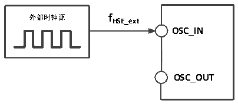
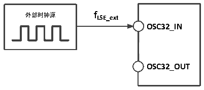

<!-- source-page: 23 -->

[← p.22](0022.md) · [index](../README.md) · [PDF p.23](https://ch32-riscv-ug.github.io/CH32V103/datasheet_zh/CH32V103DS0.PDF#page=23) · [p.24 →](0024.md)

<!-- header: CH32V103数据手册 http://wch.cn -->

> ⬆ **Table continued** — rendered in full at [page 22](0022.md). <!-- p23-table-001 -->

注：以上为实测参数  

### 3.3.5 外部时钟源特性

<!-- p23-table-002 (table-3-9@1) -->
<table><caption>表3-9 来自外部高速时钟</caption><tr><th>符号</th><th>参数</th><th>条件</th><th>最小值</th><th>典型值</th><th>最大值</th><th>单位</th></tr><tr><td style="text-align:left">FHSE_ext</td><td>外部时钟频率</td><td></td><td></td><td>8</td><td>25</td><td>MHz</td></tr><tr><td style="text-align:left">V (1) HSEH</td><td>OSC_IN输入引脚高电平电压</td><td></td><td style="text-align:left">0.8VDD</td><td></td><td style="text-align:left">VDD</td><td>V</td></tr><tr><td style="text-align:left">V (1) HSEL</td><td>OSC_IN输入引脚低电平电压</td><td></td><td>0</td><td></td><td style="text-align:left">0.2VDD</td><td>V</td></tr><tr><td style="text-align:left">C in(HSE)</td><td>OSC_IN输入电容</td><td></td><td></td><td>5</td><td></td><td>pF</td></tr><tr><td style="text-align:left">DuCy (HSE)</td><td>占空比</td><td></td><td></td><td>50</td><td></td><td>%</td></tr></table>

注：1.不满足此条件可能会引起电平识别错误  

图3-3 外部提供高频时钟源电路  
 <!-- rendered from the PDF; verify at https://ch32-riscv-ug.github.io/CH32V103/datasheet_zh/CH32V103DS0.PDF#page=23 -->

🖼 Text parsed from the figure above

<strong>外部时钟源 f HSE_ext</strong>  
<strong>OSC_IN</strong>  
<!-- image: p23-draw-image-00002 inside the figure -->
<strong>OSC_OUT</strong>  

<!-- p23-table-003 (table-3-10@1) -->
<table><caption>表3-10 来自外部低速时钟</caption><tr><th>符号</th><th>参数</th><th>条件</th><th>最小值</th><th>典型值</th><th>最大值</th><th>单位</th></tr><tr><td style="text-align:left">FLSE_ext</td><td>用户外部时钟频率</td><td></td><td></td><td>32.768</td><td>1000</td><td>KHz</td></tr><tr><td style="text-align:left">VLSEH</td><td>OSC32_IN输入引脚高电平电压</td><td></td><td style="text-align:left">0.8VDD</td><td></td><td style="text-align:left">VDD</td><td>V</td></tr><tr><td style="text-align:left">VLSEL</td><td>OSC32_IN输入引脚低电平电压</td><td></td><td>0</td><td></td><td style="text-align:left">0.2VDD</td><td>V</td></tr><tr><td style="text-align:left">C in(LSE)</td><td>OSC32_IN输入电容</td><td></td><td></td><td>5</td><td></td><td>pF</td></tr><tr><td style="text-align:left">DuCy (LSE)</td><td>占空比</td><td></td><td></td><td>50</td><td></td><td>%</td></tr></table>

图3-4 外部提供低频时钟源电路  
 <!-- rendered from the PDF; verify at https://ch32-riscv-ug.github.io/CH32V103/datasheet_zh/CH32V103DS0.PDF#page=23 -->

🖼 Text parsed from the figure above

<strong>外部时钟源 f LSE_ext</strong>  
<strong>OSC32_IN</strong>  
<!-- image: p23-draw-image-00003 inside the figure -->
<strong>OSC32_OUT</strong>  

<!-- image: p23-draw-image-00001 bbox=[502.92, 786.36, 522.36, 796.68] -->
<!-- footer: V1.2 22 -->
