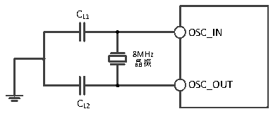
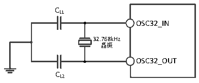

<!-- source-page: 24 -->

[← p.23](0023.md) · [index](../README.md) · [PDF p.24](https://ch32-riscv-ug.github.io/CH32V103/datasheet_zh/CH32V103DS0.PDF#page=24) · [p.25 →](0025.md)

<!-- header: CH32V103数据手册 http://wch.cn -->

<!-- p24-table-001 (table-3-11@1) -->
<table><caption>表3-11 使用一个晶体/陶瓷谐振器产生的高速外部时钟</caption><tr><th>符号</th><th>参数</th><th>条件</th><th>最小值</th><th>典型值</th><th>最大值</th><th>单位</th></tr><tr><td style="text-align:left">FOSC_IN</td><td>谐振器频率</td><td></td><td>4</td><td>8</td><td>16</td><td>MHz</td></tr><tr><td style="text-align:left">I(1) 2</td><td>HSE驱动电流</td><td style="text-align:left">V = 3.3V，20p负载DD</td><td></td><td>0.2</td><td></td><td>mA</td></tr><tr><td style="text-align:left">g(1) m</td><td>振荡器的跨导</td><td>启动</td><td></td><td>4.6</td><td></td><td>mA/V</td></tr><tr><td style="text-align:left">t SU(HSE)</td><td>启动时间</td><td style="text-align:left">V 是稳定的DD</td><td></td><td>1</td><td>2</td><td>ms</td></tr></table>

注：1.设计参数  
电路参考设计及要求：  
晶体的负载电容一般选用20pF（CL1=CL2，建议5～25pF），实际请参考所使用晶体的厂家数据手册。  

图3-5 外接8M晶体典型电路  
 <!-- rendered from the PDF; verify at https://ch32-riscv-ug.github.io/CH32V103/datasheet_zh/CH32V103DS0.PDF#page=24 -->

🖼 Text parsed from the figure above

CL1  
OSC_IN  
8MHz  
晶振  
OSC_OUT  
CL2  

<!-- p24-table-002 (table-3-12@1) -->
<table><caption>表3-12 使用一个晶体/陶瓷谐振器产生的低速外部时钟（f(LSE)=32.768KHz）</caption><tr><th>符号</th><th>参数</th><th>条件</th><th>最小值</th><th>典型值</th><th>最大值</th><th>单位</th></tr><tr><td style="text-align:left">I(1) 2</td><td>LSE驱动电流</td><td style="text-align:left">V = 3.3VDD</td><td></td><td>0.5</td><td></td><td>uA</td></tr><tr><td style="text-align:left">g(1) m</td><td>振荡器的跨导</td><td>启动</td><td></td><td>13.5</td><td></td><td>uA/V</td></tr><tr><td style="text-align:left">t SU(LSE)</td><td>启动时间</td><td style="text-align:left">V 是稳定的DD</td><td></td><td>200</td><td>500</td><td>mS</td></tr></table>

注：1.设计参数。  
电路参考设计及要求：  
晶体的负载电容一般选用不超过15pF（CL1=CL2，建议5～15pF），实际请参考所使用晶体的厂家数  
据手册。  

图3-6外接32.768K晶体典型电路  
 <!-- rendered from the PDF; verify at https://ch32-riscv-ug.github.io/CH32V103/datasheet_zh/CH32V103DS0.PDF#page=24 -->

🖼 Text parsed from the figure above

CL1  
OSC32_IN  
32.768kHz  
晶振  
OSC32_OUT  
CL2  

注：负载电容CL由下式计算：CL= CL1 x CL2/ (CL1+ CL2) + Cstray，其中Cstray 是引脚的电容和PCB板或  
PCB相关的电容，它的典型值是介于2pF至7pF之间。  

### 3.3.6 内部时钟源特性

<!-- p24-table-003 (table-3-13@1) pages 24-25 -->
<table><caption>表3-13 内部高速(HSI)RC振荡器特性</caption><tr><th>符号</th><th>参数</th><th>条件</th><th>最小值</th><th>典型值</th><th>最大值</th><th>单位</th></tr><tr><td style="text-align:left">FHSI</td><td>频率</td><td></td><td></td><td>8</td><td></td><td>MHz</td></tr><tr><td style="text-align:left">DuCy HSI</td><td>占空比</td><td></td><td>45</td><td>50</td><td>55</td><td>%</td></tr><tr><td rowspan="2" style="text-align:left">ACCHSI</td><td rowspan="2">HSI振荡器的精度</td><td style="text-align:left">T = 0℃～70℃ A</td><td>-1.8</td><td></td><td>1.8</td><td>%</td></tr><tr><td style="text-align:left">T = -40℃～85℃ A</td><td>-2.5</td><td></td><td>2.5</td><td>%</td></tr><tr><td style="text-align:left">t SU(HSI)</td><td>HSI振荡器启动时间</td><td></td><td></td><td></td><td>8</td><td>us</td></tr><tr><td style="text-align:left">IDD(HSI)</td><td>HSI振荡器功耗</td><td></td><td></td><td>200</td><td></td><td>uA</td></tr></table>

<!-- image: p24-draw-image-00001 bbox=[502.92, 786.36, 522.36, 796.68] -->
<!-- footer: V1.2 23 -->
