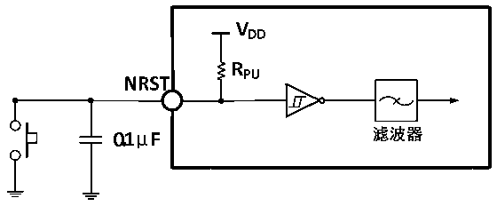

<!-- source-page: 27 -->

[← p.26](0026.md) · [index](../README.md) · [PDF p.27](https://ch32-riscv-ug.github.io/CH32V103/datasheet_zh/CH32V103DS0.PDF#page=27) · [p.28 →](0028.md)

<!-- header: CH32V103数据手册 http://wch.cn -->

> ⬆ **Table continued** — rendered in full at [page 26](0026.md). <!-- p27-table-001 -->

注：以上均为设计参数保证。  

### 3.3.11 NRST引脚特性

<!-- p27-table-002 (table-3-22@1) -->
<table><caption>表3-22 外部复位引脚特性</caption><tr><th>符号</th><th>参数</th><th>条件</th><th>最小值</th><th>典型值</th><th>最大值</th><th>单位</th></tr><tr><td style="text-align:left">V (1) IL(NRST)</td><td>NRST输入低电平电压</td><td></td><td>-0.3</td><td></td><td>0.8</td><td>V</td></tr><tr><td style="text-align:left">V (1) IH(NRST)</td><td>NRST输入高电平电压</td><td></td><td style="text-align:left">0.65VDD</td><td></td><td style="text-align:left">V +0.5DD</td><td>V</td></tr><tr><td style="text-align:left">V hys(NRST)</td><td>NRST施密特触发器电压迟滞</td><td></td><td></td><td>330</td><td></td><td>mV</td></tr><tr><td style="text-align:left">R （2） PU</td><td>弱上拉等效电阻</td><td></td><td>30</td><td>42</td><td>55</td><td>KΩ</td></tr><tr><td style="text-align:left">T (1) F(NRST)</td><td>NRST输入滤波脉冲</td><td></td><td></td><td></td><td>4</td><td>ns</td></tr><tr><td style="text-align:left">T (1) NF(NRST)</td><td>NRST输入非滤波脉冲</td><td></td><td>20</td><td></td><td></td><td>ns</td></tr></table>

注：1.设计参数  
2.上拉电阻是一个真正的电阻串联一个可开关的PMOS实现。这个PMOS/NMOS开关的电阻很小(约  
占10%)。  
电路参考设计及要求：  

图3-7 外部复位引脚典型电路  
 <!-- rendered from the PDF; verify at https://ch32-riscv-ug.github.io/CH32V103/datasheet_zh/CH32V103DS0.PDF#page=27 -->

🖼 Text parsed from the figure above

<!-- image: p27-draw-image-00010 inside the figure -->
<!-- image: p27-draw-image-00011 inside the figure -->
<!-- image: p27-draw-image-00008 inside the figure -->
<!-- image: p27-draw-image-00009 inside the figure -->
<!-- image: p27-draw-image-00007 inside the figure -->
<!-- image: p27-draw-image-00012 inside the figure -->
<!-- image: p27-draw-image-00002 inside the figure -->
<!-- image: p27-draw-image-00004 inside the figure -->
<!-- image: p27-draw-image-00006 inside the figure -->
<!-- image: p27-draw-image-00005 inside the figure -->
<!-- image: p27-draw-image-00003 inside the figure -->

### 3.3.12 TIM定时器特性

<!-- p27-table-004 (table-3-23@1) pages 27-28 -->
<table><caption>表3-23 TIMx特性</caption><tr><th>符号</th><th>参数</th><th>条件</th><th>最小值</th><th>最大值</th><th>单位</th></tr><tr><td rowspan="2" style="text-align:left">t res(TIM)</td><td rowspan="2">定时器基准时钟</td><td></td><td>1</td><td></td><td style="text-align:left">t TIMxCLK</td></tr><tr><td style="text-align:left">f = 72MHz TIMxCLK</td><td>13.9</td><td></td><td>ns</td></tr><tr><td rowspan="2" style="text-align:left">FEXT</td><td rowspan="2">CH1至CH4的定时器外部时钟频率</td><td></td><td>0</td><td style="text-align:left">f /2TIMxCLK</td><td>MHz</td></tr><tr><td style="text-align:left">f = 72MHz TIMxCLK</td><td>0</td><td>36</td><td>MHz</td></tr><tr><td style="text-align:left">R esTIM</td><td>定时器分辨率</td><td></td><td></td><td>16</td><td>位</td></tr><tr><td rowspan="2" style="text-align:left">t COUNTER</td><td rowspan="2" style="text-align:left">当选择了内部时钟时，16 位计数器时钟周期</td><td></td><td>1</td><td>65536</td><td style="text-align:left">t TIMxCLK</td></tr><tr><td style="text-align:left">f = 72MHz TIMxCLK</td><td>0.0139</td><td>910</td><td>us</td></tr><tr><td rowspan="2" style="text-align:left">t MAX_COUNT</td><td rowspan="2">最大可能的计数</td><td></td><td></td><td>65535</td><td style="text-align:left">t TIMxCLK</td></tr><tr><td style="text-align:left">f = 72MHz TIMxCLK</td><td></td><td>59.6</td><td>s</td></tr></table>

<!-- image: p27-draw-image-00001 bbox=[502.92, 786.36, 522.36, 796.68] -->
<!-- footer: V1.2 26 -->
