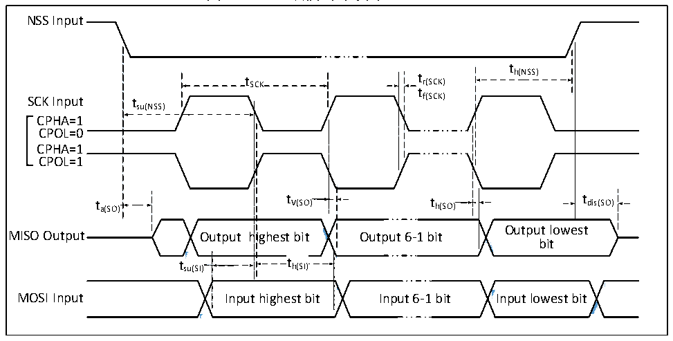

<!-- source-page: 30 -->

[← p.29](0029.md) · [index](../README.md) · [PDF p.30](https://ch32-riscv-ug.github.io/CH32V103/datasheet_zh/CH32V103DS0.PDF#page=30) · [p.31 →](0031.md)

<!-- header: CH32V103数据手册 http://wch.cn -->

图3-11 SPI从模式时序图（CPHA=1）  
 <!-- rendered from the PDF; verify at https://ch32-riscv-ug.github.io/CH32V103/datasheet_zh/CH32V103DS0.PDF#page=30 -->

🖼 Text parsed from the figure above

NSS Input  
t  
t SCK t r(SCK) h(NSS)  
t  
SCK Input tsu(NSS) f(SCK)  
CPHA=1  
CPOL=0  
CPHA=1  
CPOL=1  
t a(SO) t V(SO) t h(SO) t dis(SO)  
<!-- image: p30-draw-image-00008 inside the figure -->
<!-- image: p30-draw-image-00002 inside the figure -->
<!-- image: p30-draw-image-00003 inside the figure -->
Output lowest  
MISO Output Output highest bit Output 6-1 bit  
bit  
t su(SI)  
t h(SI)  th(SI)  
<!-- image: p30-draw-image-00004 inside the figure -->
<!-- image: p30-draw-image-00005 inside the figure -->
<!-- image: p30-draw-image-00006 inside the figure -->
<!-- image: p30-draw-image-00007 inside the figure -->
MOSI Input Input highest bit Input 6-1 bit Input lowest bit  

<!-- p30-table-003 (table-3-25@1) -->
<table><caption>表3-25 SPI接口特性</caption><tr><th>符号</th><th>参数</th><th>条件</th><th>最小值</th><th>最大值</th><th>单位</th></tr><tr><td rowspan="2" style="text-align:left">f /t SCK SCK</td><td rowspan="2">SPI时钟频率</td><td>主模式</td><td></td><td>36</td><td>MHz</td></tr><tr><td>从模式</td><td></td><td>36</td><td>MHz</td></tr><tr><td style="text-align:left">t /t r(SCK) f(SCK)</td><td>SPI时钟上升和下降时间</td><td>负载电容：C = 30pF</td><td></td><td>20</td><td>ns</td></tr><tr><td style="text-align:left">t SU(NSS)</td><td>NSS建立时间</td><td>从模式</td><td style="text-align:left">2t HCLK</td><td></td><td>ns</td></tr><tr><td style="text-align:left">t h(NSS)</td><td>NSS保持时间</td><td>从模式</td><td style="text-align:left">2t HCLK</td><td></td><td>ns</td></tr><tr><td style="text-align:left">t /t w(SCKH) w(SCKL)</td><td>SCK高电平和低电平时间</td><td style="text-align:left">主模式，f = 36MHz，预分频HCLK系数=4</td><td>40</td><td>60</td><td>ns</td></tr><tr><td style="text-align:left">t SU(MI)</td><td rowspan="2">数据输入建立时间</td><td>主模式</td><td>5</td><td></td><td>ns</td></tr><tr><td style="text-align:left">t SU(SI)</td><td>从模式</td><td>5</td><td></td><td>ns</td></tr><tr><td style="text-align:left">t h(MI)</td><td rowspan="2">数据输入保持时间</td><td>主模式</td><td>5</td><td></td><td>ns</td></tr><tr><td style="text-align:left">t h(SI)</td><td>从模式</td><td>4</td><td></td><td>ns</td></tr><tr><td style="text-align:left">t a(SO)</td><td>数据输出访问时间</td><td style="text-align:left">从模式，f = 20MHz HCLK</td><td>0</td><td style="text-align:left">1t HCLK</td><td>ns</td></tr><tr><td style="text-align:left">t dis(SO)</td><td>数据输出禁止时间</td><td>从模式</td><td>0</td><td>10</td><td>ns</td></tr><tr><td style="text-align:left">t V(SO)</td><td rowspan="2">数据输出有效时间</td><td>从模式（使能边沿之后）</td><td></td><td>25</td><td>ns</td></tr><tr><td style="text-align:left">t V(MO)</td><td>主模式（使能边沿之后）</td><td></td><td>5</td><td>ns</td></tr><tr><td style="text-align:left">t h(SO)</td><td rowspan="2">数据输出保持时间</td><td>从模式（使能边沿之后）</td><td>15</td><td></td><td>ns</td></tr><tr><td style="text-align:left">t h(MO)</td><td>主模式（使能边沿之后）</td><td>0</td><td></td><td>ns</td></tr></table>

### 3.3.15 USB接口特性

<!-- p30-table-004 (table-3-26@1) pages 30-31 -->
<table><caption>表3-26 USB接口I/O特性</caption><tr><th>符号</th><th>参数</th><th>条件</th><th>最小值</th><th>最大值</th><th>单位</th></tr><tr><td rowspan="2" style="text-align:left">VDD</td><td rowspan="2">USB操作电压</td><td>不启用USB5VSEL控制位</td><td>3.0</td><td>3.6</td><td rowspan="2">V</td></tr><tr><td>启用USB5VSEL控制位</td><td>4.2</td><td>5.5</td></tr><tr><td rowspan="2" style="text-align:left">V （1） SE</td><td rowspan="2">单端接收器阈值</td><td style="text-align:left">V = 3.3VDD</td><td>1.2</td><td>1.9</td><td rowspan="2">V</td></tr><tr><td style="text-align:left">V = 5VDD</td><td>1.2</td><td>2</td></tr><tr><td style="text-align:left">VOL</td><td>静态输出低电平</td><td></td><td></td><td>0.3</td><td>V</td></tr><tr><td style="text-align:left">VOH</td><td>静态输出高电平</td><td></td><td>2.8</td><td>3.6</td><td>V</td></tr></table>

<!-- image: p30-draw-image-00001 bbox=[502.92, 786.36, 522.36, 796.68] -->
<!-- footer: V1.2 29 -->
