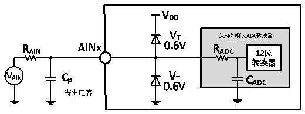
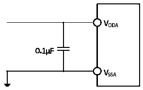

<!-- source-page: 32 -->

[← p.31](0031.md) · [index](../README.md) · [PDF p.32](https://ch32-riscv-ug.github.io/CH32V103/datasheet_zh/CH32V103DS0.PDF#page=32) · [p.33 →](0033.md)

<!-- header: CH32V103数据手册 http://wch.cn -->
注：以上均为设计参数保证。  
Cp 表示PCB与焊盘上的寄生电容（大约5pF），可能与焊盘和PCB布局质量有关。较大的Cp 数值将  
降低转换精度，解决办法是降低fADC 值。  

图3-12 ADC典型连接图  
 <!-- rendered from the PDF; verify at https://ch32-riscv-ug.github.io/CH32V103/datasheet_zh/CH32V103DS0.PDF#page=32 -->

🖼 Text parsed from the figure above

<!-- image: p32-draw-image-00032 inside the figure -->
<!-- image: p32-draw-image-00033 inside the figure -->
<!-- image: p32-draw-image-00026 inside the figure -->
<!-- image: p32-draw-image-00017 inside the figure -->
<!-- image: p32-draw-image-00019 inside the figure -->
<!-- image: p32-draw-image-00018 inside the figure -->
<!-- image: p32-draw-image-00027 inside the figure -->
<!-- image: p32-draw-image-00028 inside the figure -->
<!-- image: p32-draw-image-00030 inside the figure -->
<!-- image: p32-draw-image-00031 inside the figure -->
<!-- image: p32-draw-image-00004 inside the figure -->
<!-- image: p32-draw-image-00002 inside the figure -->
<!-- image: p32-draw-image-00015 inside the figure -->
<!-- image: p32-draw-image-00029 inside the figure -->
<!-- image: p32-draw-image-00016 inside the figure -->
<!-- image: p32-draw-image-00003 inside the figure -->
<!-- image: p32-draw-image-00011 inside the figure -->
<!-- image: p32-draw-image-00010 inside the figure -->
<!-- image: p32-draw-image-00012 inside the figure -->
<!-- image: p32-draw-image-00020 inside the figure -->
<!-- image: p32-draw-image-00008 inside the figure -->
<!-- image: p32-draw-image-00005 inside the figure -->
<!-- image: p32-draw-image-00013 inside the figure -->
<!-- image: p32-draw-image-00009 inside the figure -->
<!-- image: p32-draw-image-00021 inside the figure -->
<!-- image: p32-draw-image-00006 inside the figure -->
<!-- image: p32-draw-image-00014 inside the figure -->
<!-- image: p32-draw-image-00022 inside the figure -->
<!-- image: p32-draw-image-00024 inside the figure -->
<!-- image: p32-draw-image-00025 inside the figure -->
<!-- image: p32-draw-image-00023 inside the figure -->
<!-- image: p32-draw-image-00007 inside the figure -->

图3-13 模拟电源及退耦电路参考  
 <!-- rendered from the PDF; verify at https://ch32-riscv-ug.github.io/CH32V103/datasheet_zh/CH32V103DS0.PDF#page=32 -->

🖼 Text parsed from the figure above

<!-- image: p32-draw-image-00034 inside the figure -->
<!-- image: p32-draw-image-00035 inside the figure -->
<!-- image: p32-draw-image-00038 inside the figure -->
<!-- image: p32-draw-image-00040 inside the figure -->
<!-- image: p32-draw-image-00042 inside the figure -->
<!-- image: p32-draw-image-00041 inside the figure -->
<!-- image: p32-draw-image-00039 inside the figure -->
<!-- image: p32-draw-image-00036 inside the figure -->
<!-- image: p32-draw-image-00037 inside the figure -->

### 3.3.17 温度传感器特性

<!-- p32-table-001 (table-3-29@1) -->
<table><caption>表3-29 温度传感器特性</caption><tr><th>符号</th><th>参数</th><th>条件</th><th>最小值</th><th>典型值</th><th>最大值</th><th>单位</th></tr><tr><td>Avg_Slope</td><td>平均斜率</td><td></td><td>3.3</td><td>4.3</td><td>5.3</td><td>mV/℃</td></tr><tr><td style="text-align:left">V25</td><td>在25℃时的电压</td><td></td><td>1.1</td><td>1.34</td><td>1.6</td><td>V</td></tr><tr><td style="text-align:left">TS_temp</td><td>当读取温度时，ADC采样时间</td><td style="text-align:left">f = 14MHz ADC</td><td></td><td></td><td>17.1</td><td>us</td></tr></table>

注：以上均为设计参数保证。  

### 3.3.18 TKey模块特性

<!-- p32-table-002 (table-3-30@1) -->
<table><caption>表3-30 TKey模块特性</caption><tr><th>符号</th><th>参数</th><th>条件</th><th>最小值</th><th>典型值</th><th>最大值</th><th>单位</th></tr><tr><td style="text-align:left">ITKey</td><td>模块工作电流</td><td style="text-align:left">V = 3.3VDD</td><td>211</td><td>270</td><td>421</td><td>uA</td></tr></table>

<!-- image: p32-draw-image-00001 bbox=[502.92, 786.36, 522.36, 796.68] -->
<!-- footer: V1.2 31 -->
