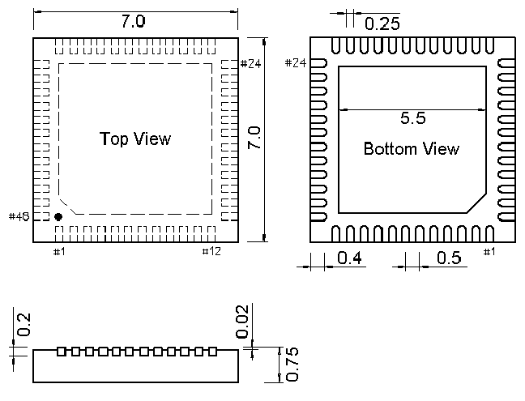

<!-- source-page: 35 -->

[← p.34](0034.md) · [index](../README.md) · [PDF p.35](https://ch32-riscv-ug.github.io/CH32V103/datasheet_zh/CH32V103DS0.PDF#page=35) · [p.36 →](0036.md)

<!-- header: CH32V103数据手册 http://wch.cn -->

图4-3 QFN48X7封装  
 <!-- rendered from the PDF; verify at https://ch32-riscv-ug.github.io/CH32V103/datasheet_zh/CH32V103DS0.PDF#page=35 -->

🖼 Text parsed from the figure above

<!-- image: p35-draw-image-00002 inside the figure -->

<!-- image: p35-draw-image-00001 bbox=[502.92, 779.28, 522.36, 789.6] -->
<!-- footer: V1.2 34 -->
