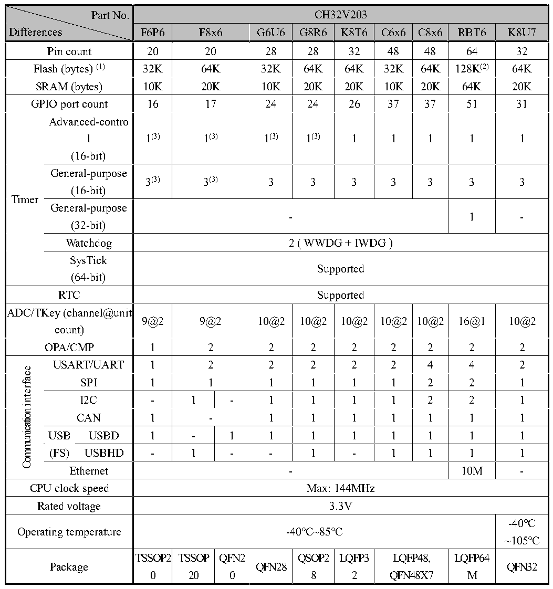

<!-- source-page: 7 -->

[← p.6](0006.md) · [index](../README.md) · [PDF p.7](https://ch32-riscv-ug.github.io/CH32V20x/datasheet_en/CH32V203DS0.PDF#page=7) · [p.8 →](0008.md)

<!-- header: CH32V203 Datasheet https://wch-ic.com -->

## 2.1 Model Comparison

 <!-- p7-cluster-01 uncaptioned graphics, rendered from the PDF; verify at https://ch32-riscv-ug.github.io/CH32V20x/datasheet_en/CH32V203DS0.PDF#page=7 -->

🖼 Text parsed from the figure above

Part No.  CH32V203  Differences  F6P6  F8x6  G6U6  G8R6  K8T6  C6x6  C8x6  RBT6  K8U7  Pin count  20  20  28  28  32  48  48  64  32  Flash (bytes) (1)  32K  64K  32K  64K  64K  32K  64K  128K(2)  64K  SRAM (bytes)  10K  20K  10K  20K  20K  10K  20K  64K  20K  GPIO port count  16  17  24  24  26  37  37  51  31  Timer  Advanced-contro l (16-bit)  1(3)  1(3)  1(3)  1(3)  1  1  1  1  1  General-purpose (16-bit)  3(3)  3(3)  3  3  3  3  3  3  3  General-purpose (32-bit)  -  1  -  Watchdog  2 ( WWDG + IWDG )  SysTick (64-bit)  Supported  RTC  Supported  ADC/TKey (channel@unit count)  9@2  9@2  10@2  10@2  10@2  10@2  10@2  16@1  10@2  OPA/CMP  1  2  2  2  2  2  2  2  2  Communicationinterface  USART/UART  1  2  2  2  2  2  4  4  2  SPI  1  1  1  1  1  1  2  2  1  I2C  -  1  -  1  1  1  1  2  2  1  CAN  1  -  1  1  1  1  1  1  1  USB (FS)  USBD  1  -  1  1  1  1  1  1  1  1  USBHD  -  1  -  -  1  -  1  1  1  1  Ethernet  -  10M  -  CPU clock speed  Max: 144MHz  Rated voltage  3.3V  Operating temperature  -40℃~85℃  -40℃ ~105℃  Package  TSSOP20  TSSOP20  QFN20  QFN28  QSOP28  LQFP32  LQFP48, QFN48X7  LQFP64M  QFN32  

<em>Note: 1. The flash memory byte represents the zero-wait operating area (R0WAIT). The non-zero-wait area is</em>  
<em>480K - R0WAIT for the V203RB model and 224K - R0WAIT for other V203 models.</em>  
<em>2. 128K FLASH+64K SRAM products support user-selected word configuration as one of several</em>  
<em>combinations (128K FLASH+64K SRAM), (144K FLASH+48K SRAM), (160K FLASH+32K SRAM).</em>  
<em>3. Timer PWM, capture and other functions involving pin signals need to be combined with the actual</em>  
<em>chip package pins, some package chips do not lead to such functions cannot be used.</em>  
<!-- image: p7-draw-image-00001 bbox=[511.92, 783.36, 531.36, 793.92] -->
<!-- footer: V3.0 5 -->
