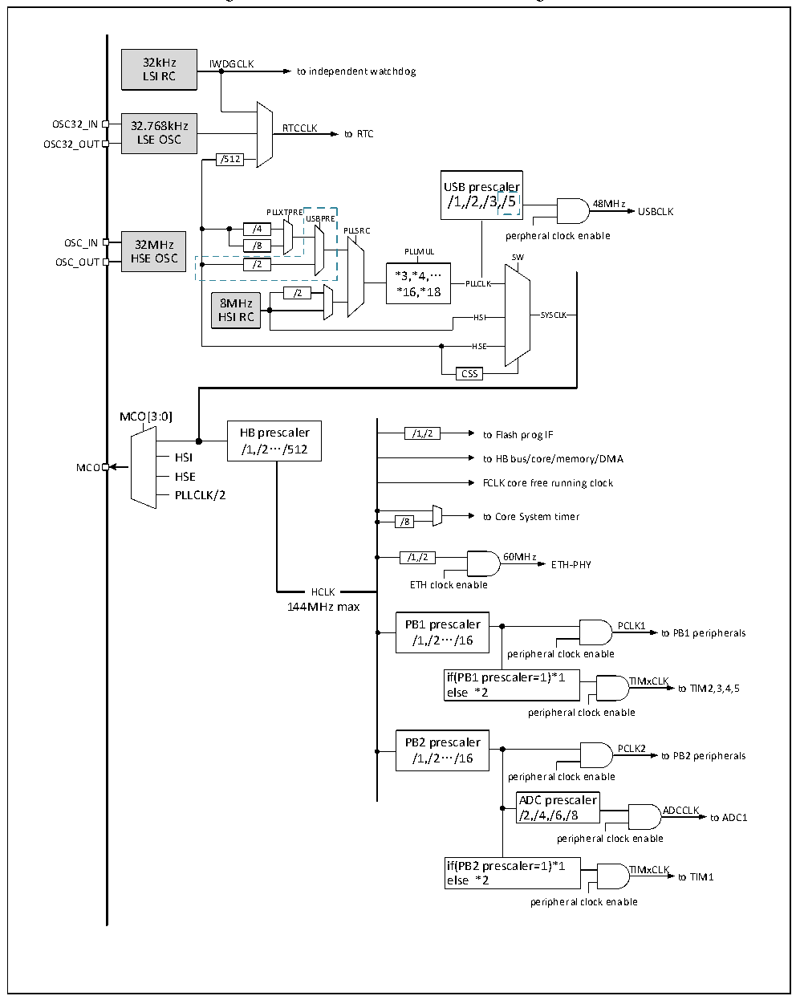

<!-- source-page: 12 -->

[← p.11](0011.md) · [index](../README.md) · [PDF p.12](https://ch32-riscv-ug.github.io/CH32V20x/datasheet_en/CH32V203DS0.PDF#page=12) · [p.13 →](0013.md)

<!-- header: CH32V203 Datasheet https://wch-ic.com -->

Figure 2-4 CH32V203RB clock tree block diagram  
 <!-- rendered from the PDF; verify at https://ch32-riscv-ug.github.io/CH32V20x/datasheet_en/CH32V203DS0.PDF#page=12 -->

🖼 Text parsed from the figure above

32kHz IWDGCLK  
LSI RC to independent watchdog  
OSC32_IN 32.768kHz RTCCLK  
to RTC  
LSE OSC  
OSC32_OUT  
/512  
USB prescaler /1,/2,/3,/5  a,/l5er  
/1,/2,/3,/5 48MHz  
PLLXTPRE USBCLK  
USBPRE  
/4 PLLSRC perpheral clock enable  
OSC_IN 32MHz /8  
OSC_OUT HSE OSC /2 PLLMUL SW  
*3,*4,…  
PLLCLK  
/2 *16,*18  
8MHz  
HSI RC HSI SYSCLK  
HSE  HSE  
CSS  
MCO[3:0]  
HB prescaler /1,/2 to Flash prog IF  
/1,/2…/512  
HSI to HB bus/core/memory/DMA  
MCO  
HSE  
FCLK core free running clock  
PLLCLK/2  
to Core System timer  
/8  
/1,/2 60MHz  
ETH-PHY  
ETH clock enable  
HCLK  HCLK  
144MHz max  
PB1 prescaler PCLK1  
/1,/2…/16 to PB1 peripherals  
peripheral clock enable  
if(PB1 prescaler=1)*1 TIMxCLK  
else *2 to TIM2,3,4,5  
peripheral clock enable  
PB2 prescaler  
PCLK2  
/1,/2…/16 to PB2 peripherals  
peripheral clock enable  
ADC prescaler  
/2,/4,/6,/8 ADCCLK to ADC1  
peripheral clock enable  
if(PB2 prescaler=1)*1 TIMxCLK  
else *2 to TIM1  
peripheral clock enable  

Note: 1. For CH32V203RB, the external crystal or clock (HSE) is 32M. When the external crystal is enabled,  
no load capacitor is required as it is built in.  
2. The blue dotted line in Figure 2-4 above applies only to CH32V203RB chips with a lot number whose  
penultimate fifth digit is greater than zero.  
<!-- image: p12-draw-image-00001 bbox=[514.2, 783.36, 533.64, 793.92] -->
<!-- footer: V3.0 10 -->
