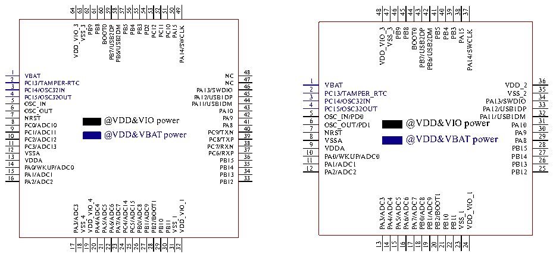
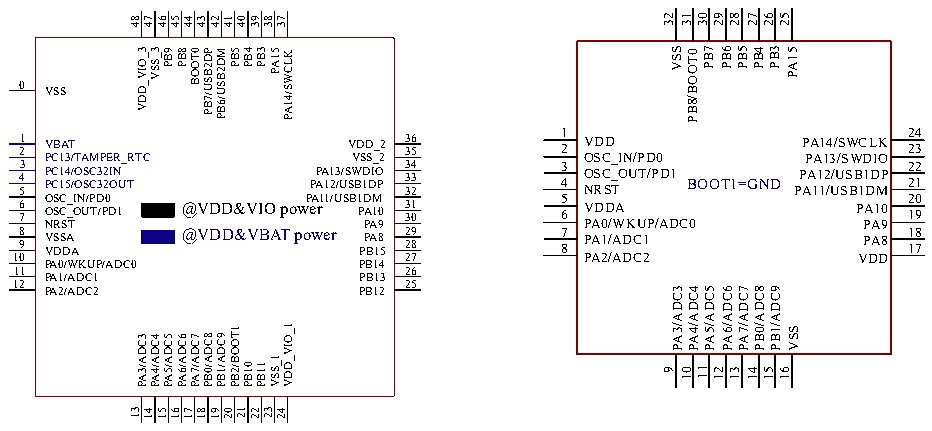

<!-- source-page: 21 -->

[← p.20](0020.md) · [index](../README.md) · [PDF p.21](https://ch32-riscv-ug.github.io/CH32V20x/datasheet_en/CH32V203DS0.PDF#page=21) · [p.22 →](0022.md)

<!-- header: CH32V203 Datasheet https://wch-ic.com -->

# Chapter 3 Pinouts and Pin Definition

## 3.1 Pinout

# CH32V203RBT6 CH32V203CxT6

 <!-- p21-cluster-01 uncaptioned graphics, rendered from the PDF; verify at https://ch32-riscv-ug.github.io/CH32V20x/datasheet_en/CH32V203DS0.PDF#page=21 -->

🖼 Text parsed from the figure above

64 63 62 61 60 59 58 57 56 55 54 53 52 51 50 49  
48  
47  
46  
45  
44  
43  
42  
41  
40  
39  
38  
37  
VDD_VIO_3 VSS_3 PB9 PB8 BOOT0 PB7/USB2DP PB6/USB2DM PB5 PB4 PB3 PD2 PC12 PC11 PC10 PA15 PA14/SWCLK  
PB3  
VDD_VIO_3  
VSS_3  
PB9  
PB8  
PB5  
PB4  
BOOT0  
PB7/USB2DP  
PB6/USB2DM  
PA15  
PA14/SWCLK  
1 1 1 1 1 1 1 2 4 6 7 9 0 2 4 6 5 5 8 3 3 1 1 V P P P O O N P P P P V V P P P A A A C C C C C C C B S S R S D 0 1 2 1 1 1 0 1 2 3 C C S A S D / / / 3 4 5 / / / / A _ _ T W A A T A A A A A / / / I O T O O D D D D D D N K A U S S C C C C C C U C C M T 1 2 1 1 1 1 P 3 3 1 0 2 3 P / 2 2 A E I O N R D U - C R T 0 TC  
P P A A P 1 A 1 1 1 2 /U 3 P / P P P U / C C S C S C S B 7 9 W 6 8 B / / 1 P / P P P / P R T R 1 D T A D P P B B B B X X D N N A X X A I 1 M 1 1 1 1 O N N P C C 9 0 8 P P 2 4 5 3 3 3 3 3 3 3 3 4 4 4 4 4 4 4 4 4 3 4 5 6 7 8 9 0 1 2 3 4 5 6 7 8  
1 VBAT 2 PC13/TAMPER_RTC 3 PC14/OSC32IN 4 PC15/OSC32OUT 5 OSC_IN/PD0 6 OSC_OUT/PD1 7 NRST 8 VSSA 9 VDDA 10 PA0/WKUP/ADC0 11 PA1/ADC1 12 PA2/ADC2  
36 VDD_2 35 VSS_2 34 PA13/SWDIO 33 PA12/USB1DP 32 PA11/USB1DM 31 PA10 30 PA9 29 PA8 28 PB15 27 PB14 26 PB13 25 PB12  
@VDD&amp;VIO power @VDD&amp;VBAT power  
@VDD&amp;VIO power @VDD&amp;VBAT power  
VDD_VIO_1  
PB2/BOOT1  
PB0/ADC8  
PB1/ADC9  
PA3/ADC3  
PA4/ADC4  
PA5/ADC5  
PA6/ADC6  
PA7/ADC7  
PA3/ADC3 VSS_4 VDD_VIO_4 PA4/ADC4 PA5/ADC5 PA6/ADC6 PA7/ADC7 PC4/ADC14 PC5/ADC15 PB0/ADC8 PB1/ADC9 PB2/BOOT1 PB10 PB11 VSS_1 VDD_VIO_1  
VSS_1  
PB10  
PB11  
21  
13  
23  
15  
18  
14  
16  
17  
19  
20  
22  
24  
17 18 19 20 21 22 23 24 25 26 27 28 29 30 31 32  

# CH32V203CxU6 CH32V203K8T6

 <!-- p21-cluster-02 uncaptioned graphics, rendered from the PDF; verify at https://ch32-riscv-ug.github.io/CH32V20x/datasheet_en/CH32V203DS0.PDF#page=21 -->

🖼 Text parsed from the figure above

32 31 30 29 27 26 25  
28  
48  
47  
46  
45  
44  
43  
42  
41  
40  
39  
38  
37  
PB7  
PB6  
PB5  
PB3  
VSS  
PB3  
PB4  
PA15  
VDD_VIO_3  
VSS_3  
PB9  
PB8  
PB5  
PB4  
BOOT0  
PB7/USB2DP  
PB6/USB2DM  
PA15  
PB8/BOOT0  
PA14/SWCLK  
0  
VSS  
1  
24 23  
1 VBAT 2 PC13/TAMPER_RTC  
36 VDD_2 35 VSS_2  
VDD PA14/SWCLK OSC_IN/PD0 PA13/SWDIO  
2  
3 PC14/OSC32IN 4 PC15/OSC32OUT 5  
34 PA13/SWDIO 33 PA12/USB1DP 32  
3 4  
22 21  
OSC_OUT/PD1 PA12/USB1DP BOOT1=GND NRST PA11/USB1DM  
5  
20  
OSC_IN/PD0  
PA11/USB1DM  
6 OSC_OUT/PD1 7 NRST  
31 PA10 30 PA9  
@VDD&amp;VIO power  
VDDA PA10 PA0/WKUP/ADC0 PA9  
6  
19  
8 VSSA 9 VDDA 10  
29 PA8 28 PB15 27  
7 8  
18  
@VDD&amp;VBAT power  
PA1/ADC1 PA8 PA2/ADC2 VDD  
17  
PA0/WKUP/ADC0  
PB14  
11  
26  
PA1/ADC1  
PB13  
12  
25  
PA3/ADC3  
PA4/ADC4  
PA5/ADC5  
PA6/ADC6  
PA7/ADC7  
PB0/ADC8  
PB1/ADC9  
PA2/ADC2  
PB12  
VDD_VIO_1  
PB2/BOOT1  
VSS  
PB0/ADC8  
PB1/ADC9  
PA3/ADC3  
PA4/ADC4  
PA5/ADC5  
PA6/ADC6  
PA7/ADC7  
VSS_1  
PB10  
PB11  
9 10 11  
12 13 15 16  
14  
21  
13  
23  
15  
18  
14  
16  
17  
19  
20  
22  
24  

<!-- image: p21-draw-image-00001 bbox=[514.2, 783.36, 533.64, 793.92] -->
<!-- footer: V3.0 19 -->
