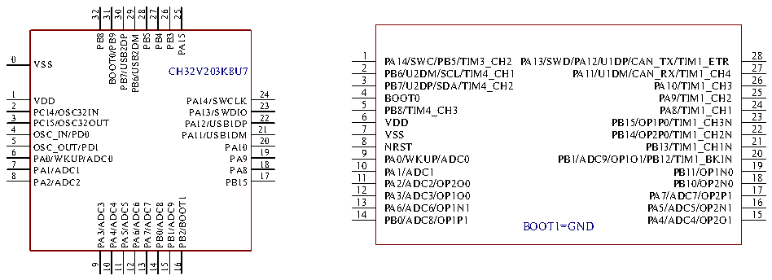
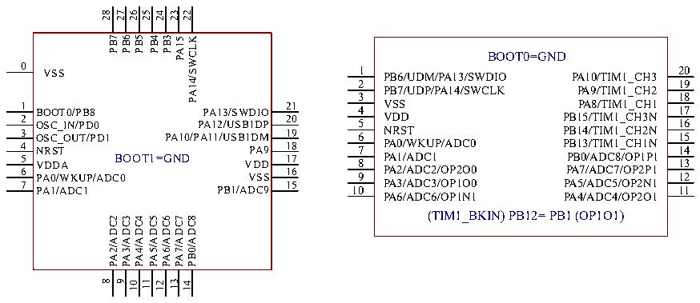
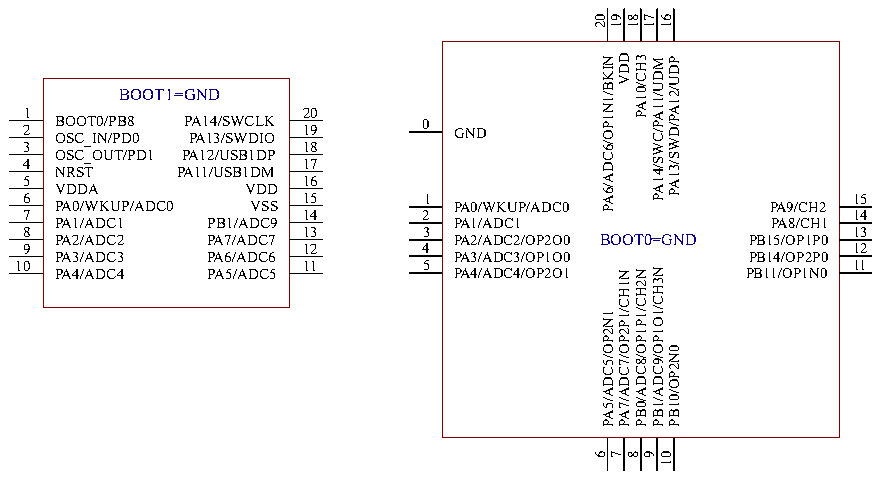

<!-- source-page: 22 -->

[← p.21](0021.md) · [index](../README.md) · [PDF p.22](https://ch32-riscv-ug.github.io/CH32V20x/datasheet_en/CH32V203DS0.PDF#page=22) · [p.23 →](0023.md)

<!-- header: CH32V203 Datasheet https://wch-ic.com -->

# CH32V203K8U7 CH32V203G8R6

 <!-- p22-cluster-01 uncaptioned graphics, rendered from the PDF; verify at https://ch32-riscv-ug.github.io/CH32V20x/datasheet_en/CH32V203DS0.PDF#page=22 -->

🖼 Text parsed from the figure above

32  
31  
30  
29  
28  
27  
26  
25  
PB8  
BOOT0/PB9  
PB5  
PB4  
PB3  
PA15  
PB7/USB2DP  
PB6/USB2DM  
1 28 2 PA14/SWC/PB5/TIM3_CH2 PA13/SWD/PA12/U1DP/CAN_TX/TIM1_ETR 27 PB6/U2DM/SCL/TIM4_CH1 PA11/U1DM/CAN_RX/TIM1_CH4  
0 VSS CH32V203K8U7  
3 26  
PB7/U2DP/SDA/TIM4_CH2 PA10/TIM1_CH3  
4  
25 BOOT0 PA9/TIM1_CH2 5 24 PB8/TIM4_CH3 PA8/TIM1_CH1 6 23 VDD PB15/OP1P0/TIM1_CH3N 7 22 VSS PB14/OP2P0/TIM1_CH2N  
1 24 PA14/SWCLK 2 23 PA13/SWDIO 3 PA12/USB1DP 22 4 PA11/USB1DM 21  
VDD PC14/OSC32IN PC15/OSC32OUT OSC_IN/PD0  
8  
21  
5 20  
NRST PB13/TIM1_CH1N  
6 PA10 19  
OSC_OUT/PD1  
9 20  
PA0/WKUP/ADC0  
PA9  
PA0/WKUP/ADC0 PB1/ADC9/OP1O1/PB12/TIM1_BKIN  
7 PA8 18 8 17  
10 PA1/ADC1 PB11/OP1N0 19 11 18  
PA1/ADC1  
PA2/ADC2  
PB15  
PA2/ADC2/OP2O0 PB10/OP2N0  
12 17  
PA3/ADC3/OP1O0 PA7/ADC7/OP2P1 13 16 PA6/ADC6/OP1N1 PA5/ADC5/OP2N1  
PB2/BOOT1  
PA3/ADC3  
PA4/ADC4  
PA5/ADC5  
PA6/ADC6  
PA7/ADC7  
PB0/ADC8  
PB1/ADC9  
14 15  
PB0/ADC8/OP1P1 BOOT1=GND PA4/ADC4/OP2O1  
9  
10  
11  
12  
13  
14  
15  
16  

# CH32V203G6U6 CH32V203F8P6

 <!-- p22-cluster-02 uncaptioned graphics, rendered from the PDF; verify at https://ch32-riscv-ug.github.io/CH32V20x/datasheet_en/CH32V203DS0.PDF#page=22 -->

🖼 Text parsed from the figure above

28 27 26 25 24 23 22  
PB7  
PB6  
PB5  
PB4  
PB3  
PA14/SWCLK  
PA15  
BOOT0=GND  
0 VSS  
1 20 PB6/UDM/PA13/SWDIO PA10/TIM1_CH3  
2 19  
PB7/UDP/PA14/SWCLK PA9/TIM1_CH2  
3  
18  
VSS PA8/TIM1_CH1 4 17 5 VDD PB15/TIM1_CH3N 16 NRST PB14/TIM1_CH2N 6 15 7 PA0/WKUP/ADC0 PB13/TIM1_CH1N 14  
1 2 3  
21 PA13/SWDIO 20 PA12/USB1DP PA10/PA11/USB1DM 19 PA9 18  
BOOT0/PB8 OSC_IN/PD0 OSC_OUT/PD1 4 NRST  
PA1/ADC1 PB0/ADC8/OP1P1 8 13 9 PA2/ADC2/OP2O0 PA7/ADC7/OP2P1 12 PA3/ADC3/OP1O0 PA5/ADC5/OP2N1 10 11  
BOOT1=GND VDDA PA0/WKUP/ADC0 PA1/ADC1  
5 6 7  
17 VDD 16 VSS PB1/ADC9 15  
PA6/ADC6/OP1N1 PA4/ADC4/OP2O1  
(TIM1_BKIN) PB12= PB1 (OP1O1)  
PA2/ADC2  
PA3/ADC3  
PA4/ADC4  
PA5/ADC5  
PA6/ADC6  
PA7/ADC7  
PB0/ADC8  
8 9 10 11  
12 13 14  

# CH32V203F6P6 CH32V203F8U6

 <!-- p22-cluster-03 uncaptioned graphics, rendered from the PDF; verify at https://ch32-riscv-ug.github.io/CH32V20x/datasheet_en/CH32V203DS0.PDF#page=22 -->

🖼 Text parsed from the figure above

20  
19  
18  
17  
16  
VDD  
PA10/CH3  
PA6/ADC6/OP1N1/BKIN  
PA13/SWD/PA12/UDP  
PA14/SWC/PA11/UDM  
BOOT1=GND  
1  
20  
BOOT0/PB8 PA14/SWCLK  
0 GND  
2 19 OSC_IN/PD0 PA13/SWDIO  
3  
18  
OSC_OUT/PD1 PA12/USB1DP  
4 17  
NRST PA11/USB1DM  
5 16  
VDDA VDD  
6 15  
1  
15  
PA0/WKUP/ADC0 VSS  
PA0/WKUP/ADC0  
PA9/CH2  
7 14  
2  
14  
PA1/ADC1 PB1/ADC9  
PA1/ADC1  
PA8/CH1  
8 13  
3  
13  
PA2/ADC2/OP2O0 BOOT0=GND  
PA2/ADC2 PA7/ADC7  
PB15/OP1P0  
4  
12  
9 12  
PA3/ADC3/OP1O0  
PB14/OP2P0  
PA3/ADC3 PA6/ADC6  
5  
11  
10 11  
PB1/ADC9/OP1O1/CH3N  
PA4/ADC4/OP2O1  
PB11/OP1N0  
PA4/ADC4 PA5/ADC5  
PB0/ADC8/OP1P1/CH2N  
PA7/ADC7/OP2P1/CH1N  
PA5/ADC5/OP2N1  
PB10/OP2N0  
8  
6  
7  
9  
10  

<!-- image: p22-draw-image-00001 bbox=[514.2, 783.36, 533.64, 793.92] -->
<!-- footer: V3.0 20 -->
