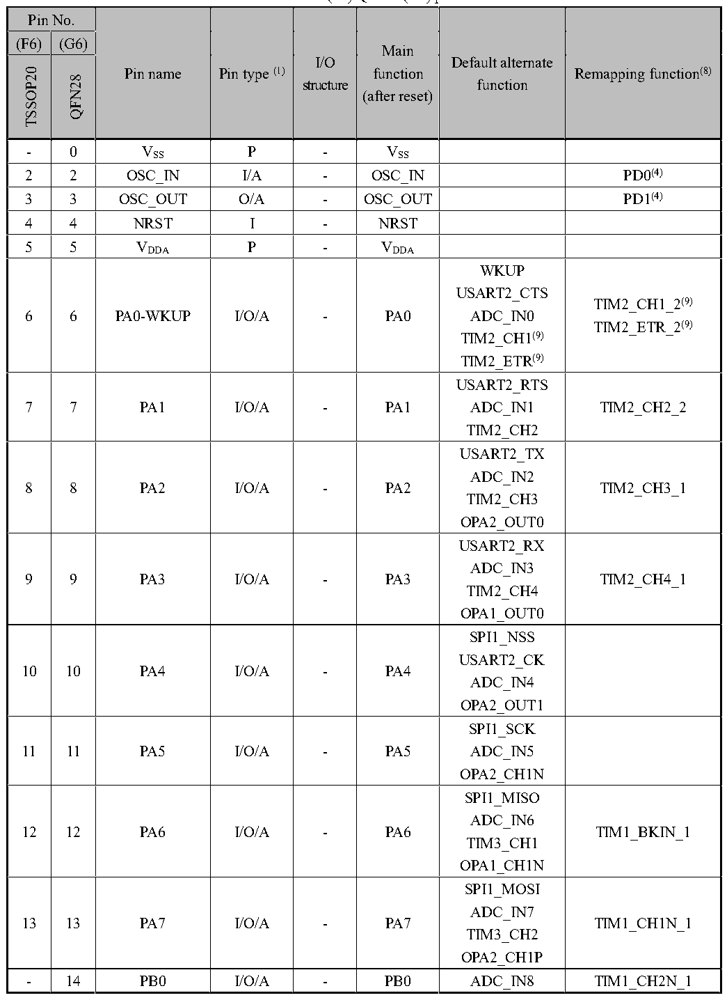

<!-- source-page: 29 -->

[← p.28](0028.md) · [index](../README.md) · [PDF p.29](https://ch32-riscv-ug.github.io/CH32V20x/datasheet_en/CH32V203DS0.PDF#page=29) · [p.30 →](0030.md)

<!-- header: CH32V203 Datasheet https://wch-ic.com -->

 <!-- p29-cluster-01 uncaptioned graphics, rendered from the PDF; verify at https://ch32-riscv-ug.github.io/CH32V20x/datasheet_en/CH32V203DS0.PDF#page=29 -->

🖼 Text parsed from the figure above

<!-- p29-table-001 (table-3-1-3@1) pages 29-31 -->
<table><caption>Table 3-1-3 TSSOP20(F6)/QFN28(G6) pin definitions</caption><tr><th colspan="2">Pin No.</th><th rowspan="8">Pin name</th><th rowspan="8">Pin type (1)</th><th rowspan="4">I/O</th><th rowspan="3">Main</th><th rowspan="8" style="text-align:left">Default alternate function</th><th rowspan="8">Remapping function(8)</th></tr><tr><td>(F6)</td><td>(G6)</td></tr><tr><td rowspan="6">TSSOP20</td><td rowspan="6">QFN28</td></tr><tr><td rowspan="2">function</td></tr><tr><td rowspan="2">structure</td></tr><tr><td rowspan="2">(after reset)</td></tr><tr><td rowspan="2"></td></tr><tr><td></td></tr><tr><td>-</td><td>0</td><td style="text-align:left">VSS</td><td>P</td><td>-</td><td style="text-align:left">VSS</td><td></td><td></td></tr><tr><td>2</td><td>2</td><td>OSC_IN</td><td>I/A</td><td>-</td><td>OSC_IN</td><td></td><td>PD0(4)</td></tr><tr><td>3</td><td>3</td><td>OSC_OUT</td><td>O/A</td><td>-</td><td>OSC_OUT</td><td></td><td>PD1(4)</td></tr><tr><td>4</td><td>4</td><td>NRST</td><td>I</td><td>-</td><td>NRST</td><td></td><td></td></tr><tr><td>5</td><td>5</td><td style="text-align:left">VDDA</td><td>P</td><td>-</td><td style="text-align:left">VDDA</td><td></td><td></td></tr><tr><td>6</td><td>6</td><td>PA0-WKUP</td><td>I/O/A</td><td>-</td><td>PA0</td><td style="text-align:left">WKUPUSART2_CTSADC_IN0TIM2_CH1(9) TIM2_ETR(9)</td><td style="text-align:left">TIM2_CH1_2(9) TIM2_ETR_2(9)</td></tr><tr><td>7</td><td>7</td><td>PA1</td><td>I/O/A</td><td>-</td><td>PA1</td><td style="text-align:left">USART2_RTSADC_IN1TIM2_CH2</td><td>TIM2_CH2_2</td></tr><tr><td>8</td><td>8</td><td>PA2</td><td>I/O/A</td><td>-</td><td>PA2</td><td style="text-align:left">USART2_TXADC_IN2TIM2_CH3OPA2_OUT0</td><td>TIM2_CH3_1</td></tr><tr><td>9</td><td>9</td><td>PA3</td><td>I/O/A</td><td>-</td><td>PA3</td><td style="text-align:left">USART2_RXADC_IN3TIM2_CH4OPA1_OUT0</td><td>TIM2_CH4_1</td></tr><tr><td>10</td><td>10</td><td>PA4</td><td>I/O/A</td><td>-</td><td>PA4</td><td style="text-align:left">SPI1_NSSUSART2_CKADC_IN4OPA2_OUT1</td><td></td></tr><tr><td>11</td><td>11</td><td>PA5</td><td>I/O/A</td><td>-</td><td>PA5</td><td style="text-align:left">SPI1_SCKADC_IN5OPA2_CH1N</td><td></td></tr><tr><td>12</td><td>12</td><td>PA6</td><td>I/O/A</td><td>-</td><td>PA6</td><td style="text-align:left">SPI1_MISOADC_IN6TIM3_CH1OPA1_CH1N</td><td>TIM1_BKIN_1</td></tr><tr><td>13</td><td>13</td><td>PA7</td><td>I/O/A</td><td>-</td><td>PA7</td><td style="text-align:left">SPI1_MOSIADC_IN7TIM3_CH2OPA2_CH1P</td><td>TIM1_CH1N_1</td></tr><tr><td>-</td><td>14</td><td>PB0</td><td>I/O/A</td><td>-</td><td>PB0</td><td>ADC_IN8</td><td>TIM1_CH2N_1</td></tr><tr><td colspan="2">Pin No.</td><td rowspan="8">Pin name</td><td rowspan="8">Pin type (1)</td><td rowspan="4">I/O</td><td rowspan="3">Main</td><td rowspan="8" style="text-align:left">Default alternate function</td><td rowspan="8">Remapping function(8)</td></tr><tr><td>(F6)</td><td>(G6)</td></tr><tr><td rowspan="6">TSSOP20</td><td rowspan="6">QFN28</td></tr><tr><td rowspan="2">function</td></tr><tr><td rowspan="2">structure</td></tr><tr><td rowspan="2">(after reset)</td></tr><tr><td rowspan="2"></td></tr><tr><td></td></tr><tr><td></td><td></td><td></td><td></td><td></td><td></td><td style="text-align:left">TIM3_CH3OPA1_CH1P</td><td>TIM3_CH3_2</td></tr><tr><td>14</td><td>15</td><td>PB1</td><td>I/O/A</td><td>-</td><td>PB1</td><td style="text-align:left">ADC_IN9TIM3_CH4OPA1_OUT1</td><td style="text-align:left">TIM1_CH3N_1TIM3_CH4_2</td></tr><tr><td>15</td><td>16</td><td style="text-align:left">VSS</td><td>P</td><td></td><td style="text-align:left">VSS</td><td></td><td></td></tr><tr><td>16</td><td>17</td><td style="text-align:left">VDD</td><td>P</td><td></td><td style="text-align:left">VDD</td><td></td><td></td></tr><tr><td>-</td><td>18</td><td>PA9</td><td>I/O</td><td>FT</td><td>PA9</td><td style="text-align:left">USART1_TXTIM1_CH2</td><td>TIM1_CH2_1</td></tr><tr><td>-</td><td>19</td><td>PA10</td><td>I/O</td><td>FT</td><td>PA10</td><td style="text-align:left">USART1_RXTIM1_CH3</td><td>TIM1_CH3_1</td></tr><tr><td>17</td><td>19</td><td>PA11</td><td>I/O/A</td><td>FT</td><td>PA11</td><td style="text-align:left">USART1_CTSUSBDMCAN1_RXTIM1_CH4</td><td style="text-align:left">USART1_CTS_1TIM1_CH4_1</td></tr><tr><td>18</td><td>20</td><td>PA12</td><td>I/O/A</td><td>FT</td><td>PA12</td><td style="text-align:left">USART1_RTSUSBDPCAN1_TXTIM1_ETR</td><td style="text-align:left">USART1_RTS_1TIM1_ETR_1</td></tr><tr><td>19</td><td>21</td><td>PA13</td><td>I/O</td><td>FT</td><td>SWDIO</td><td></td><td>PA13</td></tr><tr><td>20</td><td>22</td><td>PA14</td><td>I/O</td><td>FT</td><td>SWCLK</td><td></td><td>PA14</td></tr><tr><td>-</td><td>23</td><td>PA15</td><td>I/O</td><td>FT</td><td>PA15</td><td></td><td style="text-align:left">TIM2_CH1_1(9) TIM2_ETR_1(9) TIM2_CH1_3(9) TIM2_ETR_3(9) SPI1_NSS_1</td></tr><tr><td>-</td><td>24</td><td>PB3</td><td>I/O</td><td>FT</td><td>PB3</td><td></td><td style="text-align:left">TIM2_CH2_1TIM2_CH2_3SPI1_SCK_1</td></tr><tr><td>-</td><td>25</td><td>PB4</td><td>I/O</td><td>FT</td><td>PB4</td><td></td><td style="text-align:left">TIM3_CH1_2SPI1_MISO_1</td></tr><tr><td>-</td><td>26</td><td>PB5</td><td>I/O</td><td>FT</td><td>PB5</td><td>I2C1_SMBA</td><td style="text-align:left">TIM3_CH2_2SPI1_MOSI_1</td></tr><tr><td>-</td><td>27</td><td>PB6</td><td>I/O</td><td>FT</td><td>PB6</td><td style="text-align:left">I2C1_SCLTIM4_CH1</td><td>USART1_TX_1</td></tr><tr><td>-</td><td>28</td><td>PB7</td><td>I/O</td><td>FT</td><td>PB7</td><td style="text-align:left">I2C1_SDATIM4_CH2</td><td>USART1_RX_1</td></tr><tr><td>1(6)</td><td>1(6)</td><td>BOOT0</td><td>I</td><td>-</td><td>BOOT0</td><td></td><td></td></tr><tr><td colspan="2">Pin No.</td><td rowspan="5">Pin name</td><td rowspan="5">Pin type (1)</td><td rowspan="5" style="text-align:left">I/O structure</td><td rowspan="5" style="text-align:left">Main function (after reset)</td><td rowspan="3">Default alternate</td><td rowspan="5">Remapping function(8)</td></tr><tr><td>(F6)</td><td>(G6)</td></tr><tr><td rowspan="3">TSSOP20</td><td rowspan="3">QFN28</td></tr><tr><td>function</td></tr><tr><td></td></tr><tr><td></td><td></td><td>PB8</td><td>I/O/A</td><td>FT</td><td>PB8</td><td></td><td style="text-align:left">I2C1_SCL_1CAN1_RX_2</td></tr></table>

0 VSS P - VSS  
5 5 VDDA P - VDDA  

<!-- image: p29-draw-image-00001 bbox=[514.2, 783.36, 533.64, 793.92] -->
<!-- footer: V3.0 27 -->
