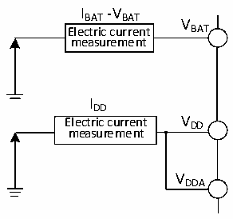

<!-- source-page: 41 -->

[← p.40](0040.md) · [index](../README.md) · [PDF p.41](https://ch32-riscv-ug.github.io/CH32V20x/datasheet_en/CH32V203DS0.PDF#page=41) · [p.42 →](0042.md)

<!-- header: CH32V203 Datasheet https://wch-ic.com -->

### 4.3.4 Supply Current Characteristics

Current consumption is a comprehensive index of a variety of parameters and factors. These parameters and  
factors include operating voltage, ambient temperature, I/O pin load, the software configuration of the  
product, the operating frequency, flip rate of the I/O pin, the location of the program in memory and the  
executed code, etc. The current consumption measurement method is as follows:  

Figure 4-2 Current consumption measurement  
 <!-- rendered from the PDF; verify at https://ch32-riscv-ug.github.io/CH32V20x/datasheet_en/CH32V203DS0.PDF#page=41 -->

🖼 Text parsed from the figure above

IBAT-VBAT  
V  
Electric current BAT  
measurement  
IDD  
Electric current V DD  
measurement  
VDDA  

The microcontroller is in the following conditions:  
Under normal temperature conditions and when VDD= 3.3V, all I/O ports are configured with pull-down  
inputs, only one of HSE and HIS is enabled, HSE=8M, HIS=8M (calibrated), FPLCK1=FHCLK/2, FPLCK2=FHCLK,  
PLL is enabled when FHCLK&gt;8MHz. Enable or disable the power consumption of all peripheral clocks.  
(V203)  

<!-- p41-table-001 (table-4-6-1@1) pages 41-42 -->
<table><caption>Table 4-6-1 Typical current consumption in Run mode, the data processing code runs from the internal Flash</caption><tr><th rowspan="2">Symbol</th><th rowspan="2">Parameter</th><th rowspan="2" colspan="2">Condition</th><th colspan="2">Typ.</th><th rowspan="2">Unit</th></tr><tr><td style="text-align:left">All peripherals enabled</td><td style="text-align:left">All peripherals disabled(2)</td></tr><tr><td rowspan="17" style="text-align:left">I (1) DD</td><td rowspan="17" style="text-align:left">Supply current in Run mode</td><td rowspan="9">External clock</td><td style="text-align:left">F = 144MHz HCLK</td><td>11.8</td><td>7.6</td><td rowspan="17">mA</td></tr><tr><td style="text-align:left">F = 72MHz HCLK</td><td>6.3</td><td>4.2</td></tr><tr><td style="text-align:left">F = 48MHz HCLK</td><td>4.4</td><td>3.0</td></tr><tr><td style="text-align:left">F = 36MHz HCLK</td><td>3.5</td><td>2.5</td></tr><tr><td style="text-align:left">F = 24MHz HCLK</td><td>2.6</td><td>1.9</td></tr><tr><td style="text-align:left">F = 16MHz HCLK</td><td>2.0</td><td>1.5</td></tr><tr><td style="text-align:left">F = 8MHz HCLK</td><td>1.2</td><td>1.0</td></tr><tr><td style="text-align:left">F = 4MHz HCLK</td><td>1.0</td><td>0.8</td></tr><tr><td style="text-align:left">F = 500KHz HCLK</td><td>0.7</td><td>0.7</td></tr><tr><td rowspan="8" style="text-align:left">Runs on the high-speed internal RC oscillator (HSI). Uses HB prescaler to reduce the frequency.</td><td style="text-align:left">F = 144MHz HCLK</td><td>11.4</td><td>7.1</td></tr><tr><td style="text-align:left">F = 72MHz HCLK</td><td>6.0</td><td>3.7</td></tr><tr><td style="text-align:left">F = 48MHz HCLK</td><td>4.1</td><td>2.6</td></tr><tr><td style="text-align:left">F = 36MHz HCLK</td><td>3.2</td><td>2.1</td></tr><tr><td style="text-align:left">F = 24MHz HCLK</td><td>2.3</td><td>1.5</td></tr><tr><td style="text-align:left">F = 16MHz HCLK</td><td>1.6</td><td>1.1</td></tr><tr><td style="text-align:left">F = 8MHz HCLK</td><td>0.9</td><td>0.6</td></tr><tr><td style="text-align:left">F = 4MHz HCLK</td><td>0.6</td><td>0.5</td></tr><tr><td></td><td></td><td></td><td style="text-align:left">F = 500KHz HCLK</td><td>0.3</td><td>0.3</td><td></td></tr></table>

<!-- image: p41-draw-image-00001 bbox=[515.76, 779.04, 535.2, 789.6] -->
<!-- footer: V3.0 36 -->
