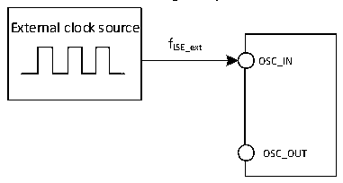
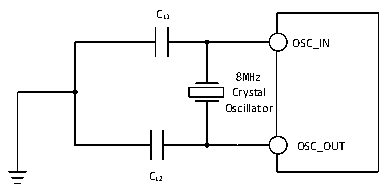

<!-- source-page: 46 -->

[← p.45](0045.md) · [index](../README.md) · [PDF p.46](https://ch32-riscv-ug.github.io/CH32V20x/datasheet_en/CH32V203DS0.PDF#page=46) · [p.47 →](0047.md)

<!-- header: CH32V203 Datasheet https://wch-ic.com -->

Figure 4-4 External low-frequency clock source circuit  
 <!-- rendered from the PDF; verify at https://ch32-riscv-ug.github.io/CH32V20x/datasheet_en/CH32V203DS0.PDF#page=46 -->

🖼 Text parsed from the figure above

External clock source  
fLSE_ext  
OSC_IN  
OSC_OUT  

<!-- p46-table-001 (table-4-11@1) -->
<table><caption>Table 4-11 High-speed external clock generated from a crystal/ceramic resonator</caption><tr><th>Symbol</th><th>Parameter</th><th>Condition</th><th>Min.</th><th>Typ.</th><th>Max.</th><th>Unit</th></tr><tr><td rowspan="2" style="text-align:left">FOSC_IN</td><td rowspan="2">Resonator frequency</td><td></td><td>3</td><td>8</td><td>25</td><td rowspan="2">MHz</td></tr><tr><td>Applied for V203RBT6</td><td></td><td>32(3)</td><td></td></tr><tr><td style="text-align:left">RF</td><td>Feedback resistance</td><td></td><td></td><td>250</td><td></td><td>kΩ</td></tr><tr><td>C</td><td style="text-align:left">Recommended load capacitance and corresponding crystal series impedance RS</td><td style="text-align:left">R =60Ω(1) S</td><td></td><td>20</td><td></td><td>pF</td></tr><tr><td style="text-align:left">I2</td><td>HSE drive current</td><td></td><td></td><td>0.53</td><td></td><td>mA</td></tr><tr><td style="text-align:left">g m</td><td>Oscillator transconductance</td><td>Startup</td><td></td><td>17</td><td></td><td>mA/V</td></tr><tr><td style="text-align:left">t SU(HSE)</td><td>Startup time</td><td style="text-align:left">V is stable, 8M crystal DD</td><td></td><td>2.5(2)</td><td></td><td>ms</td></tr></table>

<em>Note 1: It is recommended that the crystal ESR does not exceed 80Ω, and crystals with smaller ESR are</em>  
<em>preferred. For load capacitance, refer to the crystal manual requirements.</em>  
<em>2. Startup time refers to the time difference from when HSEON is turned on to when HSERDY is set.</em>  
<em>3. No external load capacitor is required.</em>  
Circuit reference design and requirements:  
The load capacitance of the crystal is subject to the recommendation of the crystal manufacturer, generally  
CL1=CL2.  
For CH32V203RB, they are connected with external 32M crystals, and they have built-in load capacitor, so  
the external circuit is not necessary.  

Figure 4-5 Typical circuit of external 8M crystal  
 <!-- rendered from the PDF; verify at https://ch32-riscv-ug.github.io/CH32V20x/datasheet_en/CH32V203DS0.PDF#page=46 -->

🖼 Text parsed from the figure above

CL1  
OSC_IN  
8MHz  
Crystal  
Oscillator  
OSC_OUT  
CL2  

(fLSE=32.768KHz)  

<!-- p46-table-002 (table-4-12@1) pages 46-47 -->
<table><caption>Table 4-12 Low-speed external clock generated by generated from a crystal/ceramic resonator</caption><tr><th>Symbol</th><th>Parameter</th><th>Condition</th><th>Min.</th><th>Typ.</th><th>Max.</th><th>Unit</th></tr><tr><td style="text-align:left">RF</td><td>Feedback resistance</td><td></td><td></td><td>5</td><td></td><td>MΩ</td></tr><tr><td>C</td><td style="text-align:left">Recommended load capacitance and corresponding crystal serial impedance RS</td><td style="text-align:left">R &lt;70kΩS</td><td></td><td></td><td>15</td><td>pF</td></tr><tr><td style="text-align:left">i 2</td><td>LSE drive current</td><td>VDD = 3.3V</td><td></td><td>0.35</td><td></td><td>uA</td></tr><tr><td style="text-align:left">g m</td><td>Oscillator transconductance</td><td>Startup</td><td></td><td>25.3</td><td></td><td>uA/V</td></tr><tr><td style="text-align:left">t SU(LSE)</td><td>Startup time</td><td>VDD is stable</td><td></td><td>800</td><td></td><td>mS</td></tr></table>

<!-- image: p46-draw-image-00001 bbox=[515.76, 779.04, 535.2, 789.6] -->
<!-- footer: V3.0 41 -->
