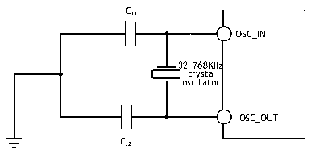

<!-- source-page: 47 -->

[← p.46](0046.md) · [index](../README.md) · [PDF p.47](https://ch32-riscv-ug.github.io/CH32V20x/datasheet_en/CH32V203DS0.PDF#page=47) · [p.48 →](0048.md)

<!-- header: CH32V203 Datasheet https://wch-ic.com -->

> ⬆ **Table continued** — rendered in full at [page 46](0046.md). <!-- p47-table-001 -->

Circuit reference design and requirements:  
The load capacitance of the crystal is subject to the recommendation of the crystal manufacturer, usually  
CL1=CL2, which is about 12pF.  

Figure 4-6 Typical circuit of external 32.768K crystal  
 <!-- rendered from the PDF; verify at https://ch32-riscv-ug.github.io/CH32V20x/datasheet_en/CH32V203DS0.PDF#page=47 -->

🖼 Text parsed from the figure above

CL1  
OSC_IN  
32.768KHz  
crystal  
oscillator  
OSC_OUT  
CL2  

<em>Note: The load capacitance CL is calculated by the following formula: CL= CL1 x CL2/ (CL1+ CL2) + Cstray.</em>  
<em>Cstray is the capacitance of the pin and the PCB board or PCB-related capacitance. Its typical value is</em>  
<em>between 2pF and 7pF.</em>  

### 4.3.6 Internal Clock Source Characteristics

<!-- p47-table-002 (table-4-13@1) -->
<table><caption>Table 4-13 Internal high-speed (HSI) RC oscillator characteristics</caption><tr><th>Symbol</th><th>Parameter</th><th>Condition</th><th>Min.</th><th>Typ.</th><th>Max.</th><th>Unit</th></tr><tr><td style="text-align:left">FHSI</td><td>Frequency (after calibration)</td><td></td><td></td><td>8</td><td></td><td>MHz</td></tr><tr><td style="text-align:left">DuCy HSI</td><td>Duty cycle</td><td></td><td>45</td><td>50</td><td>55</td><td>%</td></tr><tr><td rowspan="2" style="text-align:left">ACCHSI</td><td rowspan="2" style="text-align:left">Accuracy of HSI oscillator (after calibration)</td><td>TA = 0℃~70℃</td><td>-1.6</td><td></td><td>1.6</td><td>%</td></tr><tr><td style="text-align:left">TA = The working environment temperature range shown in Table 4-2</td><td>-2.2</td><td></td><td>2.2</td><td>%</td></tr><tr><td style="text-align:left">t SU(HSI)</td><td style="text-align:left">HSI oscillator startup stabilization time</td><td></td><td></td><td></td><td>8</td><td>us</td></tr><tr><td style="text-align:left">IDD(HSI)</td><td>HSI oscillator power consumption</td><td></td><td>120</td><td>180</td><td>270</td><td>uA</td></tr></table>

<!-- image: p47-draw-image-00001 bbox=[515.76, 779.04, 535.2, 789.6] -->
<!-- footer: V3.0 42 -->
