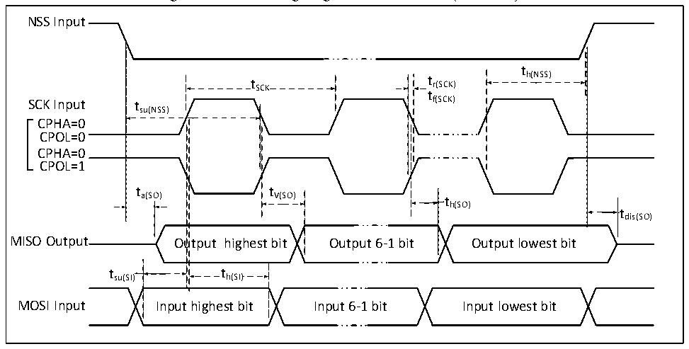

<!-- source-page: 55 -->

[← p.54](0054.md) · [index](../README.md) · [PDF p.55](https://ch32-riscv-ug.github.io/CH32V20x/datasheet_en/CH32V203DS0.PDF#page=55) · [p.56 →](0056.md)

<!-- header: CH32V203 Datasheet https://wch-ic.com -->

Figure 4-11 SPI timing diagram in Slave mode (CPHA=1)  
 <!-- rendered from the PDF; verify at https://ch32-riscv-ug.github.io/CH32V20x/datasheet_en/CH32V203DS0.PDF#page=55 -->

🖼 Text parsed from the figure above

NSS Input  
t  
t SCK t r(SCK) h(NSS)  
t  
SCK Input tsu(NSS) f(SCK)  
CPHA=0  
CPOL=0  
CPHA=0  
CPOL=1  
t t  
a(SO) V(SO) t  
h(SO)  
tdis(SO)  
MISO Output Output highest bit Output 6-1 bit Output lowest bit  
t h(SI)  t h(SI)  )  th(SI)  
tsu(SI) th(SI)  
MOSI Input Input highest bit Input 6-1 bit Input lowest bit  

<!-- p55-table-002 (table-4-25@1) -->
<table><caption>Table 4-25 SPI interface characteristics</caption><tr><th>Symbol</th><th>Parameter</th><th>Condition</th><th>Min.</th><th>Max.</th><th>Unit</th></tr><tr><td rowspan="2" style="text-align:left">f /t SCK SCK</td><td rowspan="2">SPI clock frequency</td><td>Master mode</td><td></td><td>36</td><td>MHz</td></tr><tr><td>Slave mode</td><td></td><td>36</td><td>MHz</td></tr><tr><td style="text-align:left">t /t r(SCK) f(SCK)</td><td>SPI clock rise and fall time</td><td>Load capacitance:C = 30pF</td><td></td><td>20</td><td>ns</td></tr><tr><td style="text-align:left">t SU(NSS)</td><td>NSS setup time</td><td>Slave mode</td><td style="text-align:left">2t PCLK</td><td></td><td>ns</td></tr><tr><td style="text-align:left">t h(NSS)</td><td>NSS hold time</td><td>Slave mode</td><td style="text-align:left">2t PCLK</td><td></td><td>ns</td></tr><tr><td style="text-align:left">t /t w(SCKH) w(SCKL)</td><td>SCK high and low time</td><td style="text-align:left">Master mode, f = 36MHz, PCLK Prescaler factor = 4</td><td>40</td><td>60</td><td>ns</td></tr><tr><td style="text-align:left">t SU(MI)</td><td rowspan="2">Data input setup time</td><td>Master mode</td><td>5</td><td></td><td>ns</td></tr><tr><td style="text-align:left">t SU(SI)</td><td>Slave mode</td><td>5</td><td></td><td>ns</td></tr><tr><td style="text-align:left">t h(MI)</td><td rowspan="2">Data input hold time</td><td>Master mode</td><td>5</td><td></td><td>ns</td></tr><tr><td style="text-align:left">t h(SI)</td><td>Slave mode</td><td>4</td><td></td><td>ns</td></tr><tr><td style="text-align:left">t a(SO)</td><td>Data output access time</td><td style="text-align:left">Slave mode, f = 20MHz PCLK</td><td>0</td><td style="text-align:left">1t PCLK</td><td>ns</td></tr><tr><td style="text-align:left">t dis(SO)</td><td>Data output disable time</td><td>Slave mode</td><td>0</td><td>10</td><td>ns</td></tr><tr><td style="text-align:left">t V(SO)</td><td rowspan="2">Data output valid time</td><td>Slave mode (After enable edge)</td><td></td><td>25</td><td>ns</td></tr><tr><td style="text-align:left">t V(MO)</td><td>Master mode (After enable edge)</td><td></td><td>5</td><td>ns</td></tr><tr><td style="text-align:left">t h(SO)</td><td rowspan="2">Data output hold time</td><td>Slave mode (After enable edge)</td><td>15</td><td></td><td>ns</td></tr><tr><td style="text-align:left">t h(MO)</td><td>Master mode (After enable edge)</td><td>0</td><td></td><td>ns</td></tr></table>

### 4.3.15 USB Interface Characteristics

<!-- p55-table-003 (table-4-26@1) pages 55-56 -->
<table><caption>Table 4-26 USB characteristics</caption><tr><th>Symbol</th><th>Parameter</th><th>Condition</th><th>Min.</th><th>Max.</th><th>Unit</th></tr><tr><td style="text-align:left">VDD</td><td>USB operating voltage</td><td></td><td>3.0</td><td>3.6</td><td>V</td></tr><tr><td style="text-align:left">VSE</td><td style="text-align:left">Single-ended receiver threshold</td><td style="text-align:left">V = 3.3VDD</td><td>1.2</td><td>1.9</td><td>V</td></tr><tr><td style="text-align:left">VOL</td><td>Static output low level</td><td></td><td></td><td>0.3</td><td>V</td></tr><tr><td style="text-align:left">VOH</td><td>Static output high level</td><td></td><td>2.8</td><td>3.6</td><td>V</td></tr><tr><td style="text-align:left">VHSSQ</td><td style="text-align:left">High-speed suppression information detection threshold</td><td></td><td>100</td><td>150</td><td>mV</td></tr><tr><td style="text-align:left">VHSDSC</td><td style="text-align:left">High-speed disconnection detection threshold</td><td></td><td>500</td><td>625</td><td>mV</td></tr><tr><td style="text-align:left">VHSOI</td><td>High-speed idle level</td><td></td><td>-10</td><td>10</td><td>mV</td></tr><tr><td style="text-align:left">VHSOH</td><td>High-speed data high level</td><td></td><td>360</td><td>440</td><td>mV</td></tr><tr><td style="text-align:left">VHSOL</td><td>High-speed data low level</td><td></td><td>-10</td><td>10</td><td>mV</td></tr></table>

<!-- image: p55-draw-image-00001 bbox=[515.76, 779.04, 535.2, 789.6] -->
<!-- footer: V3.0 50 -->
