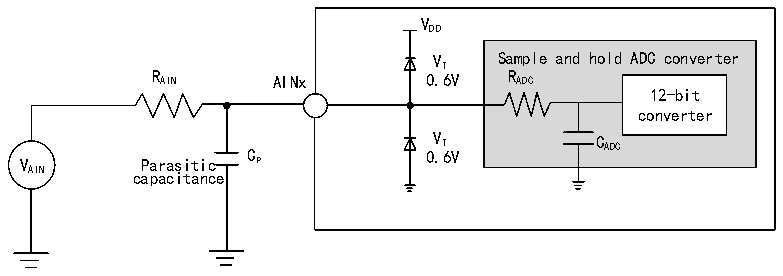
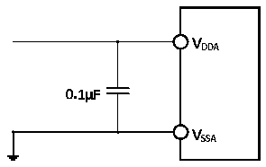

<!-- source-page: 57 -->

[← p.56](0056.md) · [index](../README.md) · [PDF p.57](https://ch32-riscv-ug.github.io/CH32V20x/datasheet_en/CH32V203DS0.PDF#page=57) · [p.58 →](0058.md)

<!-- header: CH32V203 Datasheet https://wch-ic.com -->

<!-- p57-table-001 (table-4-28@1) -->
<table><caption>Table 4-28 Maximum RAIN when fADC= 14MHz</caption><tr><th style="text-align:left">T (cycle) S</th><th style="text-align:left">t (us) S</th><th style="text-align:left">Maximum R (kΩ) AIN</th></tr><tr><td>1.5</td><td>0.11</td><td>0.4</td></tr><tr><td>7.5</td><td>0.54</td><td>5.9</td></tr><tr><td>13.5</td><td>0.96</td><td>11.4</td></tr><tr><td>28.5</td><td>2.04</td><td>25.2</td></tr><tr><td>41.5</td><td>2.96</td><td>37.2</td></tr><tr><td>55.5</td><td>3.96</td><td>50</td></tr><tr><td>71.5</td><td>5.11</td><td>Invalid</td></tr><tr><td>239.5</td><td>17.1</td><td>Invalid</td></tr></table>

<!-- p57-table-002 (table-4-29@1) -->
<table><caption>Table 4-29 ADC error</caption><tr><th>Symbol</th><th>Parameter</th><th>Condition</th><th>Min.</th><th>Typ.</th><th>Max.</th><th>Unit</th></tr><tr><td>EO</td><td>Offset error</td><td rowspan="3" style="text-align:left">f = 56MHz, PCLK2 f = 14 MHz, ADC R &lt; 10kΩ, AIN V = 3.3VDDA</td><td></td><td>±4</td><td></td><td rowspan="3">LSB</td></tr><tr><td>ED</td><td>Differential nonlinearity error</td><td></td><td>±2</td><td></td></tr><tr><td>EL</td><td>Integral nonlinearity error</td><td></td><td>±2.5</td><td></td></tr></table>

Cp represents the parasitic capacitance on the PCB and the pad (about 5pF), which may be related to the  
quality of the pad and PCB layout. A larger Cp value will reduce the conversion accuracy, the solution is to  
reduce the fADC value.  

Figure 4-12 ADC typical connection diagram  
 <!-- rendered from the PDF; verify at https://ch32-riscv-ug.github.io/CH32V20x/datasheet_en/CH32V203DS0.PDF#page=57 -->

🖼 Text parsed from the figure above

VDD  
VT Sample and hold ADC converter  
R AIN AINx 0.6V R ADC  
12-bit  
converter  
V Parasitic C P 0 V . T 6V C ADC  
AIN capacitance  

Figure 4-13 Analog power supply and decoupling circuit reference  
 <!-- rendered from the PDF; verify at https://ch32-riscv-ug.github.io/CH32V20x/datasheet_en/CH32V203DS0.PDF#page=57 -->

🖼 Text parsed from the figure above

<!-- image: p57-draw-image-00002 inside the figure -->
<!-- image: p57-draw-image-00003 inside the figure -->
<!-- image: p57-draw-image-00006 inside the figure -->
<!-- image: p57-draw-image-00008 inside the figure -->
<!-- image: p57-draw-image-00010 inside the figure -->
<!-- image: p57-draw-image-00009 inside the figure -->
<!-- image: p57-draw-image-00007 inside the figure -->
<!-- image: p57-draw-image-00004 inside the figure -->
<!-- image: p57-draw-image-00005 inside the figure -->

<!-- image: p57-draw-image-00001 bbox=[515.76, 779.04, 535.2, 789.6] -->
<!-- footer: V3.0 52 -->
