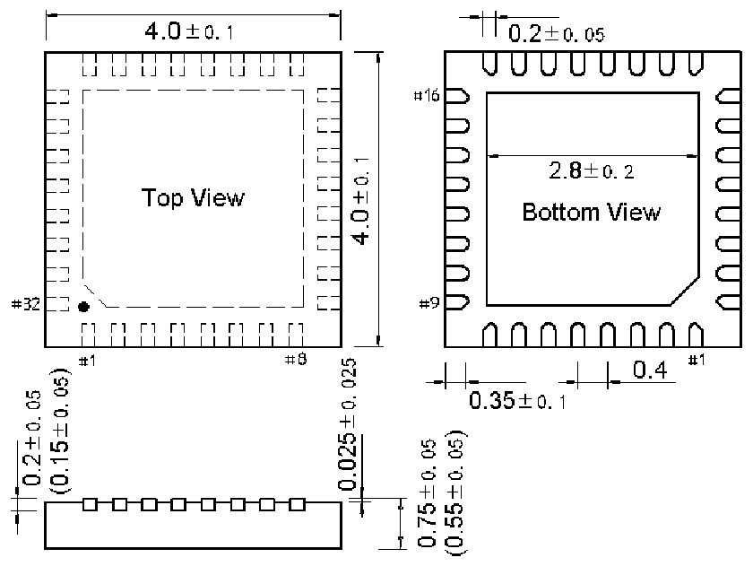
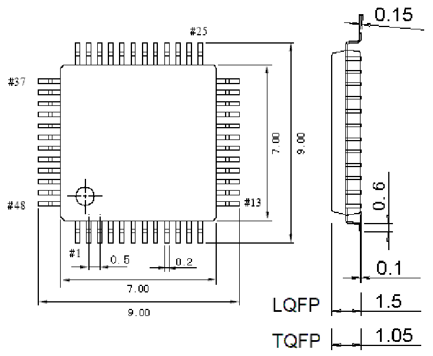

<!-- source-page: 63 -->

[← p.62](0062.md) · [index](../README.md) · [PDF p.63](https://ch32-riscv-ug.github.io/CH32V20x/datasheet_en/CH32V203DS0.PDF#page=63) · [p.64 →](0064.md)

<!-- header: CH32V203 Datasheet https://wch-ic.com -->

## 5.6 QFN32 Package

 <!-- p63-draw-image-00002 rendered from the PDF -->

## 5.7 LQFP48 Package

 <!-- p63-draw-image-00003 rendered from the PDF -->

<!-- image: p63-draw-image-00001 bbox=[515.76, 779.04, 535.2, 789.6] -->
<!-- footer: V3.0 58 -->
