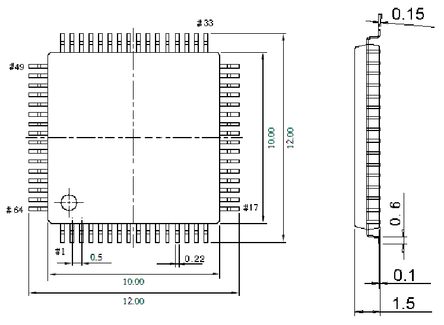

<!-- source-page: 64 -->

[← p.63](0063.md) · [index](../README.md) · [PDF p.64](https://ch32-riscv-ug.github.io/CH32V20x/datasheet_en/CH32V203DS0.PDF#page=64) · [p.65 →](0065.md)

<!-- header: CH32V203 Datasheet https://wch-ic.com -->

## 5.8 LQFP64M Package

 <!-- p64-draw-image-00002 rendered from the PDF -->

<!-- image: p64-draw-image-00001 bbox=[515.76, 779.04, 535.2, 789.6] -->
<!-- footer: V3.0 59 -->
