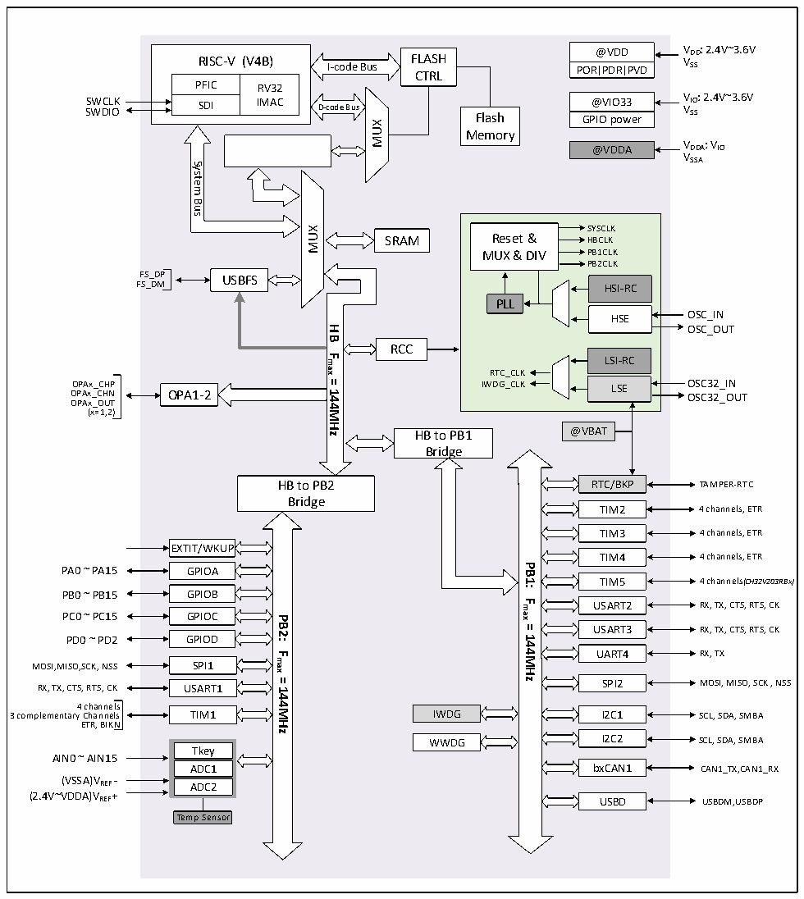

<!-- source-page: 5 -->

[← p.4](0004.md) · [index](../README.md) · [PDF p.5](https://ch32-riscv-ug.github.io/CH32V20x/datasheet_zh/CH32V203DS0.PDF#page=5) · [p.6 →](0006.md)

<!-- header: CH32V203数据手册 https://wch.cn -->

## 2.2 系统架构

微控制器基于RISC-V指令集设计，其架构中将内核、仲裁单元、DMA模块、SRAM存储等部分通过  
多组总线实现交互。设计中集成通用DMA控制器以减轻CPU负担、提高访问效率，应用多级时钟管理  
机制降低了外设的运行功耗，同时兼有数据保护机制，时钟自动切换保护等措施增加了系统稳定性。  
下图是系列产品内部总体架构框图。  

图2-1 系统框图  
 <!-- rendered from the PDF; verify at https://ch32-riscv-ug.github.io/CH32V20x/datasheet_zh/CH32V203DS0.PDF#page=5 -->

🖼 Text parsed from the figure above

@VDD VDD: 2.4V~3.6V  
<!-- image: p5-draw-image-00002 inside the figure -->
RISC-V (V4B) FLASH  
RISC-V (V4B)  PFIC  RV32IMAC  SDI  
VSS  
I-code Bus CTRL  
PORPDRPVD  
SWCLK @VIO33 VIO: 2.4V~3.6V SWDIO VSS GPIO power  
@VIO33  GPIO power  
SDI IMAC D-code Bus Flash  
MUX  
Memory  
@VDDA VDDA: VIO VSSA  
DMA 8Channels  
System  
Bus  
SYSCLK Reset &amp; HBCLK MUX &amp; DIV PB1CLKPB2CLKHSI-RCPLLHSELSI-RCRTC_CLK IWDG_CLK LSE  LSI-RC  LSE  
MUX  
SRAM  
FS_DP USBFS  
FS_DM  
OSC_OUT  
<strong>HB</strong>  
RCC  
<strong>Fmax</strong>  
OPAx_CHP IWDG_CLK LSE OSC32_IN OPAx_CHN OPA1-2 OSC32_OUT  
<strong>=144MHz</strong>  
OPAx_OUT  
(x=1,2)  
HB to PB1 @VBAT  
Bridge  
RTC/BKP TAMPER-RTC  
HB to PB2  
Bridge  
TIM2 4 channels, ETR  
TIM3 4 channels, ETR  
EXTIT/WKUP  
TIM4 4 channels, ETR  
<strong>PB1:</strong>  
PA0 ~ PA15 GPIOA  
<em>TIM5 4 channels(CH32V203RBx)</em>  
PB0 ~ PB15 GPIOB  
<strong>Fmax</strong>  
USART2 RX, TX, CTS, RTS, CK  
PC0 ~ PC15 GPIOC  
<strong>PB2:</strong>  
<strong>=</strong>  
USART3 RX, TX, CTS, RTS, CK  
<strong>144MHz</strong>  
PD0 ~ PD2 GPIOD  
UART4 RX, TX  
<strong>Fmax</strong>  
MOSI,MISO,SCK, NSS SPI1  
<strong>=144MHz</strong>  
RX, TX, CTS, RTS, CK USART1 SPI2 MOSI, MISO, SCK , NSS  
4 channels  
3 complementary Channels TIM1 IWDG I2C1 SCL, SDA, SMBA  
ETR, BIKN  
WWDG I2C2 SCL, SDA, SMBA  
Tkey ADC1ADC2  
AIN0 ~ AIN15  
ADC1 bxCAN1 CAN1_TX,CAN1_RX  
(VSSA)VREF -  
(2.4V~VDDA)VREF+  
USBD USBDM,USBDP  
Temp Sensor  

<!-- image: p5-draw-image-00001 bbox=[517.92, 779.28, 537.36, 789.6] -->
<!-- footer: V3.0 3 -->
