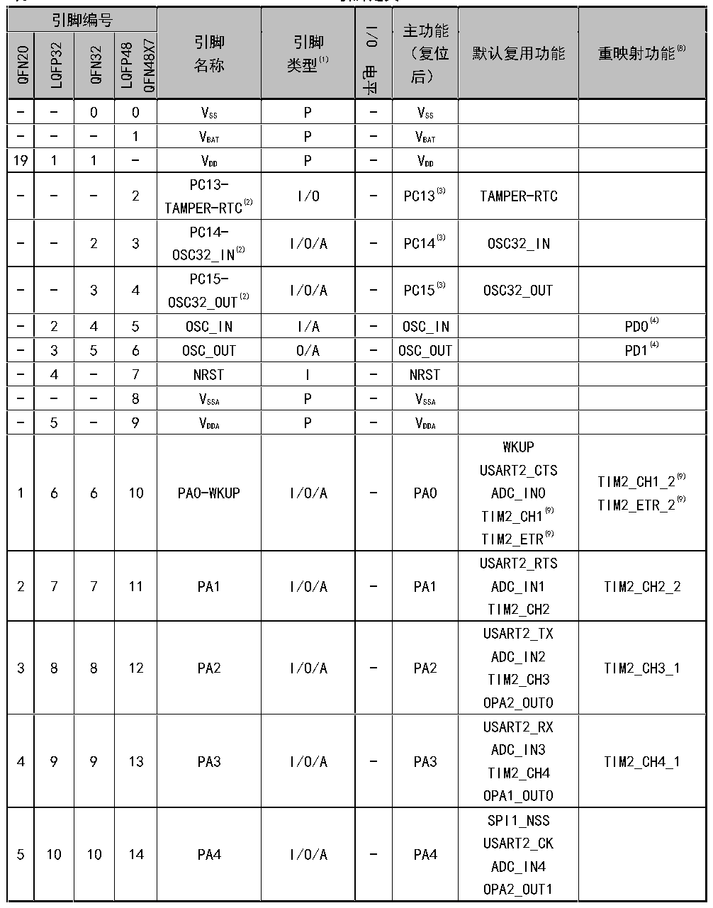

<!-- source-page: 17 -->

[← p.16](0016.md) · [index](../README.md) · [PDF p.17](https://ch32-riscv-ug.github.io/CH32V20x/datasheet_zh/CH32V203DS0.PDF#page=17) · [p.18 →](0018.md)

<!-- header: CH32V203数据手册 https://wch.cn -->

## 3.2 引脚定义

表3-1 引脚定义  
注意，下表中的引脚功能描述针对的是所有功能，不涉及具体型号产品。不同型号之间外设资源有差  
异，查看前请先根据产品型号资源表确认是否有此功能。  

 <!-- p17-cluster-01 uncaptioned graphics, rendered from the PDF; verify at https://ch32-riscv-ug.github.io/CH32V20x/datasheet_zh/CH32V203DS0.PDF#page=17 -->

🖼 Text parsed from the figure above

<!-- p17-table-001 (table-3-1-1@1) pages 17-20 -->
<table><caption>表3-1-1 QFN20/LQFP32/QFN32/LQFP48/QFN48X7引脚定义</caption><tr><th colspan="5">引脚编号</th><th rowspan="3">引脚</th><th rowspan="3">引脚</th><th rowspan="7">I/O电平</th><th rowspan="2">主功能</th><th rowspan="7">默认复用功能</th><th rowspan="7">重映射功能(8)</th></tr><tr><td rowspan="6">QFN20</td><td rowspan="6">LQFP32</td><td rowspan="6">QFN32</td><td rowspan="6">LQFP48</td><td rowspan="6">QFN48X7</td></tr><tr><td rowspan="2">（复位</td></tr><tr><td rowspan="2">名称</td><td rowspan="2">类型(1)</td></tr><tr><td rowspan="2">后）</td></tr><tr><td rowspan="2"></td><td rowspan="2"></td></tr><tr><td></td></tr><tr><td>-</td><td>-</td><td>0</td><td colspan="2">0</td><td style="text-align:left">VSS</td><td>P</td><td>-</td><td style="text-align:left">VSS</td><td></td><td></td></tr><tr><td>-</td><td>-</td><td>-</td><td colspan="2">1</td><td style="text-align:left">VBAT</td><td>P</td><td>-</td><td style="text-align:left">VBAT</td><td></td><td></td></tr><tr><td>19</td><td>1</td><td>1</td><td colspan="2">-</td><td style="text-align:left">VDD</td><td>P</td><td>-</td><td style="text-align:left">VDD</td><td></td><td></td></tr><tr><td>-</td><td>-</td><td>-</td><td colspan="2">2</td><td style="text-align:left">PC13- TAMPER-RTC(2)</td><td>I/O</td><td>-</td><td>PC13(3)</td><td>TAMPER-RTC</td><td></td></tr><tr><td>-</td><td>-</td><td>2</td><td colspan="2">3</td><td style="text-align:left">PC14- OSC32_IN(2)</td><td>I/O/A</td><td>-</td><td>PC14(3)</td><td>OSC32_IN</td><td></td></tr><tr><td>-</td><td>-</td><td>3</td><td colspan="2">4</td><td style="text-align:left">PC15- OSC32_OUT(2)</td><td>I/O/A</td><td>-</td><td>PC15(3)</td><td>OSC32_OUT</td><td></td></tr><tr><td>-</td><td>2</td><td>4</td><td colspan="2">5</td><td>OSC_IN</td><td>I/A</td><td>-</td><td>OSC_IN</td><td></td><td>PD0(4)</td></tr><tr><td>-</td><td>3</td><td>5</td><td colspan="2">6</td><td>OSC_OUT</td><td>O/A</td><td>-</td><td>OSC_OUT</td><td></td><td>PD1(4)</td></tr><tr><td>-</td><td>4</td><td>-</td><td colspan="2">7</td><td>NRST</td><td>I</td><td>-</td><td>NRST</td><td></td><td></td></tr><tr><td>-</td><td>-</td><td>-</td><td colspan="2">8</td><td style="text-align:left">VSSA</td><td>P</td><td>-</td><td style="text-align:left">VSSA</td><td></td><td></td></tr><tr><td>-</td><td>5</td><td>-</td><td colspan="2">9</td><td style="text-align:left">VDDA</td><td>P</td><td>-</td><td style="text-align:left">VDDA</td><td></td><td></td></tr><tr><td>1</td><td>6</td><td>6</td><td colspan="2">10</td><td>PA0-WKUP</td><td>I/O/A</td><td>-</td><td>PA0</td><td style="text-align:left">WKUPUSART2_CTSADC_IN0TIM2_CH1(9) TIM2_ETR(9)</td><td style="text-align:left">TIM2_CH1_2(9) TIM2_ETR_2(9)</td></tr><tr><td>2</td><td>7</td><td>7</td><td colspan="2">11</td><td>PA1</td><td>I/O/A</td><td>-</td><td>PA1</td><td style="text-align:left">USART2_RTSADC_IN1TIM2_CH2</td><td>TIM2_CH2_2</td></tr><tr><td>3</td><td>8</td><td>8</td><td colspan="2">12</td><td>PA2</td><td>I/O/A</td><td>-</td><td>PA2</td><td style="text-align:left">USART2_TXADC_IN2TIM2_CH3OPA2_OUT0</td><td>TIM2_CH3_1</td></tr><tr><td>4</td><td>9</td><td>9</td><td colspan="2">13</td><td>PA3</td><td>I/O/A</td><td>-</td><td>PA3</td><td style="text-align:left">USART2_RXADC_IN3TIM2_CH4OPA1_OUT0</td><td>TIM2_CH4_1</td></tr><tr><td>5</td><td>10</td><td>10</td><td colspan="2">14</td><td>PA4</td><td>I/O/A</td><td>-</td><td>PA4</td><td style="text-align:left">SPI1_NSSUSART2_CKADC_IN4OPA2_OUT1</td><td></td></tr><tr><td colspan="5">引脚编号</td><td rowspan="3">引脚</td><td rowspan="3">引脚</td><td rowspan="7">I/O电平</td><td rowspan="2">主功能</td><td rowspan="7">默认复用功能</td><td rowspan="7">重映射功能(8)</td></tr><tr><td rowspan="6">QFN20</td><td rowspan="6">LQFP32</td><td rowspan="6">QFN32</td><td rowspan="6">LQFP48</td><td rowspan="6">QFN48X7</td></tr><tr><td rowspan="2">（复位</td></tr><tr><td rowspan="2">名称</td><td rowspan="2">类型(1)</td></tr><tr><td rowspan="2">后）</td></tr><tr><td rowspan="2"></td><td rowspan="2"></td></tr><tr><td></td></tr><tr><td>6</td><td>11</td><td>11</td><td colspan="2">15</td><td>PA5</td><td>I/O/A</td><td>-</td><td>PA5</td><td style="text-align:left">SPI1_SCKADC_IN5OPA2_CH1N</td><td>USART4_TX_1</td></tr><tr><td>20</td><td>12</td><td>12</td><td colspan="2">16</td><td>PA6</td><td>I/O/A</td><td>-</td><td>PA6</td><td style="text-align:left">SPI1_MISOADC_IN6TIM3_CH1OPA1_CH1N</td><td style="text-align:left">TIM1_BKIN_1USART4_CK_1</td></tr><tr><td>7</td><td>13</td><td>13</td><td colspan="2">17</td><td>PA7</td><td>I/O/A</td><td>-</td><td>PA7</td><td style="text-align:left">SPI1_MOSIADC_IN7TIM3_CH2OPA2_CH1P</td><td style="text-align:left">TIM1_CH1N_1USART4_CTS_1</td></tr><tr><td>8</td><td>14</td><td>14</td><td colspan="2">18</td><td>PB0</td><td>I/O/A</td><td>-</td><td>PB0</td><td style="text-align:left">ADC_IN8TIM3_CH3OPA1_CH1PUSART4_TX</td><td style="text-align:left">TIM1_CH2N_1TIM3_CH3_2</td></tr><tr><td>9</td><td>15</td><td>15</td><td colspan="2">19</td><td>PB1</td><td>I/O/A</td><td>-</td><td>PB1</td><td style="text-align:left">ADC_IN9TIM3_CH4OPA1_OUT1USART4_RX</td><td style="text-align:left">TIM1_CH3N_1TIM3_CH4_2</td></tr><tr><td>-</td><td>-</td><td>16</td><td colspan="2">20</td><td>PB2(5)</td><td>I/O</td><td>FT</td><td style="text-align:left">PB2BOOT1(5)</td><td>USART4_CK</td><td></td></tr><tr><td>10</td><td>-</td><td>-</td><td colspan="2">21</td><td>PB10</td><td>I/O/A</td><td>FT</td><td>PB10</td><td style="text-align:left">I2C2_SCLUSART3_TXOPA2_CH0N</td><td style="text-align:left">TIM2_CH3_2TIM2_CH3_3</td></tr><tr><td>11</td><td>-</td><td>-</td><td colspan="2">22</td><td>PB11</td><td>I/O/A</td><td>FT</td><td>PB11</td><td style="text-align:left">I2C2_SDAUSART3_RXOPA1_CH0N</td><td style="text-align:left">TIM2_CH4_2TIM2_CH4_3</td></tr><tr><td>-</td><td>-</td><td>-</td><td colspan="2">23</td><td style="text-align:left">VSS_1</td><td>P</td><td>-</td><td style="text-align:left">VSS_1</td><td></td><td></td></tr><tr><td>-</td><td>16</td><td>-</td><td colspan="2"></td><td style="text-align:left">VSS</td><td>P</td><td>-</td><td style="text-align:left">VSS</td><td></td><td></td></tr><tr><td>-</td><td>-</td><td>-</td><td colspan="2">24</td><td style="text-align:left">VDD_IO_1</td><td>P</td><td>-</td><td style="text-align:left">VDD_IO_1</td><td></td><td></td></tr><tr><td>-</td><td>17</td><td>-</td><td colspan="2">-</td><td style="text-align:left">VDD</td><td>P</td><td>-</td><td style="text-align:left">VDD</td><td></td><td></td></tr><tr><td>-</td><td>-</td><td>-</td><td colspan="2">25</td><td>PB12</td><td>I/O/A</td><td>FT</td><td>PB12</td><td style="text-align:left">SPI2_NSSI2C2_SMBAUSART3_CKTIM1_BKIN</td><td></td></tr><tr><td>-</td><td>-</td><td>-</td><td colspan="2">26</td><td>PB13</td><td>I/O/A</td><td>FT</td><td>PB13</td><td style="text-align:left">SPI2_SCKUSART3_CTSTIM1_CH1N</td><td></td></tr><tr><td colspan="5">引脚编号</td><td rowspan="3">引脚</td><td rowspan="3">引脚</td><td rowspan="7">I/O电平</td><td rowspan="2">主功能</td><td rowspan="7">默认复用功能</td><td rowspan="7">重映射功能(8)</td></tr><tr><td rowspan="6">QFN20</td><td rowspan="6">LQFP32</td><td rowspan="6">QFN32</td><td rowspan="6">LQFP48</td><td rowspan="6">QFN48X7</td></tr><tr><td rowspan="2">（复位</td></tr><tr><td rowspan="2">名称</td><td rowspan="2">类型(1)</td></tr><tr><td rowspan="2">后）</td></tr><tr><td rowspan="2"></td><td rowspan="2"></td></tr><tr><td></td></tr><tr><td>12</td><td>-</td><td>-</td><td colspan="2">27</td><td>PB14</td><td>I/O/A</td><td>FT</td><td>PB14</td><td style="text-align:left">SPI2_MISOTIM1_CH2NUSART3_RTSOPA2_CH0P</td><td></td></tr><tr><td>13</td><td>-</td><td>17</td><td colspan="2">28</td><td>PB15</td><td>I/O/A</td><td>FT</td><td>PB15</td><td style="text-align:left">SPI2_MOSITIM1_CH3NOPA1_CH0P</td><td></td></tr><tr><td>14</td><td>18</td><td>18</td><td colspan="2">29</td><td>PA8</td><td>I/O</td><td>FT</td><td>PA8</td><td style="text-align:left">USART1_CKTIM1_CH1MCO</td><td style="text-align:left">USART1_CK_1TIM1_CH1_1</td></tr><tr><td>15</td><td>19</td><td>19</td><td colspan="2">30</td><td>PA9</td><td>I/O</td><td>FT</td><td>PA9</td><td style="text-align:left">USART1_TXTIM1_CH2</td><td>TIM1_CH2_1</td></tr><tr><td>18</td><td>20</td><td>20</td><td colspan="2">31</td><td>PA10</td><td>I/O</td><td>FT</td><td>PA10</td><td style="text-align:left">USART1_RXTIM1_CH3</td><td>TIM1_CH3_1</td></tr><tr><td>17</td><td>21</td><td>21</td><td colspan="2">32</td><td>PA11</td><td>I/O/A</td><td>FT</td><td>PA11</td><td style="text-align:left">USART1_CTSUSBDMCAN1_RXTIM1_CH4</td><td style="text-align:left">USART1_CTS_1TIM1_CH4_1</td></tr><tr><td rowspan="2">16</td><td>22</td><td>22</td><td colspan="2">33</td><td>PA12</td><td>I/O/A</td><td>FT</td><td>PA12</td><td style="text-align:left">USART1_RTSUSBDPCAN1_TXTIM1_ETR</td><td style="text-align:left">USART1_RTS_1TIM1_ETR_1</td></tr><tr><td>23</td><td>23</td><td colspan="2">34</td><td>PA13</td><td>I/O</td><td>FT</td><td>SWDIO</td><td></td><td>PA13</td></tr><tr><td>-</td><td>-</td><td>-</td><td colspan="2">35</td><td style="text-align:left">VSS_2</td><td>P</td><td>-</td><td style="text-align:left">VSS_2</td><td></td><td></td></tr><tr><td>-</td><td>-</td><td>-</td><td colspan="2">36</td><td style="text-align:left">VDD_2</td><td>P</td><td>-</td><td style="text-align:left">VDD_2</td><td></td><td></td></tr><tr><td>17</td><td>24</td><td>24</td><td colspan="2">37</td><td>PA14</td><td>I/O</td><td>FT</td><td>SWCLK</td><td></td><td>PA14</td></tr><tr><td>-</td><td>25</td><td>25</td><td colspan="2">38</td><td>PA15</td><td>I/O</td><td>FT</td><td>PA15</td><td></td><td style="text-align:left">TIM2_CH1_1(9) TIM2_ETR_1(9) TIM2_CH1_3(9) TIM2_ETR_3(9) SPI1_NSS_1USART4_RTS_1</td></tr><tr><td>-</td><td>26</td><td>26</td><td colspan="2">39</td><td>PB3</td><td>I/O</td><td>FT</td><td>PB3</td><td>USART4_CTS</td><td style="text-align:left">TIM2_CH2_1TIM2_CH2_3SPI1_SCK_1</td></tr><tr><td>-</td><td>27</td><td>27</td><td colspan="2">40</td><td>PB4</td><td>I/O</td><td>FT</td><td>PB4</td><td>USART4_RTS</td><td style="text-align:left">TIM3_CH1_2SPI1_MISO_1</td></tr><tr><td>-</td><td>28</td><td>28</td><td colspan="2">41</td><td>PB5</td><td>I/O</td><td>FT</td><td>PB5</td><td>I2C1_SMBA</td><td style="text-align:left">TIM3_CH2_2SPI1_MOSI_1USART4_RX_1</td></tr><tr><td colspan="5">引脚编号</td><td rowspan="3">引脚</td><td rowspan="7" style="text-align:left">引脚类型(1)</td><td rowspan="7">I/O电平</td><td rowspan="2">主功能</td><td rowspan="7">默认复用功能</td><td rowspan="7">重映射功能(8)</td></tr><tr><td rowspan="6">QFN20</td><td rowspan="6">LQFP32</td><td rowspan="6">QFN32</td><td rowspan="6">LQFP48</td><td rowspan="6">QFN48X7</td></tr><tr><td rowspan="2">（复位</td></tr><tr><td rowspan="2">名称</td></tr><tr><td rowspan="2">后）</td></tr><tr><td rowspan="2"></td></tr><tr><td></td></tr><tr><td>-</td><td>29</td><td>29</td><td colspan="2">42</td><td>PB6</td><td>I/O</td><td>FT</td><td>PB6</td><td style="text-align:left">I2C1_SCLTIM4_CH1USBFS_DM</td><td>USART1_TX_1</td></tr><tr><td>-</td><td>30</td><td>30</td><td colspan="2">43</td><td>PB7</td><td>I/O</td><td>FT</td><td>PB7</td><td style="text-align:left">I2C1_SDATIM4_CH2USBFS_DP</td><td>USART1_RX_1</td></tr><tr><td>-</td><td rowspan="2">31(6)</td><td>31(6)</td><td colspan="2">44</td><td>BOOT0</td><td>I</td><td>-</td><td>BOOT0</td><td></td><td></td></tr><tr><td>-</td><td>32</td><td colspan="2">45</td><td>PB8</td><td>I/O/A</td><td>FT</td><td>PB8</td><td>TIM4_CH3</td><td style="text-align:left">I2C1_SCL_1CAN1_RX_2</td></tr><tr><td>-</td><td>-</td><td>31(6)</td><td colspan="2">46</td><td>PB9</td><td>I/O/A</td><td>FT</td><td>PB9</td><td>TIM4_CH4</td><td style="text-align:left">I2C1_SDA_1CAN1_TX_2</td></tr><tr><td>-</td><td>-</td><td>-</td><td colspan="2">47</td><td style="text-align:left">VSS_3</td><td>P</td><td>-</td><td style="text-align:left">VSS_3</td><td></td><td></td></tr><tr><td>-</td><td>32</td><td>-</td><td colspan="2">-</td><td style="text-align:left">VSS</td><td>P</td><td>-</td><td style="text-align:left">VSS</td><td></td><td></td></tr><tr><td>-</td><td>-</td><td>-</td><td colspan="2">48</td><td style="text-align:left">VDD_IO_3</td><td>P</td><td>-</td><td style="text-align:left">VDD_IO_3</td><td></td><td></td></tr></table>

- 0 0 VSS P - VSS  
- - 1 VBAT P - VBAT  
- - 8 VSSA P - VSSA  
5 - 9 VDDA P - VDDA  

<!-- image: p17-draw-image-00001 bbox=[502.8, 779.28, 522.24, 789.6] -->
<!-- footer: V3.0 15 -->
