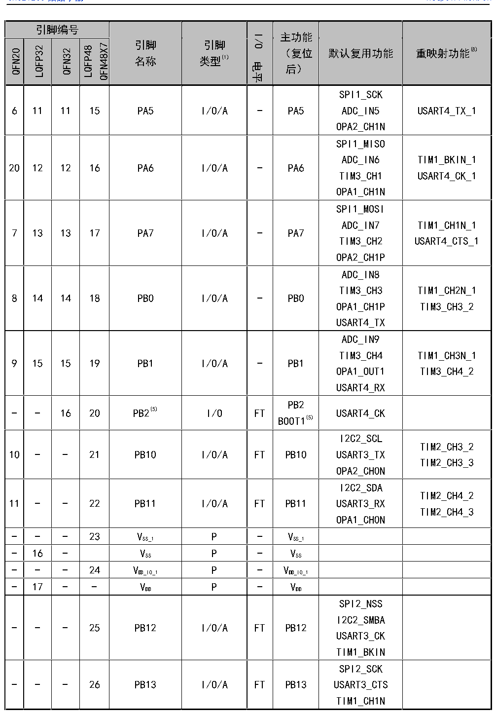

<!-- source-page: 18 -->

[← p.17](0017.md) · [index](../README.md) · [PDF p.18](https://ch32-riscv-ug.github.io/CH32V20x/datasheet_zh/CH32V203DS0.PDF#page=18) · [p.19 →](0019.md)

<!-- header: CH32V203数据手册 https://wch.cn -->

 <!-- p18-cluster-01 uncaptioned graphics, rendered from the PDF; verify at https://ch32-riscv-ug.github.io/CH32V20x/datasheet_zh/CH32V203DS0.PDF#page=18 -->

🖼 Text parsed from the figure above

> ⬆ **Table continued** — rendered in full at [page 17](0017.md). <!-- p18-table-001 -->

<!-- image: p18-draw-image-00001 bbox=[502.8, 779.28, 522.24, 789.6] -->
<!-- footer: V3.0 16 -->
