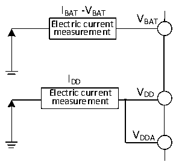

<!-- source-page: 34 -->

[← p.33](0033.md) · [index](../README.md) · [PDF p.34](https://ch32-riscv-ug.github.io/CH32V20x/datasheet_zh/CH32V203DS0.PDF#page=34) · [p.35 →](0035.md)

<!-- header: CH32V203数据手册 https://wch.cn -->

> ⬆ **Table continued** — rendered in full at [page 33](0033.md). <!-- p34-table-001 -->

注：1.常温测试值。  

### 4.3.3 内置的参考电压

<!-- p34-table-002 (table-4-5@1) -->
<table><caption>表4-5 内置参考电压</caption><tr><th>符号</th><th>参数</th><th>条件</th><th>最小值</th><th>典型值</th><th>最大值</th><th>单位</th></tr><tr><td style="text-align:left">VREFINT</td><td>内置参考电压</td><td style="text-align:left">T = 表4-2所示的工作环境A温度范围</td><td>1.17</td><td>1.2</td><td>1.23</td><td>V</td></tr><tr><td style="text-align:left">TS_vrefint</td><td style="text-align:left">当读出内部参考电压时，ADC的采样时间</td><td></td><td>17.1</td><td></td><td></td><td>us</td></tr></table>

### 4.3.4 供电电流特性

电流消耗是多种参数和因素的综合指标，这些参数和因素包括工作电压、环境温度、I/O 引脚的  
负载、产品的软件配置、工作频率、I/O 脚的翻转速率、程序在存储器中的位置以及执行的代码等。  
电流消耗测量方法如下图：  

图4-2 电流消耗测量  
 <!-- rendered from the PDF; verify at https://ch32-riscv-ug.github.io/CH32V20x/datasheet_zh/CH32V203DS0.PDF#page=34 -->

🖼 Text parsed from the figure above

IBAT-VBAT  
V  
Electric current BAT  
measurement  
IDD  
Electric current V DD  
measurement  
VDDA  

微控制器处于下列条件：  
常温VDD= 3.3V情况下，测试时：所有IO端口配置下拉输入，HSE或HSI只开1个，HSE=8M，HSI=8M  
（已校准），FPLCK1=FHCLK/2，FPLCK2=FHCLK，当FHCLK&gt;8MHz时，PLL打开。使能或关闭所有外设时钟的功耗。  

<!-- p34-table-003 (table-4-6-1@1) pages 34-35 -->
<table><caption>表4-6-1 运行模式下典型的电流消耗，数据处理代码从内部闪存中运行（应用V203芯片）</caption><tr><th rowspan="2">符号</th><th rowspan="2">参数</th><th rowspan="2" colspan="2">条件</th><th colspan="2">典型值</th><th rowspan="2">单位</th></tr><tr><td>使能所有外设</td><td>关闭所有外设</td></tr><tr><td rowspan="18" style="text-align:left">I (1) DD</td><td rowspan="18" style="text-align:left">运行模式下的供应电流</td><td rowspan="9">外部时钟</td><td style="text-align:left">F = 144MHz HCLK</td><td>11.8</td><td>7.6</td><td rowspan="18">mA</td></tr><tr><td style="text-align:left">F = 72MHz HCLK</td><td>6.3</td><td>4.2</td></tr><tr><td style="text-align:left">F = 48MHz HCLK</td><td>4.4</td><td>3.0</td></tr><tr><td style="text-align:left">F = 36MHz HCLK</td><td>3.5</td><td>2.5</td></tr><tr><td style="text-align:left">F = 24MHz HCLK</td><td>2.6</td><td>1.9</td></tr><tr><td style="text-align:left">F = 16MHz HCLK</td><td>2.0</td><td>1.5</td></tr><tr><td style="text-align:left">F = 8MHz HCLK</td><td>1.2</td><td>1.0</td></tr><tr><td style="text-align:left">F = 4MHz HCLK</td><td>1.0</td><td>0.8</td></tr><tr><td style="text-align:left">F = 500KHz HCLK</td><td>0.7</td><td>0.7</td></tr><tr><td rowspan="9" style="text-align:left">运行于高速内部RC振荡器（HSI）， 使用 HB 预分频以减低频率</td><td style="text-align:left">F = 144MHz HCLK</td><td>11.4</td><td>7.1</td></tr><tr><td style="text-align:left">F = 72MHz HCLK</td><td>6.0</td><td>3.7</td></tr><tr><td style="text-align:left">F = 48MHz HCLK</td><td>4.1</td><td>2.6</td></tr><tr><td style="text-align:left">F = 36MHz HCLK</td><td>3.2</td><td>2.1</td></tr><tr><td style="text-align:left">F = 24MHz HCLK</td><td>2.3</td><td>1.5</td></tr><tr><td style="text-align:left">F = 16MHz HCLK</td><td>1.6</td><td>1.1</td></tr><tr><td style="text-align:left">F = 8MHz HCLK</td><td>0.9</td><td>0.6</td></tr><tr><td style="text-align:left">F = 4MHz HCLK</td><td>0.6</td><td>0.5</td></tr><tr><td style="text-align:left">F = 500KHz HCLK</td><td>0.3</td><td>0.3</td></tr></table>

<!-- image: p34-draw-image-00001 bbox=[502.8, 786.36, 522.24, 796.68] -->
<!-- footer: V3.0 32 -->
