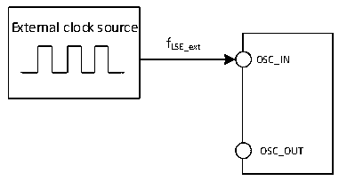

<!-- source-page: 38 -->

[← p.37](0037.md) · [index](../README.md) · [PDF p.38](https://ch32-riscv-ug.github.io/CH32V20x/datasheet_zh/CH32V203DS0.PDF#page=38) · [p.39 →](0039.md)

<!-- header: CH32V203数据手册 https://wch.cn -->

> ⬆ **Table continued** — rendered in full at [page 37](0037.md). <!-- p38-table-001 -->

注：以上为实测参数。  

### 4.3.5 外部时钟源特性

<!-- p38-table-002 (table-4-9@1) -->
<table><caption>表4-9 来自外部高速时钟</caption><tr><th>符号</th><th>参数</th><th>条件</th><th>最小值</th><th>典型值</th><th>最大值</th><th>单位</th></tr><tr><td rowspan="2" style="text-align:left">FHSE_ext</td><td rowspan="2">外部时钟频率</td><td></td><td>3</td><td>8</td><td>25</td><td rowspan="2">MHz</td></tr><tr><td>适用V203RBT6</td><td></td><td>32</td><td></td></tr><tr><td style="text-align:left">V (1) HSEH</td><td>OSC_IN输入引脚高电平电压</td><td></td><td style="text-align:left">0.8VIO</td><td></td><td style="text-align:left">VIO</td><td>V</td></tr><tr><td style="text-align:left">V (1) HSEL</td><td>OSC_IN输入引脚低电平电压</td><td></td><td>0</td><td></td><td style="text-align:left">0.2VIO</td><td>V</td></tr><tr><td style="text-align:left">C in(HSE)</td><td>OSC_IN输入电容</td><td></td><td></td><td>5</td><td></td><td>pF</td></tr><tr><td style="text-align:left">DuCy (HSE)</td><td>占空比</td><td></td><td></td><td>50</td><td></td><td>%</td></tr><tr><td style="text-align:left">IL</td><td>OSC_IN输入漏电流</td><td></td><td></td><td></td><td>±1</td><td>uA</td></tr></table>

注：1.不满足此条件可能会引起电平识别错误。  

图4-3 外部提供高频时钟源电路  
 <!-- rendered from the PDF; verify at https://ch32-riscv-ug.github.io/CH32V20x/datasheet_zh/CH32V203DS0.PDF#page=38 -->

🖼 Text parsed from the figure above

External clock source  
fHSE_ext  
OSC_IN  
OSC_OUT  

<!-- p38-table-003 (table-4-10@1) -->
<table><caption>表4-10 来自外部低速时钟</caption><tr><th>符号</th><th>参数</th><th>条件</th><th>最小值</th><th>典型值</th><th>最大值</th><th>单位</th></tr><tr><td style="text-align:left">FLSE_ext</td><td>用户外部时钟频率</td><td></td><td></td><td>32.768</td><td>1000</td><td>KHz</td></tr><tr><td style="text-align:left">VLSEH</td><td>OSC32_IN输入引脚高电平电压</td><td></td><td style="text-align:left">0.8VDD</td><td></td><td style="text-align:left">VDD</td><td>V</td></tr><tr><td style="text-align:left">VLSEL</td><td>OSC32_IN输入引脚低电平电压</td><td></td><td>0</td><td></td><td style="text-align:left">0.2VDD</td><td>V</td></tr><tr><td style="text-align:left">C in(LSE)</td><td>OSC32_IN输入电容</td><td></td><td></td><td>5</td><td></td><td>pF</td></tr><tr><td style="text-align:left">DuCy (LSE)</td><td>占空比</td><td></td><td></td><td>50</td><td></td><td>%</td></tr><tr><td style="text-align:left">IL</td><td>OSC32_IN输入漏电流</td><td></td><td></td><td></td><td>±1</td><td>uA</td></tr></table>

图4-4 外部提供低频时钟源电路  
 <!-- rendered from the PDF; verify at https://ch32-riscv-ug.github.io/CH32V20x/datasheet_zh/CH32V203DS0.PDF#page=38 -->

🖼 Text parsed from the figure above

External clock source  
fLSE_ext  
OSC_IN  
OSC_OUT  

<!-- p38-table-004 (table-4-11@1) pages 38-39 -->
<table><caption>表4-11 使用一个晶体/陶瓷谐振器产生的高速外部时钟</caption><tr><th>符号</th><th>参数</th><th>条件</th><th>最小值</th><th>典型值</th><th>最大值</th><th>单位</th></tr><tr><td rowspan="2" style="text-align:left">FOSC_IN</td><td rowspan="2">谐振器频率</td><td></td><td>3</td><td>8</td><td>25</td><td rowspan="2">MHz</td></tr><tr><td>适用V203RBT6</td><td></td><td>32(3)</td><td></td></tr><tr><td style="text-align:left">RF</td><td>反馈电阻</td><td></td><td></td><td>250</td><td></td><td>kΩ</td></tr><tr><td>C</td><td style="text-align:left">建议的负载电容与对应晶体串行阻抗RS</td><td style="text-align:left">R=60Ω(1) S</td><td></td><td>20</td><td></td><td>pF</td></tr><tr><td style="text-align:left">I2</td><td>HSE驱动电流</td><td></td><td></td><td>0.53</td><td></td><td>mA</td></tr><tr><td style="text-align:left">g m</td><td>振荡器的跨导</td><td>启动</td><td></td><td>17</td><td></td><td>mA/V</td></tr><tr><td style="text-align:left">t SU(HSE)</td><td>启动时间</td><td style="text-align:left">V 稳定，8M晶体DD</td><td></td><td>2.5（2）</td><td></td><td>ms</td></tr></table>

<!-- image: p38-draw-image-00001 bbox=[502.8, 786.36, 522.24, 796.68] -->
<!-- footer: V3.0 36 -->
