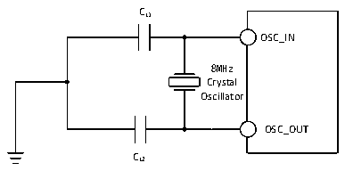
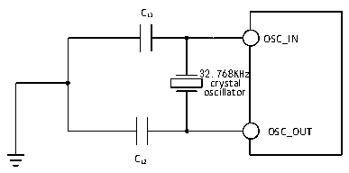

<!-- source-page: 39 -->

[← p.38](0038.md) · [index](../README.md) · [PDF p.39](https://ch32-riscv-ug.github.io/CH32V20x/datasheet_zh/CH32V203DS0.PDF#page=39) · [p.40 →](0040.md)

<!-- header: CH32V203数据手册 https://wch.cn -->

> ⬆ **Table continued** — rendered in full at [page 38](0038.md). <!-- p39-table-001 -->

注：1.建议晶体ESR不超过80欧姆，优先选择ESR较小的晶体，负载电容参考晶体手册要求。  
2.启动时间指从HSEON开启到HSERDY被置位的时间差。  
3.无需外部负载电容。  
电路参考设计及要求：  
晶体的负载电容以晶体厂商建议为准，通常情况CL1=CL2。  
CH32V203RB芯片外接32M晶体，芯片内置了负载电容，外部电路可省。  

图4-5 外接8M晶体典型电路  
 <!-- rendered from the PDF; verify at https://ch32-riscv-ug.github.io/CH32V20x/datasheet_zh/CH32V203DS0.PDF#page=39 -->

🖼 Text parsed from the figure above

CL1  
OSC_IN  
8MHz  
Crystal  
Oscillator  
OSC_OUT  
CL2  

<!-- p39-table-002 (table-4-12@1) -->
<table><caption>表4-12 使用一个晶体/陶瓷谐振器产生的低速外部时钟（fLSE=32.768KHz）</caption><tr><th>符号</th><th>参数</th><th>条件</th><th>最小值</th><th>典型值</th><th>最大值</th><th>单位</th></tr><tr><td style="text-align:left">RF</td><td>反馈电阻</td><td></td><td></td><td>5</td><td></td><td>MΩ</td></tr><tr><td>C</td><td style="text-align:left">建议的负载电容与对应晶体串行阻抗RS</td><td style="text-align:left">R&lt;70kΩS</td><td></td><td></td><td>15</td><td>pF</td></tr><tr><td style="text-align:left">i 2</td><td>LSE驱动电流</td><td style="text-align:left">V = 3.3VDD</td><td></td><td>0.35</td><td></td><td>uA</td></tr><tr><td style="text-align:left">g m</td><td>振荡器的跨导</td><td>启动</td><td></td><td>25.3</td><td></td><td>uA/V</td></tr><tr><td style="text-align:left">t SU(LSE)</td><td>启动时间</td><td style="text-align:left">V 是稳定的DD</td><td></td><td>800</td><td></td><td>mS</td></tr></table>

电路参考设计及要求：  
晶体的负载电容以晶体厂商建议为准，通常情况CL1=CL2，可选12pF左右。  

图4-6 外接32.768K晶体典型电路  
 <!-- rendered from the PDF; verify at https://ch32-riscv-ug.github.io/CH32V20x/datasheet_zh/CH32V203DS0.PDF#page=39 -->

🖼 Text parsed from the figure above

CL1  
OSC_IN  
32.768KHz  
crystal  
oscillator  
OSC_OUT  
CL2  

注：负载电容CL由下式计算：CL= CL1 x CL2/ (CL1+ CL2) + Cstray，其中Cstray 是引脚的电容和PCB板或  
PCB相关的电容，它的典型值是介于2pF至7pF之间。  
<!-- image: p39-draw-image-00001 bbox=[502.8, 786.36, 522.24, 796.68] -->
<!-- footer: V3.0 37 -->
