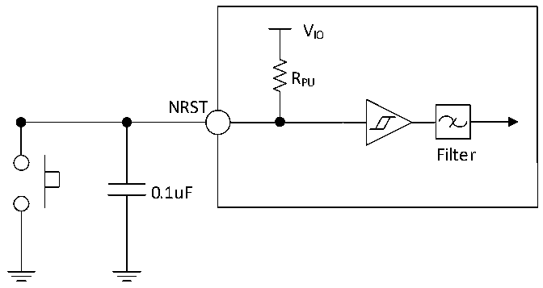

<!-- source-page: 43 -->

[← p.42](0042.md) · [index](../README.md) · [PDF p.43](https://ch32-riscv-ug.github.io/CH32V20x/datasheet_zh/CH32V203DS0.PDF#page=43) · [p.44 →](0044.md)

> ⚠ 7 subscript glyph(s) on this page appear as `*` because the PDF's text layer maps them to `*` (broken ToUnicode); the printed page shows the real subscripts -- read [the PDF, p.43](https://ch32-riscv-ug.github.io/CH32V20x/datasheet_zh/CH32V203DS0.PDF#page=43).

<!-- header: CH32V203数据手册 https://wch.cn -->

> ⬆ **Table continued** — rendered in full at [page 42](0042.md). <!-- p43-table-001 -->

注：1.上表中V*根据具体的引脚可表示为VIO 或VDD。  
2.PC13、PC14和PC15作为GPIO输出脚时只能工作在2MHz以下，最大驱动负载为30pF。  
3.USB接口I/O仅符合MODEx[1:0]=10b或01b项的参数。  

### 4.3.11 NRST引脚特性

<!-- p43-table-002 (table-4-22@1) -->
<table><caption>表4-22 外部复位引脚特性</caption><tr><th>符号</th><th>参数</th><th>条件</th><th>最小值</th><th>典型值</th><th>最大值</th><th>单位</th></tr><tr><td style="text-align:left">VIL(NRST)</td><td>NRST输入低电平电压</td><td></td><td>-0.3</td><td></td><td style="text-align:left">0.28*(V -1.8)+0.6IO</td><td>V</td></tr><tr><td style="text-align:left">VIH(NRST)</td><td>NRST输入高电平电压</td><td></td><td style="text-align:left">0.41*(V -1.8)+1.3IO</td><td></td><td style="text-align:left">V +0.3IO</td><td>V</td></tr><tr><td style="text-align:left">V hys(NRST)</td><td style="text-align:left">NRST施密特触发器电压迟滞</td><td></td><td>150</td><td></td><td></td><td>mV</td></tr><tr><td style="text-align:left">R (1) PU</td><td>弱上拉等效电阻</td><td></td><td>30</td><td>40</td><td>50</td><td>kΩ</td></tr><tr><td style="text-align:left">VF(NRST)</td><td>NRST输入可被滤波脉宽</td><td></td><td></td><td></td><td>100</td><td>ns</td></tr><tr><td style="text-align:left">VNF(NRST)</td><td>NRST输入无法滤波脉宽</td><td></td><td>300</td><td></td><td></td><td>ns</td></tr></table>

注：1.上拉电阻是一个真正的电阻串联一个可开关的PMOS实现。这个PMOS/NMOS开关的电阻很小(约  
占10%)。  
电路参考设计及要求：  

图4-7 外部复位引脚典型电路  
 <!-- rendered from the PDF; verify at https://ch32-riscv-ug.github.io/CH32V20x/datasheet_zh/CH32V203DS0.PDF#page=43 -->

🖼 Text parsed from the figure above

VIO  
RPU  
NRST  
Filter  
0.1uF  

### 4.3.12 TIM定时器特性

<!-- p43-table-004 (table-4-23-1@1) pages 43-44 -->
<table><caption>表4-23-1 TIM1/2/3/4特性</caption><tr><th>符号</th><th>参数</th><th>条件</th><th>最小值</th><th>最大值</th><th>单位</th></tr><tr><td rowspan="2" style="text-align:left">t res(TIM)</td><td rowspan="2">定时器基准时钟</td><td></td><td>1</td><td></td><td style="text-align:left">t TIMxCLK</td></tr><tr><td style="text-align:left">f = 72MHz TIMxCLK</td><td>13.9</td><td></td><td>ns</td></tr><tr><td rowspan="2" style="text-align:left">FEXT</td><td rowspan="2">CH1至CH4的定时器外部时钟频率</td><td></td><td>0</td><td style="text-align:left">f /2TIMxCLK</td><td>MHz</td></tr><tr><td style="text-align:left">f = 72MHz TIMxCLK</td><td>0</td><td>36</td><td>MHz</td></tr><tr><td style="text-align:left">R esTIM</td><td>定时器分辨率</td><td></td><td></td><td>16</td><td>位</td></tr><tr><td rowspan="2" style="text-align:left">t COUNTER</td><td rowspan="2" style="text-align:left">当选择了内部时钟时，16 位计数器时钟周期</td><td></td><td>1</td><td>65536</td><td style="text-align:left">t TIMxCLK</td></tr><tr><td style="text-align:left">f = 72MHz TIMxCLK</td><td>0.0139</td><td>910</td><td>us</td></tr><tr><td rowspan="2" style="text-align:left">t MAX_COUNT</td><td rowspan="2">最大可能的计数</td><td></td><td></td><td>65536</td><td style="text-align:left">t TIMxCLK</td></tr><tr><td style="text-align:left">f = 72MHz TIMxCLK</td><td></td><td>59.6</td><td>s</td></tr></table>

<!-- image: p43-draw-image-00001 bbox=[502.8, 786.36, 522.24, 796.68] -->
<!-- footer: V3.0 41 -->
