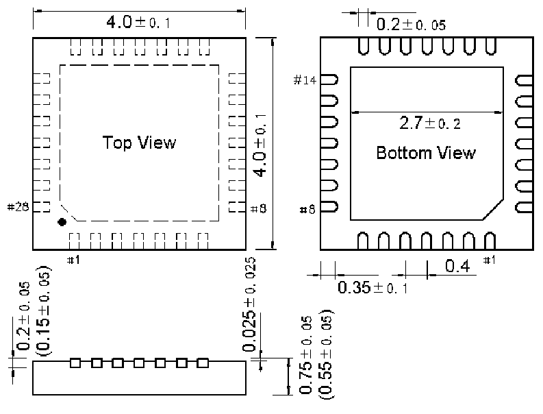
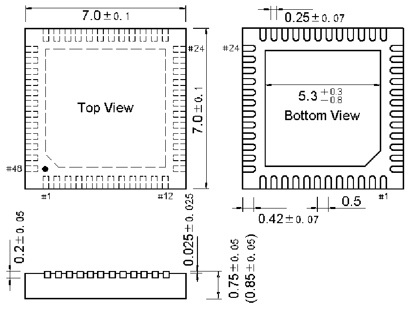

<!-- source-page: 52 -->

[← p.51](0051.md) · [index](../README.md) · [PDF p.52](https://ch32-riscv-ug.github.io/CH32V20x/datasheet_zh/CH32V203DS0.PDF#page=52) · [p.53 →](0053.md)

<!-- header: CH32V203数据手册 https://wch.cn -->

## 5.3 QFN28封装

 <!-- p52-draw-image-00002 rendered from the PDF -->

## 5.4 QFN48X7封装

 <!-- p52-draw-image-00003 rendered from the PDF -->

<!-- image: p52-draw-image-00001 bbox=[502.8, 779.28, 522.24, 789.6] -->
<!-- footer: V3.0 50 -->
