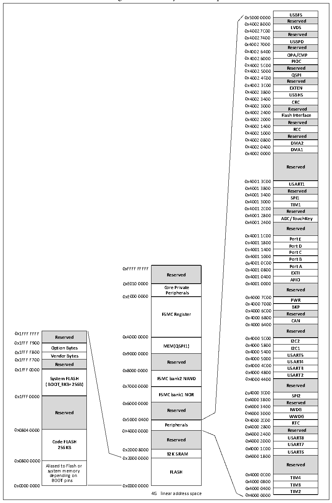

<!-- source-page: 7 -->

[← p.6](0006.md) · [index](../README.md) · [PDF p.7](https://ch32-riscv-ug.github.io/CH32V205/datasheet_en/CH32V205DS0.PDF#page=7) · [p.8 →](0008.md)

<!-- header: CH32V205/V203 Datasheet https://wch-ic.com -->

## 1.2 Memory Map

Figure 1-2 Memory address map  
 <!-- rendered from the PDF; verify at https://ch32-riscv-ug.github.io/CH32V205/datasheet_en/CH32V205DS0.PDF#page=7 -->

🖼 Text parsed from the figure above

USBFS  Reserved  LVDS  Reserved  USBPD  Reserved  OPA/CMP  PIOC  Reserved  QSPI  Reserved  EXTEN  USBHS  CRC  ReCsReCrved  Flash Interface  Reserved  RCC  Reserved  DMA2  DMA1  Reserved  USART1  Reserved  SPI1  TIM1  Reserved  ADC/TouchKey  Reserved  Port E  Port D  Port C  Port B  Port A  EXTI  AFIO  Reserved  PWR  BKP  Reserved  CAN  Reserved  I2C2  I2C2I2C1  USART5  USART4  USART3  USART3USART2  Reserved  SPI2  Reserved  IWDG  WWDG  RTC  Reserved  USART8  USART7  USART6  Reserved  TIM4  TIM3  TIM3TIM2  
0x5000 0000  
0x4002 8000  
0x4002 7C00  
0x4002 7400  
0x4002 7000  
0x4002 6400  
0x4002 6000  
0x4002 5C00  
0x4002 5000  
0x4002 4C00  
0x4002 3C00  
0x4002 3800  
0x4002 3400  
0x4002 3000  
0x4002 2400  
0x4002 2000  
0x4002 1400  
0x4002 1000  
0x4002 0800  
0x4002 0400  
0x4002 0000  
0x4001 3C00  
0x4001 3800  
0x4001 3400  
0x4001 3000  
0x4001 2C00  
0x4001 2800  
0x4001 2400  
0x4001 1C00  
0x4001 1800  
0x4001 1400  
0x4001 1000  
0x4001 0C00  
Reserved  Core Private Peripherals  FSMC Register  MEM(QSPI1)  Reserved  FSMC bank2 NAND  FSMC bank1 NOR  Reserved  Peripherals  Reserved  32K SRAM  FLASH  
Reserved 0x4001 0400 EXTI  
0x4000 7000  
0x4000 6C00  
<strong>FSMC Register Reserved</strong>  
0x4000 6800  
0x4000 6400  
Reserved  Option Bytes  Vendor Bytes  Reserved  System FLASH (BOOT_3KB+256B)  Reserved  Code FLASH256KB  Aliased to Flash or system memory depending on BOOT pins  
0x1FFF FFFF  
0x4000 3800  
0x6000 0000 Reserved  
0x4000 3400  
<strong>Peripherals 0x4000 2800 RTC</strong>  
0x4000 2400  
0x0800 0000  
system memory FLASH  
0x4000 0400  
4G linear address space 0x4000 0000 TIM2  

<!-- image: p7-draw-image-00001 bbox=[509.28, 782.04, 531.0, 793.8] -->
<!-- footer: V1.3 4 -->
