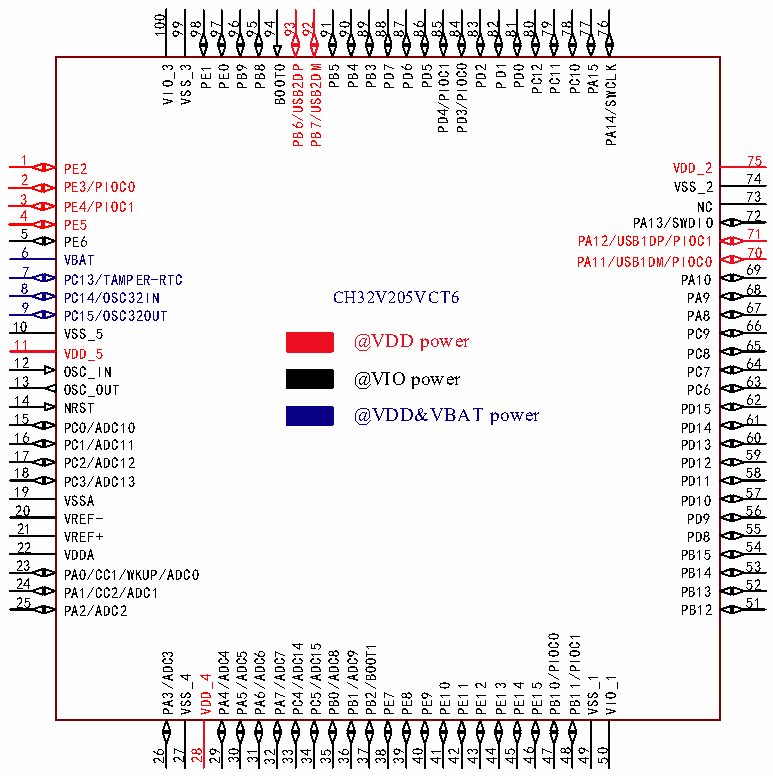

<!-- source-page: 19 -->

[← p.18](0018.md) · [index](../README.md) · [PDF p.19](https://ch32-riscv-ug.github.io/CH32V205/datasheet_en/CH32V205DS0.PDF#page=19) · [p.20 →](0020.md)

<!-- header: CH32V205/V203 Datasheet https://wch-ic.com -->

 <!-- p19-cluster-01 uncaptioned graphics, rendered from the PDF; verify at https://ch32-riscv-ug.github.io/CH32V205/datasheet_en/CH32V205DS0.PDF#page=19 -->

🖼 Text parsed from the figure above

100  
99  
98  
97  
96  
95  
94  
91  
90  
89  
88  
87  
86  
85  
84  
83  
82  
81  
80  
79  
78  
77  
76  
93  
92  
PD1  
PC11  
PB7/USB2DM /PIOC1 /PIOC0  
VIO_3  
VSS_3  
PE0  
PB9  
PB8  
BOOT0  
PB5  
PD0  
PC12  
PC10  
PA15  
PA14/SWCLK  
PB4  
PB3  
PD7  
PD6  
PD5  
PD2  
PB6/USB2DP  
PE1  
PD4  
PD3  
1  
75  
VDD_2  
PE2  
74  
2  
PE3/PIOC0  
VSS_2  
73  
3  
PE4/PIOC1  
NC  
4  
72  
PA13/SWDIO  
PE5  
5  
71  
PA12/USB1DP/PIOC1  
PE6  
70  
6  
VBAT  
PA11/USB1DM/PIOC0  
69  
7  
PC13/TAMPER-RTC  
PA10  
8  
68  
CH32V205VCT6  
PC14/OSC32IN  
PA9  
9  
67  
PC15/OSC32OUT  
PA8  
66  
10  
VSS_5 11  
@VDD power PC9 65  
VDD_5  
PC8  
12  
64  
OSC_IN 13  
@VIO power PC7 63  
OSC_OUT  
PC6  
62  
14  
NRST 15  
PD15 61  
@VDD&amp;VBAT power  
PC0/ADC10  
PD14  
60  
16  
PC1/ADC11  
PD13  
59  
17  
PC2/ADC12  
PD12  
18  
58  
PD11  
PC3/ADC13  
19  
57  
VSSA  
PD10  
20  
56  
VREF-  
PD9  
21  
55  
VREF+  
PD8  
54  
22  
PB15  
VDDA  
23 PA0/CC1/WKUP/ADC0  
PB14 53  
24  
52  
PB13  
PA1/CC2/ADC1  
25  
51  
PB12  
PA2/ADC2  
/PIOC0 /PIOC1  
PC4/ADC14  
PC5/ADC15  
PB2/BOOT1  
PB1/ADC9  
PB0/ADC8  
PA3/ADC3  
PA4/ADC4  
PA5/ADC5  
PA6/ADC6  
PA7/ADC7  
VSS_4  
VDD_4  
VSS_1  
VIO_1  
PE10  
PE11  
PE12  
PE13  
PE14  
PE15  
PB10  
PB11  
PE7  
PE8  
PE9  
49  
48  
46  
50  
30  
27 28  
31  
41  
42  
44  
47  
29  
37  
39  
40  
43  
45  
38  
26  
32  
34  
35  
36  
33  

<!-- image: p19-draw-image-00001 bbox=[513.84, 782.04, 535.56, 793.8] -->
<!-- footer: V1.3 16 -->
