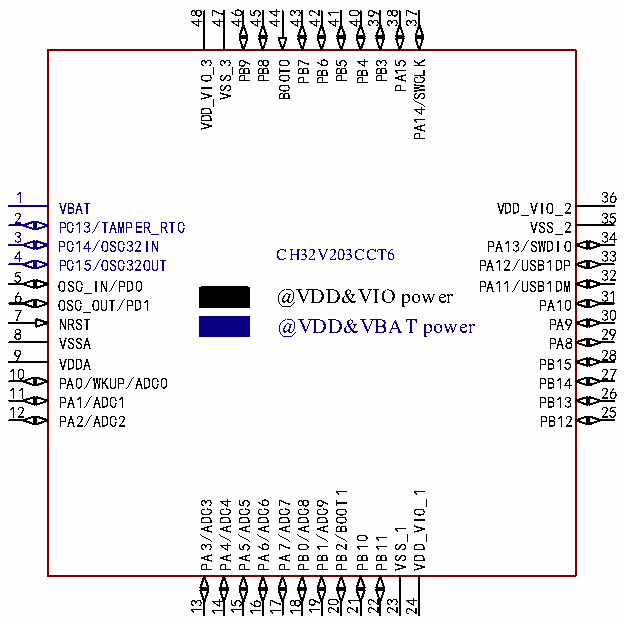

<!-- source-page: 20 -->

[← p.19](0019.md) · [index](../README.md) · [PDF p.20](https://ch32-riscv-ug.github.io/CH32V205/datasheet_en/CH32V205DS0.PDF#page=20) · [p.21 →](0021.md)

<!-- header: CH32V205/V203 Datasheet https://wch-ic.com -->

### 2.1.2 CH32V203 Pinouts

 <!-- p20-cluster-01 uncaptioned graphics, rendered from the PDF; verify at https://ch32-riscv-ug.github.io/CH32V205/datasheet_en/CH32V205DS0.PDF#page=20 -->

🖼 Text parsed from the figure above

48  
47  
46  
45  
44  
43  
42  
41  
40  
39  
38  
37  
VDD_VIO_3  
VSS_3  
PB9  
PB8  
BOOT0  
PB7  
PB6  
PB5  
PB4  
PB3  
PA15  
PA14/SWCLK  
1  
36  
VBAT  
VDD_VIO_2  
2  
35  
PC13/TAMPER_RTC  
VSS_2  
3  
34  
PC14/OSC32IN  
PA13/SWDIO  
CH32V203CCT6  
4  
33  
PC15/OSC32OUT  
PA12/USB1DP  
32  
5  
OSC_IN/PD0  
PA11/USB1DM  
@VDD&amp;VIO power  
31  
6  
OSC_OUT/PD1  
PA10  
7  
30  
NRST  
PA9  
@VDD&amp;VBAT power  
8  
29  
VSSA  
PA8  
9  
28  
VDDA  
PB15  
10  
27  
PA0/WKUP/ADC0  
PB14  
11  
26  
PA1/ADC1  
PB13  
12  
25  
PA2/ADC2  
PB12  
PB2/BOOT1  
VDD_VIO_1  
PA3/ADC3  
PA4/ADC4  
PA5/ADC5  
PA6/ADC6  
PA7/ADC7  
PB0/ADC8  
PB1/ADC9  
VSS_1  
PB10  
PB11  
21  
23  
22  
19  
20  
24  
13  
14  
15  
17  
18  
16  

Note: Multiplexed functions are abbreviated in the pin diagram.  
Example:  
ADC: (ADC0: ADC_IN0)  
USB2DP: USBHS_DP  
USB2DN: USBHS_DN  
<!-- image: p20-draw-image-00001 bbox=[513.84, 782.04, 535.56, 793.8] -->
<!-- footer: V1.3 17 -->
