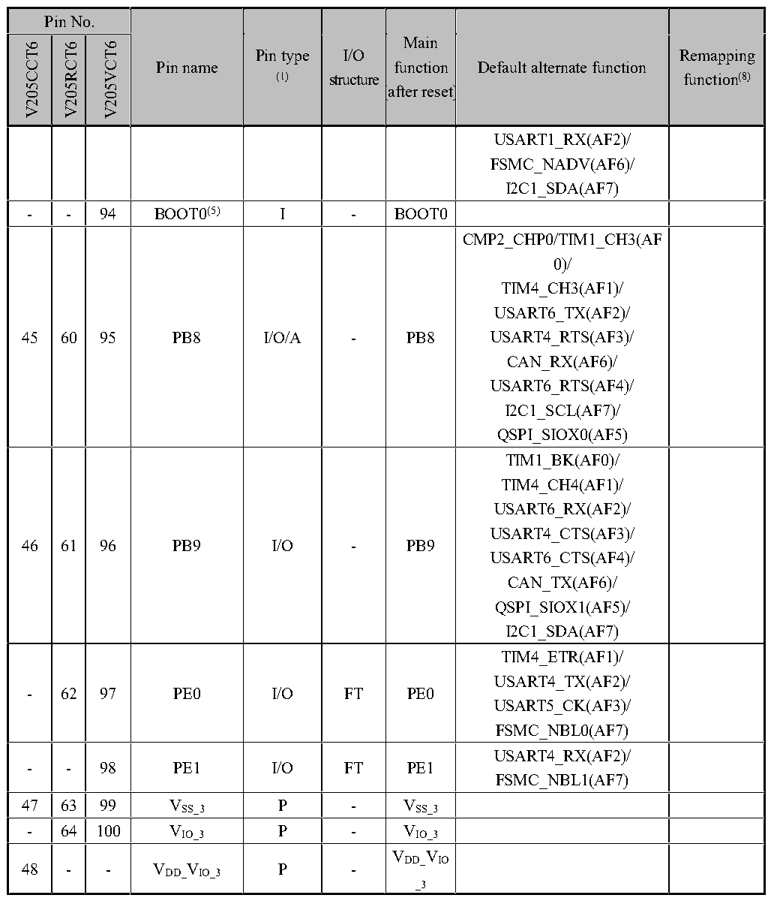

<!-- source-page: 29 -->

[← p.28](0028.md) · [index](../README.md) · [PDF p.29](https://ch32-riscv-ug.github.io/CH32V205/datasheet_en/CH32V205DS0.PDF#page=29) · [p.30 →](0030.md)

<!-- header: CH32V205/V203 Datasheet https://wch-ic.com -->

 <!-- p29-cluster-01 uncaptioned graphics, rendered from the PDF; verify at https://ch32-riscv-ug.github.io/CH32V205/datasheet_en/CH32V205DS0.PDF#page=29 -->

🖼 Text parsed from the figure above

> ⬆ **Table continued** — rendered in full at [page 21](0021.md). <!-- p29-table-001 -->

VDD_IO V  

<em>Note 1: Abbreviations in the table</em>  
<em>I = TTL/CMOS Schmitt input; O = CMOS tri-state output;</em>  
<em>A = analog signal input or output; P = power; FT = 5V tolerance;</em>  
<em>Note 2: I/O pins connect to on-board peripherals/modules via a multiplexer, which permits only one</em>  
<em>peripheral&#x27;s application function (AF) to be connected to an I/O pin at a time. This multiplexer utilizes up to</em>  
<em>8 multiplex function inputs (AF0 to AF7), configurable via the GPIOx_AFLR and GPIOx_AFHR registers:</em>  
<em>After reset, the multiplexer defaults to selecting multiplex function 0 (AF0). For further details, refer to the</em>  
<em>Multiplexed I/O section in the CH32V205RM.</em>  
<!-- image: p29-draw-image-00001 bbox=[513.84, 782.04, 535.56, 793.8] -->
<!-- footer: V1.3 26 -->
