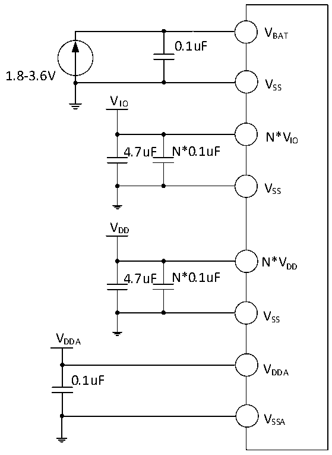

<!-- source-page: 44 -->

[← p.43](0043.md) · [index](../README.md) · [PDF p.44](https://ch32-riscv-ug.github.io/CH32V205/datasheet_en/CH32V205DS0.PDF#page=44) · [p.45 →](0045.md)

<!-- header: CH32V205/V203 Datasheet http://wch-ic.com -->

# Chapter 3 Electrical Characteristics

## 3.1 Test Conditions

Unless otherwise specified and marked, all voltages are referenced to VSS.  
All minimum and maximum values are guaranteed in the worst conditions of ambient temperature, supply voltage  
and clock frequency.  
The typical values for the CH32V205 are provided for design guidance based on an ambient temperature of 25°C  
and an operating environment where VDD= VDDA= VIO= 3.3V.  
The typical values for the CH32V203 are provided for design guidance based on an ambient temperature of 25°C  
and an operating environment where VDD_IO V = VDDA= 3.3V.  
The data based on comprehensive evaluation, design simulation or technology characteristics are not tested in  
production. On the basis of comprehensive evaluation, the minimum and maximum values refer to sample tests.  
Unless otherwise specified that is tested, the characteristic parameters are guaranteed by comprehensive evaluation  
or design.  
Power supply scheme:  

Figure 3-1-1 CH32V205 standard power supply typical circuit  
 <!-- rendered from the PDF; verify at https://ch32-riscv-ug.github.io/CH32V205/datasheet_en/CH32V205DS0.PDF#page=44 -->

🖼 Text parsed from the figure above

VBAT  
0.1uF  
1.8-3.6V  
VSS  
VIO  
N*VIO  
4.7uF N*0.1uF  
VSS  
VDD  
N*VDD  
4.7uF N*0.1uF  
VSS  
VDDA  
VDDA  
0.1uF  
VSSA  

<em>Note:</em>  
<!-- image: p44-draw-image-00001 bbox=[518.4, 783.36, 537.84, 793.92] -->
<!-- footer: V1.3 41 -->
