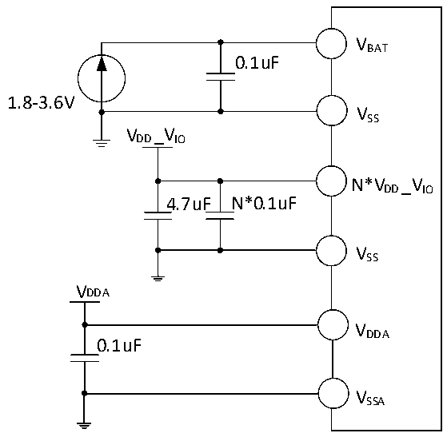

<!-- source-page: 45 -->

[← p.44](0044.md) · [index](../README.md) · [PDF p.45](https://ch32-riscv-ug.github.io/CH32V205/datasheet_en/CH32V205DS0.PDF#page=45) · [p.46 →](0046.md)

<!-- header: CH32V205/V203 Datasheet http://wch-ic.com -->
<em>In certain chip packages, VDD and VIO may have multiple pins. Power pins with the same designation must be</em>  
<em>shorted.</em>  
<em>Each VDD pin should be externally connected to a 0.1uF decoupling capacitor. It is recommended to add a</em>  
<em>4.7uF decoupling capacitor in parallel across the entire VDD power supply.</em>  
<em>Each VIO pin should be externally connected to a 0.1uF decoupling capacitor. It is recommended to add a</em>  
<em>4.7uF decoupling capacitor in parallel across the entire VIO power supply.</em>  

Figure 3-1-2 CH32V203 standard power supply typical circuit  
 <!-- rendered from the PDF; verify at https://ch32-riscv-ug.github.io/CH32V205/datasheet_en/CH32V205DS0.PDF#page=45 -->

🖼 Text parsed from the figure above

VBAT  
0.1uF  
1.8-3.6V  
VSS  
VDD_VIO  
N*VDD_VIO  
4.7uF N*0.1uF  
VSS  
VDDA  
VDDA  
0.1uF  
VSSA  

<em>Note:</em>  
<em>In certain chip packages, VDD_IO V may have multiple pins. All pins sharing this designation must be shorted</em>  
<em>together.</em>  
<em>Each VDD_IO V pin requires an external 0.1uF decoupling capacitor. Additionally, a 4.7uF decoupling</em>  
<em>capacitor should be connected in parallel across the entire VDD_IO V power supply.</em>  

## 3.2 Absolute Maximum Ratings

Stresses at or above the absolute maximum ratings listed in the table below may cause permanent damage to  
the device.  

<!-- p45-table-001 (table-3-1@1) -->
<table><caption>Table 3-1 Absolute maximum ratings</caption><tr><th>Symbol</th><th>Description</th><th>Min.</th><th>Max.</th><th>Unit</th></tr><tr><td style="text-align:left">TA</td><td>Ambient temperature during operation</td><td>-40</td><td>85</td><td>℃</td></tr><tr><td style="text-align:left">TS</td><td>Ambient temperature during storage</td><td>-40</td><td>125</td><td>℃</td></tr><tr><td style="text-align:left">V -V DD SS</td><td style="text-align:left">External main supply voltage (including V , V V DDA DD, BAT V , V ) REF+ IO</td><td>-0.3</td><td>4.0</td><td>V</td></tr><tr><td rowspan="2" style="text-align:left">VIN</td><td style="text-align:left">Input voltage on the FT (5V tolerance) pin</td><td style="text-align:left">V -0.3SS</td><td>5.5</td><td>V</td></tr><tr><td>Input voltage on other pins</td><td style="text-align:left">V -0.3SS</td><td style="text-align:left">V +0.3DD</td><td>V</td></tr><tr><td style="text-align:left">| V | DD_x</td><td style="text-align:left">Variations between different main power supply pins</td><td></td><td>20</td><td>mV</td></tr></table>

△  
<!-- image: p45-draw-image-00001 bbox=[518.4, 783.36, 537.84, 793.92] -->
<!-- footer: V1.3 42 -->
