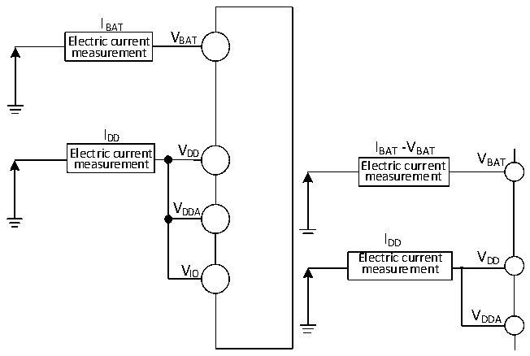
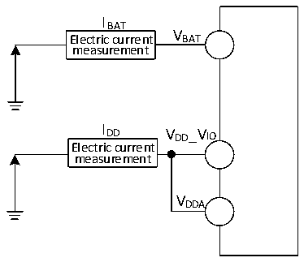

<!-- source-page: 48 -->

[← p.47](0047.md) · [index](../README.md) · [PDF p.48](https://ch32-riscv-ug.github.io/CH32V205/datasheet_en/CH32V205DS0.PDF#page=48) · [p.49 →](0049.md)

<!-- header: CH32V205/V203 Datasheet http://wch-ic.com -->

Figure 3-2-1 CH32V205 Current consumption measurement  
 <!-- rendered from the PDF; verify at https://ch32-riscv-ug.github.io/CH32V205/datasheet_en/CH32V205DS0.PDF#page=48 -->

🖼 Text parsed from the figure above

IBAT  
Electric current V BAT  
measurement  
IDD  
Electric current V DD I BAT -V BAT V  
measurement Electric current BAT  
measurement  
VDDA  
IDD  
Electric current V DD  
V measurement  
IO  
VDDA  

CH32V205 is in the following conditions:  
At normal temperature with VDD= VDDA= VIO= 3.3V, during testing: All I/O pins are configured as  
pull-down inputs, operating at the high-speed internal RC oscillator HSI (HSI = 8M). FPLCK1= FHCLK/2 and  
FPLCK2= FHCLK. Power consumption when enabling or disabling all peripheral clocks.  
<em>Note: For pins that are not packaged in small package models or are packaged but unused, it is</em>  
<em>recommended to configure them as pull-up inputs or pull-down inputs. Failure to do so may affect current</em>  
<em>specifications. For specific procedures, please refer to the EVT low-power example code.</em>  

Figure 3-2-2 CH32V203 Current consumption measurement  
 <!-- rendered from the PDF; verify at https://ch32-riscv-ug.github.io/CH32V205/datasheet_en/CH32V205DS0.PDF#page=48 -->

🖼 Text parsed from the figure above

IBAT  
Electric current VBAT  
measurement  
IDD V  
_VIO  
DD  
Electric current  
measurement  
VDDA  

CH32V203 is in the following conditions:  
At normal temperature with VDD_IO V = VDDA= 3.3V, during testing: All I/O pins are configured as pull-down  
inputs, operating at the high-speed internal RC oscillator HSI (HSI = 8M). FPLCK1= FHCLK/2 and FPLCK2=  
FHCLK. Power consumption when enabling or disabling all peripheral clocks.  

<!-- p48-table-001 (table-3-6@1) pages 48-49 -->
<table><caption>Table 3-6 The data processing code is run from FLASH, LDOTRIM[1:0]=10b (default value) and LDO_EC=0</caption><tr><th rowspan="2">Symbol</th><th rowspan="2">Parameter</th><th colspan="3">Condition</th><th colspan="2">Typ.</th><th rowspan="2">Unit</th></tr><tr><td>HSILP</td><td>PLLON</td><td style="text-align:left">FHCLK</td><td>All peripherals</td><td>All peripherals</td></tr><tr><td></td><td></td><td></td><td></td><td></td><td>enabled</td><td>disabled</td><td></td></tr><tr><td rowspan="10" style="text-align:left">I (1) DD</td><td rowspan="5" style="text-align:left">Supply current in Run mode</td><td>0</td><td>1</td><td>192MHz</td><td>21.4</td><td>12.6</td><td rowspan="5">mA</td></tr><tr><td>0</td><td>1</td><td>160MHz</td><td>19.8</td><td>11.1</td></tr><tr><td>0</td><td>1</td><td>96MHz</td><td>11.5</td><td>7.1</td></tr><tr><td>0</td><td>0</td><td>8MHz</td><td>2.1</td><td>1.7</td></tr><tr><td>1</td><td>0</td><td>1MHz</td><td>1.3</td><td>1.2</td></tr><tr><td rowspan="5" style="text-align:left">Supply current in Sleep mode(At this time, peripheral power supply and clock hold are maintained)</td><td>0</td><td>1</td><td>192MHz</td><td>13.8</td><td>5.1</td><td rowspan="5">mA</td></tr><tr><td>0</td><td>1</td><td>160MHz</td><td>13.4</td><td>4.6</td></tr><tr><td>0</td><td>1</td><td>96MHz</td><td>7.7</td><td>3.3</td></tr><tr><td>0</td><td>0</td><td>8MHz</td><td>1.9</td><td>1.5</td></tr><tr><td>1</td><td>0</td><td>1MHz</td><td>1.2</td><td>1.1</td></tr></table>

<!-- image: p48-draw-image-00001 bbox=[518.4, 783.36, 537.84, 793.92] -->
<!-- footer: V1.3 45 -->
