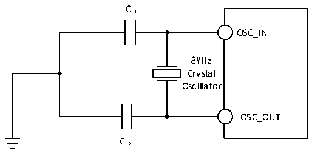

<!-- source-page: 52 -->

[← p.51](0051.md) · [index](../README.md) · [PDF p.52](https://ch32-riscv-ug.github.io/CH32V205/datasheet_en/CH32V205DS0.PDF#page=52) · [p.53 →](0053.md)

<!-- header: CH32V205/V203 Datasheet http://wch-ic.com -->

<!-- p52-table-001 (table-3-11@1) -->
<table><caption>Table 3-11 High-speed external clock generated from a crystal/ceramic resonator</caption><tr><th>Symbol</th><th>Parameter</th><th>Condition</th><th>Min.</th><th>Typ.</th><th>Max.</th><th>Unit</th></tr><tr><td style="text-align:left">FOSC_IN</td><td>Resonator frequency</td><td></td><td>3</td><td>8</td><td>25</td><td>MHz</td></tr><tr><td style="text-align:left">RF</td><td>Feedback resistance</td><td></td><td></td><td>250</td><td></td><td>kΩ</td></tr><tr><td>C</td><td style="text-align:left">Recommended load capacitance and corresponding crystal series impedance RS</td><td style="text-align:left">R =60Ω(1) S</td><td></td><td>20</td><td></td><td>pF</td></tr><tr><td rowspan="2" style="text-align:left">I2</td><td rowspan="2">HSE drive current</td><td style="text-align:left">V = 3.3V, 20p load DD</td><td></td><td>1</td><td></td><td>mA</td></tr><tr><td style="text-align:left">Low power mode, V = DD 3.3V, 20p load</td><td></td><td>0.55</td><td></td><td></td></tr><tr><td style="text-align:left">g m</td><td>Oscillator transconductance</td><td>Startup</td><td></td><td>21</td><td></td><td>mA/V</td></tr><tr><td style="text-align:left">t SU(HSE)</td><td>Startup time(2)</td><td style="text-align:left">V is stable DD</td><td></td><td>1.5</td><td>4.5</td><td>ms</td></tr></table>

<em>Note 1: It is recommended that the crystal&#x27;s ESR does not exceed 80Ω. Prioritize crystals with lower ESR</em>  
<em>values. Refer to the crystal manual for load capacitance requirements.</em>  
<em>2. Start time refers to the time difference from HSEON being activated until HSERDY is set.</em>  
Circuit reference design and requirements:  
The load capacitance of the crystal is subject to the recommendation of the crystal manufacturer, generally  
CL1=CL2.  

Figure 3-5 Typical circuit of external 8M crystal  
 <!-- rendered from the PDF; verify at https://ch32-riscv-ug.github.io/CH32V205/datasheet_en/CH32V205DS0.PDF#page=52 -->

🖼 Text parsed from the figure above

CL1  
OSC_IN  
8MHz  
Crystal  
Oscillator  
OSC_OUT  
CL2  

(fLSE=32.768KHz)  

<!-- p52-table-002 (table-3-12@1) -->
<table><caption>Table 3-12 Low-speed external clock generated by generated from a crystal/ceramic resonator</caption><tr><th>Symbol</th><th>Parameter</th><th>Condition</th><th>Min.</th><th>Typ.</th><th>Max.</th><th>Unit</th></tr><tr><td style="text-align:left">RF</td><td>Feedback resistance</td><td></td><td></td><td>5</td><td></td><td>MΩ</td></tr><tr><td>C</td><td style="text-align:left">Recommended load capacitance and corresponding crystal serial impedance RS</td><td style="text-align:left">R =70kΩS</td><td></td><td></td><td>15</td><td>pF</td></tr><tr><td style="text-align:left">i 2</td><td>LSE drive current</td><td style="text-align:left">V = 3.3VDD</td><td></td><td>0.36</td><td></td><td>uA</td></tr><tr><td style="text-align:left">g m</td><td>Oscillator transconductance</td><td>Startup</td><td></td><td>26</td><td></td><td>uA/V</td></tr><tr><td style="text-align:left">t SU(LSE)</td><td>Startup time</td><td style="text-align:left">V is stable DD</td><td></td><td>1000</td><td></td><td>mS</td></tr></table>

<em>Note 1: The startup time refers to the time difference between the moment LSEON is activated and the</em>  
<em>moment LSERDY is set.</em>  
Circuit reference design and requirements:  
The load capacitance of the crystal is subject to the recommendation of the crystal manufacturer, usually  
<!-- image: p52-draw-image-00001 bbox=[518.4, 783.36, 537.84, 793.92] -->
<!-- footer: V1.3 49 -->
