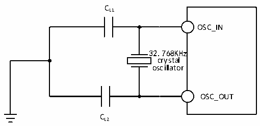

<!-- source-page: 53 -->

[← p.52](0052.md) · [index](../README.md) · [PDF p.53](https://ch32-riscv-ug.github.io/CH32V205/datasheet_en/CH32V205DS0.PDF#page=53) · [p.54 →](0054.md)

<!-- header: CH32V205/V203 Datasheet http://wch-ic.com -->
CL1=CL2, which is about 12pF.  

Figure 3-6 Typical circuit of external 32.768K crystal  
 <!-- rendered from the PDF; verify at https://ch32-riscv-ug.github.io/CH32V205/datasheet_en/CH32V205DS0.PDF#page=53 -->

🖼 Text parsed from the figure above

CL1  
OSC_IN  
32.768KHz  
crystal  
oscillator  
OSC_OUT  
CL2  

<em>Note: The load capacitance CL is calculated by the following formula: CL= CL1× CL2/ (CL1+ CL2) + Cstray.</em>  
<em>Cstray is the capacitance of the pin and the PCB board or PCB-related capacitance. Its typical value is</em>  
<em>between 2pF and 7pF.</em>  

### 3.3.6 Internal Clock Source Characteristics

<!-- p53-table-001 (table-3-13@1) -->
<table><caption>Table 3-13 Internal high-speed (HSI) RC oscillator characteristics</caption><tr><th>Symbol</th><th>Parameter</th><th>Condition</th><th>Min.</th><th>Typ.</th><th>Max.</th><th>Unit</th></tr><tr><td rowspan="2" style="text-align:left">FHSI</td><td rowspan="2">Frequency (after calibration)</td><td></td><td></td><td>8</td><td></td><td>MHz</td></tr><tr><td>Low power mode</td><td></td><td>1</td><td></td><td>MHz</td></tr><tr><td style="text-align:left">DuCy HSI</td><td>Duty cycle</td><td></td><td>45</td><td>50</td><td>55</td><td>%</td></tr><tr><td rowspan="3" style="text-align:left">ACCHSI</td><td rowspan="3" style="text-align:left">Accuracy of HSI oscillator (after calibration)</td><td style="text-align:left">T = 0℃~70℃ A</td><td>-0.7</td><td></td><td>0.7</td><td>%</td></tr><tr><td style="text-align:left">T = -40℃~85℃ A</td><td>-1</td><td></td><td>1</td><td>%</td></tr><tr><td>Low-power mode</td><td>-5</td><td></td><td>5</td><td>%</td></tr><tr><td style="text-align:left">t SU(HSI)</td><td style="text-align:left">HSI oscillator startup stabilization time</td><td></td><td></td><td></td><td>8</td><td>us</td></tr><tr><td rowspan="2" style="text-align:left">IDD(HSI)</td><td rowspan="2">HSI oscillator power consumption</td><td></td><td></td><td>200</td><td></td><td>uA</td></tr><tr><td>Low power mode</td><td></td><td>24</td><td></td><td>uA</td></tr></table>

<!-- p53-table-002 (table-3-14@1) -->
<table><caption>Table 3-14 Internal low-speed (LSI) RC oscillator characteristics</caption><tr><th>Symbol</th><th>Parameter</th><th>Condition</th><th>Min.</th><th>Typ.</th><th>Max.</th><th>Unit</th></tr><tr><td style="text-align:left">FLSI</td><td>Frequency</td><td></td><td>30</td><td>40</td><td>50</td><td>KHz</td></tr><tr><td style="text-align:left">DuCy LSI</td><td>Duty cycle</td><td></td><td>45</td><td>50</td><td>55</td><td>%</td></tr><tr><td style="text-align:left">t SU(LSI)</td><td style="text-align:left">LSI oscillator startup stabilization time</td><td></td><td></td><td>400</td><td></td><td>us</td></tr><tr><td style="text-align:left">IDD(LSI)</td><td style="text-align:left">LSI oscillator power consumption</td><td></td><td></td><td>240</td><td></td><td>nA</td></tr></table>

### 3.3.7 PLL Characteristics

<!-- p53-table-003 (table-3-15@1) pages 53-54 -->
<table><caption>Table 3-15 PLL characteristics</caption><tr><th>Symbol</th><th>Parameter</th><th>Condition</th><th>Min.</th><th>Typ.</th><th>Max.</th><th>Unit</th></tr><tr><td rowspan="2" style="text-align:left">FPLL_IN</td><td>PLL input clock</td><td></td><td>3</td><td>8</td><td>25</td><td>MHz</td></tr><tr><td style="text-align:left">PLL input clock duty cycle</td><td></td><td>40</td><td></td><td>60</td><td>%</td></tr><tr><td style="text-align:left">FPLL_OUT</td><td style="text-align:left">PLL multiplier output clock</td><td></td><td>24</td><td></td><td>208(1)</td><td>MHz</td></tr><tr><td style="text-align:left">t LOCK</td><td>PLL lock time</td><td></td><td></td><td>80</td><td>200</td><td>us</td></tr><tr><td style="text-align:left">IDD(PLL)</td><td>PLL power consumption</td><td style="text-align:left">Input frequency: 8 MHz Output frequency: 192 MHz</td><td></td><td>0.2</td><td></td><td>mA</td></tr></table>

<!-- image: p53-draw-image-00001 bbox=[518.4, 783.36, 537.84, 793.92] -->
<!-- footer: V1.3 50 -->
