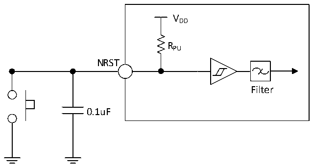

<!-- source-page: 57 -->

[← p.56](0056.md) · [index](../README.md) · [PDF p.57](https://ch32-riscv-ug.github.io/CH32V205/datasheet_en/CH32V205DS0.PDF#page=57) · [p.58 →](0058.md)

> ⚠ 11 subscript glyph(s) on this page appear as `*` because the PDF's text layer maps them to `*` (broken ToUnicode); the printed page shows the real subscripts -- read [the PDF, p.57](https://ch32-riscv-ug.github.io/CH32V205/datasheet_en/CH32V205DS0.PDF#page=57).

<!-- header: CH32V205/V203 Datasheet http://wch-ic.com -->

> ⬆ **Table continued** — rendered in full at [page 56](0056.md). <!-- p57-table-001 -->

<em>Note: 1. In the table above, V* may be represented as VIO or VDD depending on the specific pin.</em>  
<em>2. The USB interface I/O complies only with the parameters specified in MODEx[1:0]=10b.</em>  
<em>3. When functioning as GPIO output pins, PC13, PC14, and PC15 operate at frequencies below 2MHz</em>  
<em>with a maximum load capacitance of 30pF.</em>  

### 3.3.11 NRST Pin Characteristics

Circuit reference design and requirements:  

Figure 3-7 Typical circuit of external reset pin  
 <!-- rendered from the PDF; verify at https://ch32-riscv-ug.github.io/CH32V205/datasheet_en/CH32V205DS0.PDF#page=57 -->

🖼 Text parsed from the figure above

VDD  
RPU  
NRST  
Filter  
0.1uF  

<em>Note: The capacitor shown in the diagram is optional and can be used to filter out key bounce.</em>  

<!-- p57-table-003 (table-3-22@1) pages 57-58 -->
<table><caption>Table 3-22 External reset pin characteristics</caption><tr><th>Symbol</th><th>Parameter</th><th>Condition</th><th>Min.</th><th>Typ.</th><th>Max.</th><th>Unit</th></tr><tr><td style="text-align:left">VIL(NRST)</td><td style="text-align:left">NRST input low-level voltage</td><td></td><td>-0.3</td><td></td><td style="text-align:left">0.32*V -0.16IO</td><td>V</td></tr><tr><td style="text-align:left">VIH(NRST)</td><td style="text-align:left">NRST input high-level voltage</td><td></td><td style="text-align:left">0.41*V +0.53IO</td><td></td><td style="text-align:left">V +0.3IO</td><td>V</td></tr><tr><td style="text-align:left">V hys(NRST)</td><td style="text-align:left">NRST Schmitt Trigger voltage hysteresis</td><td></td><td></td><td>220</td><td></td><td>mV</td></tr><tr><td style="text-align:left">R (1) PU</td><td style="text-align:left">Pull-up equivalent resistance</td><td></td><td>30</td><td>40</td><td>50</td><td>kΩ</td></tr><tr><td style="text-align:left">VF(NRST)</td><td style="text-align:left">NRST input filtered pulse width</td><td></td><td></td><td></td><td>100</td><td>ns</td></tr><tr><td style="text-align:left">VNF(NRST)</td><td style="text-align:left">NRST input not filtered pulse width</td><td></td><td>300</td><td></td><td></td><td>ns</td></tr></table>

<!-- image: p57-draw-image-00001 bbox=[518.4, 783.36, 537.84, 793.92] -->
<!-- footer: V1.3 54 -->
