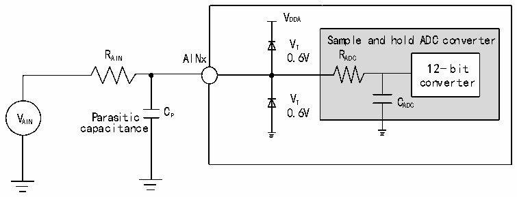
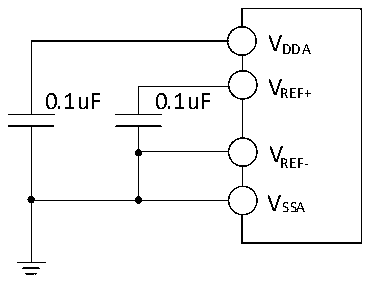

<!-- source-page: 65 -->

[← p.64](0064.md) · [index](../README.md) · [PDF p.65](https://ch32-riscv-ug.github.io/CH32V205/datasheet_en/CH32V205DS0.PDF#page=65) · [p.66 →](0066.md)

<!-- header: CH32V205/V203 Datasheet http://wch-ic.com -->

Figure 3-12 ADC typical connection diagram  
 <!-- rendered from the PDF; verify at https://ch32-riscv-ug.github.io/CH32V205/datasheet_en/CH32V205DS0.PDF#page=65 -->

🖼 Text parsed from the figure above

VDDA  
V Sample and hold ADC converter  
T  
R AIN AINx 0.6V R ADC  
12-bit  
converter  
V Parasitic C P 0 V . T 6V C ADC  
AIN capacitance  

Cp represents the parasitic capacitance on the PCB and the pad (about 5pF), which may be related to the  
quality of the pad and PCB layout. A larger Cp value will reduce the conversion accuracy, the solution is to  
reduce the fADC value.  

Figure 3-13 Analog power supply and decoupling circuit reference  
 <!-- rendered from the PDF; verify at https://ch32-riscv-ug.github.io/CH32V205/datasheet_en/CH32V205DS0.PDF#page=65 -->

🖼 Text parsed from the figure above

VDDA  
V  
0.1uF 0.1uF REF+  
VREF-  
VSSA  

### 3.3.18 Temperature Sensor Characteristics

<!-- p65-table-001 (table-3-31@1) -->
<table><caption>Table 3-31 Temperature sensor characteristics</caption><tr><th>Symbol</th><th>Parameter</th><th>Condition</th><th>Min.</th><th>Typ.</th><th>Max.</th><th>Unit</th></tr><tr><td style="text-align:left">RTS</td><td style="text-align:left">Measurement range of temperature sensor</td><td></td><td>-40</td><td></td><td>85</td><td></td></tr><tr><td style="text-align:left">ATSC</td><td style="text-align:left">Measurement range of temperature sensor after software calibration</td><td></td><td></td><td>±12</td><td></td><td></td></tr><tr><td>Avg_Slope</td><td style="text-align:left">Average slope (negative temperature coefficient)</td><td></td><td>3.8</td><td>4.3</td><td>4.8</td><td>mV/℃</td></tr><tr><td style="text-align:left">V25</td><td>Voltage at 25℃</td><td></td><td>1.35</td><td>1.43</td><td>1.5</td><td>V</td></tr><tr><td style="text-align:left">TS_temp</td><td style="text-align:left">ADC sampling time when reading temperature</td><td style="text-align:left">f = 8MHz ADC</td><td></td><td></td><td>20</td><td>us</td></tr></table>

### 3.3.19 OPA Characteristics

<!-- p65-table-002 (table-3-32-1@1) pages 65-67 -->
<table><caption>Table 3-32-1 OPA characteristics</caption><tr><th>Symbol</th><th>Parameter</th><th>Condition</th><th>Min.</th><th>Typ.</th><th>Max.</th><th>Unit</th></tr><tr><td style="text-align:left">VDDA</td><td>Supply voltage</td><td style="text-align:left">No less than 2V is recommended.</td><td>1.8</td><td>3.3</td><td>3.6</td><td>V</td></tr><tr><td style="text-align:left">VCM</td><td>Common mode input voltage</td><td></td><td>0</td><td></td><td style="text-align:left">VDDA</td><td>V</td></tr><tr><td rowspan="2" style="text-align:left">VIOFFSET</td><td>Input offset voltage (OPA1)</td><td>After calibration</td><td></td><td>±0.2</td><td></td><td>mV</td></tr><tr><td>Input offset voltage (OPA2)</td><td>After calibration</td><td></td><td>±0.9</td><td></td><td>mV</td></tr><tr><td style="text-align:left">ILOAD</td><td>Drive current</td><td style="text-align:left">R = 4kΩLOAD</td><td></td><td></td><td>900</td><td>uA</td></tr><tr><td style="text-align:left">ILOAD_PGA</td><td>PGA mode drive current</td><td></td><td></td><td></td><td>500</td><td>uA</td></tr><tr><td style="text-align:left">IDDOPAMP</td><td>Current consumption</td><td>No load, static mode</td><td></td><td>550</td><td></td><td>uA</td></tr><tr><td>CMRR(1)</td><td>Common mode rejection ratio</td><td>@1kHz</td><td></td><td>115</td><td></td><td>dB</td></tr><tr><td>PSRR(1)</td><td>Power supply rejection ratio</td><td>@1kHz</td><td></td><td>81</td><td></td><td>dB</td></tr><tr><td>Av(1)</td><td>Open loop gain</td><td style="text-align:left">C = 5pFLOAD</td><td></td><td>115</td><td></td><td>dB</td></tr><tr><td style="text-align:left">G (1) BW</td><td>Unit gain bandwidth</td><td style="text-align:left">C = 5pFLOAD</td><td></td><td>14</td><td></td><td>MHz</td></tr><tr><td style="text-align:left">P (1) M</td><td>Phase margin</td><td style="text-align:left">C = 5pFLOAD</td><td></td><td>75</td><td></td><td>°</td></tr><tr><td style="text-align:left">S (1) R</td><td>Slew rate limited</td><td style="text-align:left">C = 5pFLOAD</td><td>10</td><td>12</td><td>14</td><td>V/us</td></tr><tr><td style="text-align:left">t (1) WAKUP</td><td style="text-align:left">Setup time from shutdown to wake up, 0.1%</td><td style="text-align:left">Input V /2, DDA C = 50pF, LOAD R = 4kΩLOAD</td><td></td><td>0.2</td><td></td><td>us</td></tr><tr><td style="text-align:left">RLOAD</td><td>Resistive load</td><td></td><td>4</td><td></td><td></td><td>kΩ</td></tr><tr><td style="text-align:left">CLOAD</td><td>Capacitive load</td><td></td><td></td><td></td><td>50</td><td>pF</td></tr><tr><td rowspan="2" style="text-align:left">V (2) OHSAT</td><td rowspan="2">High saturation output voltage</td><td style="text-align:left">R = 4kΩLOAD</td><td style="text-align:left">V -100DDA</td><td style="text-align:left">V -60DDA</td><td></td><td rowspan="2">mV</td></tr><tr><td style="text-align:left">R = 20kΩLOAD</td><td style="text-align:left">V -100DDA</td><td style="text-align:left">V -60DDA</td><td></td></tr><tr><td rowspan="2" style="text-align:left">V (2) OLSAT</td><td rowspan="2">Low saturation output voltage</td><td style="text-align:left">R = 4kΩLOAD</td><td></td><td>3</td><td>10</td><td rowspan="2">mV</td></tr><tr><td style="text-align:left">R = 20kΩLOAD</td><td></td><td>3</td><td>10</td></tr><tr><td rowspan="5" style="text-align:left">PGAGain(1)</td><td rowspan="5">Internal in-phase PGA</td><td style="text-align:left">Gain = 4, VINP &lt;(V /3) (OPA2) DDA</td><td>-1</td><td></td><td>1</td><td>%</td></tr><tr><td style="text-align:left">Gain = 8, VINP &lt;(V /7) DDA (OPA1&amp;OPA2)</td><td>-1</td><td></td><td>1</td><td>%</td></tr><tr><td style="text-align:left">Gain = 16, VINP &lt;(V /15) DDA (OPA1&amp;OPA2)</td><td>-1</td><td></td><td>1</td><td>%</td></tr><tr><td style="text-align:left">Gain = 32, VINP &lt;(V /31) DDA (OPA1&amp;OPA2)</td><td>-1</td><td></td><td>1</td><td>%</td></tr><tr><td style="text-align:left">Gain = 64, VINP &lt;(V /63) (OPA1) DDA</td><td>-2</td><td></td><td>2</td><td>%</td></tr><tr><td style="text-align:left">VB</td><td style="text-align:left">Recommended DC bias voltage in PGA mode</td><td>PGADIF = 1</td><td>0.2</td><td style="text-align:left">V /2DDA</td><td style="text-align:left">V -0DDA .2</td><td>V</td></tr><tr><td>Delta R</td><td style="text-align:left">Absolute value change of resistance</td><td></td><td>-15</td><td></td><td>15</td><td>%</td></tr><tr><td rowspan="4">eN(1)</td><td rowspan="2" style="text-align:left">Equivalent input noise; Disable chopper</td><td style="text-align:left">R = 4kΩ@1kHz LOAD</td><td></td><td>105</td><td></td><td rowspan="4" style="text-align:left">nV/ sqrt(Hz)</td></tr><tr><td style="text-align:left">R = LOAD20kΩ@1KHz</td><td></td><td>105</td><td></td></tr><tr><td rowspan="2" style="text-align:left">Equivalent input noise; Enable chopper@1MHz</td><td style="text-align:left">R = 4kΩ@1kHz LOAD</td><td></td><td>28</td><td></td></tr><tr><td style="text-align:left">R = LOAD</td><td></td><td>28</td><td></td></tr><tr><td></td><td>(OPA1)</td><td>20kΩ@1KHz</td><td></td><td></td><td></td><td></td></tr></table>

<!-- image: p65-draw-image-00001 bbox=[518.4, 783.36, 537.84, 793.92] -->
<!-- footer: V1.3 62 -->
