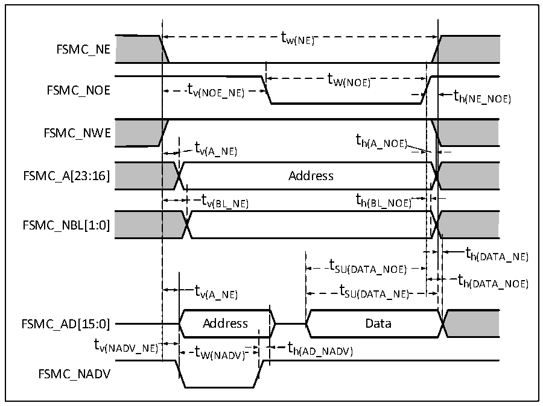

<!-- source-page: 69 -->

[← p.68](0068.md) · [index](../README.md) · [PDF p.69](https://ch32-riscv-ug.github.io/CH32V205/datasheet_en/CH32V205DS0.PDF#page=69) · [p.70 →](0070.md)

<!-- header: CH32V205/V203 Datasheet http://wch-ic.com -->

> ⬆ **Table continued** — rendered in full at [page 68](0068.md). <!-- p69-table-001 -->

<em>Note: 1. Design parameters are guaranteed.</em>  

### 3.3.21 FSMC Characteristics

Figure 3-14 Asynchronous bus multiplexing PSRAM/NOR read operation waveform  
 <!-- rendered from the PDF; verify at https://ch32-riscv-ug.github.io/CH32V205/datasheet_en/CH32V205DS0.PDF#page=69 -->

🖼 Text parsed from the figure above

tw(NE)  
FSMC_NE  
t  
FSMC_NOE t v(NOE_NE) W(NOE) t  
h(NE_NOE)  
FSMC_NWE  
t  
t h(A_NOE)  
v(A_NE)  
FSMC_A[23:16] Address  
t v(BL_NE)  )  t h(BL_NOE)  )  
FSMC_NBL[1:0]  
th(DATA_NE)  
t SU(DATA_NOE)  t SU(DATA_NE)  
t  
v(A_NE) SU(DATA_NE)  
FSMC_AD[15:0] Address Data  
tv(NADV_NE)t th(AD_NADV)  
W(NADV)  
FSMC_NADV  

<!-- p69-table-005 (table-3-34@1) pages 69-70 -->
<table><caption>Table 3-34 Timing of PSRAM/NOR read operation for asynchronous bus multiplexing</caption><tr><th>Symbol</th><th>Parameter</th><th>Min.</th><th>Max.</th><th>Unit</th></tr><tr><td style="text-align:left">t W（NE）</td><td>FSMC_NE low level time</td><td style="text-align:left">7*t HCLK</td><td></td><td rowspan="14">ns</td></tr><tr><td style="text-align:left">t V（NOE_NE）</td><td>FSMC_NE low to FSMC_NOE low</td><td>0</td><td></td></tr><tr><td style="text-align:left">t W（NOE）</td><td>FSMC_NOE low time</td><td style="text-align:left">7*t HCLK</td><td></td></tr><tr><td style="text-align:left">t h（NE_NOE）</td><td style="text-align:left">Retention time from FSMC_NOE high to FSMC_NE high</td><td>0</td><td></td></tr><tr><td style="text-align:left">t V（A_NE）</td><td>FSMC_NE low to FSMC_A active</td><td>0</td><td>5</td></tr><tr><td style="text-align:left">t V（NADV_NE）</td><td>FSMC_NE low to FSMC_NADV low</td><td>0</td><td>5</td></tr><tr><td style="text-align:left">t W（NADV）</td><td>FSMC_NADV low time</td><td style="text-align:left">t HCLK</td><td></td></tr><tr><td style="text-align:left">t h（AD_NADV）</td><td style="text-align:left">Effective retention time of FSMC_AD (address) after FSMC_NADV is high.</td><td style="text-align:left">2*t HCLK</td><td></td></tr><tr><td style="text-align:left">t h（A_NOE）</td><td style="text-align:left">Address retention time after FSMC_NOE is high</td><td>0</td><td></td></tr><tr><td style="text-align:left">t h（BL_NOE）</td><td style="text-align:left">FSMC_BL holding time after FSMC_NOE is high.</td><td>0</td><td></td></tr><tr><td style="text-align:left">t V（BL_NE）</td><td>FSMC_NE low to FSMC_BL active</td><td>0</td><td>5</td></tr><tr><td style="text-align:left">t SU（DATA_NE）</td><td>Setup time from data to FSMC_NE high</td><td style="text-align:left">3*t HCLK</td><td></td></tr><tr><td style="text-align:left">t SU（DATA_NOE）</td><td>Setup time from data to FSMC_NOE high</td><td style="text-align:left">3*t HCLK</td><td></td></tr><tr><td style="text-align:left">t h（DATA_NE）</td><td style="text-align:left">Data retention time after FSMC_NE is high</td><td>0</td><td></td></tr><tr><td style="text-align:left">t h（DATA_NOE）</td><td style="text-align:left">Data retention time after FSMC_NOE is high</td><td>0</td><td></td><td></td></tr></table>

<!-- image: p69-draw-image-00001 bbox=[518.4, 783.36, 537.84, 793.92] -->
<!-- footer: V1.3 66 -->
