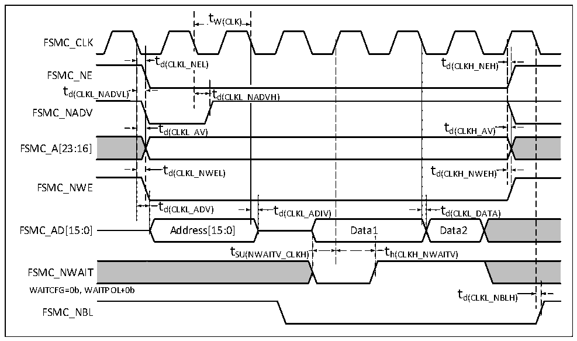

<!-- source-page: 72 -->

[← p.71](0071.md) · [index](../README.md) · [PDF p.72](https://ch32-riscv-ug.github.io/CH32V205/datasheet_en/CH32V205DS0.PDF#page=72) · [p.73 →](0073.md)

<!-- header: CH32V205/V203 Datasheet http://wch-ic.com -->

Figure 3-17 Synchronous bus multiplexing PSRAM write waveform  
 <!-- rendered from the PDF; verify at https://ch32-riscv-ug.github.io/CH32V205/datasheet_en/CH32V205DS0.PDF#page=72 -->

🖼 Text parsed from the figure above

tW(CLK)  
FSMC_CLK  
t  t d(CLKL_N  EL)  
td(CLKL_NEL) td(CLKH_NEH)  
FSMC_NE  
td(CLKL_N  NADVH  H)  td(CLKL_N  NADVH)  t d(CLKH_AV)  t d(CLKL_AV)  t  d(CLKL_AV)  t d(CLKH_NWEH)  t  t d(CLKL_ADIV)  t  t d(CLKL_DATA)  Data1  
FSMC_NADV  
FSMC_A[23:16]  
FSMC_NWE  
t h(CLKH_NWAITV)  
tSU(NWAITV_CLKH) th(CLKH_NWAITV)  
t d(CLKL_NBLH)  )  
FSMC_NWAIT  
WAITCFG=0b, WAITPOL+0b t  
FSMC_NBL  

<!-- p72-table-005 (table-3-37@1) -->
<table><caption>Table 3-37 Timing of NOR/PSRAM read operation for synchronous bus multiplexing</caption><tr><th>Symbol</th><th>Parameter</th><th>Min.</th><th>Max.</th><th>Unit</th></tr><tr><td style="text-align:left">t W（CLK）</td><td>FSMC_CLK cycle</td><td style="text-align:left">2*t HCLK</td><td></td><td rowspan="15">ns</td></tr><tr><td style="text-align:left">t d（CLKL_NEL）</td><td>FSMC_CLK low to FSMC_NE low</td><td>0</td><td>5</td></tr><tr><td style="text-align:left">t d（CLKH_NEH）</td><td>FSMC_CLK high to FSMC_NE high</td><td style="text-align:left">0.5*t HCLK</td><td style="text-align:left">0.5*t HCLK</td></tr><tr><td style="text-align:left">t d（CLKL_NADVL）</td><td>FSMC_CLK low to FSMC_NADV low</td><td>0</td><td>5</td></tr><tr><td style="text-align:left">t d（CLKL_NADVH）</td><td>FSMC_CLK low to FSMC_NADV high</td><td>0</td><td>5</td></tr><tr><td style="text-align:left">t d（CLKL_AV）</td><td style="text-align:left">FSMC_CLK low to FSMC_Ax valid (x = 16…23)</td><td>0</td><td>5</td></tr><tr><td style="text-align:left">t d（CLKH_AIV）</td><td style="text-align:left">FSMC_CLK high to FSMC_Ax invalid (x = 16…23)</td><td>0</td><td>5</td></tr><tr><td style="text-align:left">t d（CLKL_NWEL）</td><td>FSMC_CLK low to FSMC_NWE low</td><td>0</td><td></td></tr><tr><td style="text-align:left">t d（CLKH_NWEH）</td><td>FSMC_CLK high to FSMC_NWE high</td><td>0</td><td></td></tr><tr><td style="text-align:left">t d（CLKL_ADV）</td><td>FSMC_CLK low to FSMC_AD[15:0] valid</td><td>0</td><td>5</td></tr><tr><td style="text-align:left">t d（CLKL_ADIV）</td><td>FSMC_CLK low to FSMC_AD[15:0] invalid</td><td>0</td><td>5</td></tr><tr><td style="text-align:left">t d（CLKL_DATA）</td><td>FSMC_CLK low after FSMC_AD[15:0] valid</td><td>2</td><td></td></tr><tr><td style="text-align:left">t SU （NWAITV_CLKH）</td><td>FSMC_CLK high before FSMC_NWAIT valid</td><td>6</td><td></td></tr><tr><td style="text-align:left">t h （CLKH_NWAITV）</td><td>FSMC_CLK high after FSMC_NWAIT valid</td><td>2</td><td></td></tr><tr><td style="text-align:left">t d（CLKL_NBLH）</td><td>FSMC_CLK low to FSMC_NBL high</td><td>2</td><td></td></tr></table>

Waveform and timing of NAND controller  
Test conditions: NAND operation mode, 16-bit data width selected, ECC calculation circuit enabled,  
512-byte page size. Other timing configurations set via configuration registers: FSMC_PCR2=0x0002005E,  
FSMC_PMEM2=0x01020301, FSMC_PATT2=0x01020301.  
<!-- image: p72-draw-image-00001 bbox=[518.4, 783.36, 537.84, 793.92] -->
<!-- footer: V1.3 69 -->
