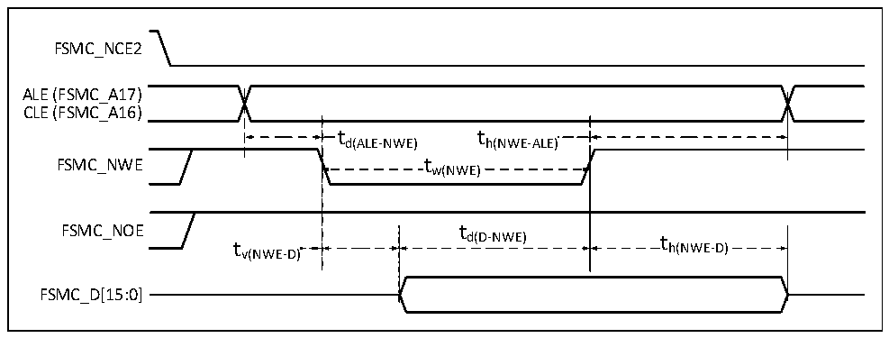

<!-- source-page: 74 -->

[← p.73](0073.md) · [index](../README.md) · [PDF p.74](https://ch32-riscv-ug.github.io/CH32V205/datasheet_en/CH32V205DS0.PDF#page=74) · [p.75 →](0075.md)

<!-- header: CH32V205/V203 Datasheet http://wch-ic.com -->

Figure 3-21 Write operation waveform of NAND controller in general storage space  
 <!-- rendered from the PDF; verify at https://ch32-riscv-ug.github.io/CH32V205/datasheet_en/CH32V205DS0.PDF#page=74 -->

🖼 Text parsed from the figure above

FSMC_NCE2  
ALE (FSMC_A17)  
CLE (FSMC_A16)  
t d(ALE-NWE)  
t h(NWE-ALE)  )  t w(NWE)  
FSMC_NWE tw(NWE)  
FSMC_NOE t  
d(D-NWE) t  
t h(NWE-D)  
v(NWE-D)  
FSMC_D[15:0]  

<!-- p74-table-003 (table-3-38@1) -->
<table><caption>Table 3-38 Timing characteristics of read/write cycle of NAND Flash memory</caption><tr><th>Symbol</th><th>Parameter</th><th>Min.</th><th>Max.</th><th>Unit</th></tr><tr><td style="text-align:left">t d（D-NWE）</td><td style="text-align:left">FSMC_NWE high before FSMC_D[15:0] data is valid</td><td style="text-align:left">4*t HCLK</td><td></td><td rowspan="11">ns</td></tr><tr><td style="text-align:left">t w（NOE）</td><td>FSMC_NOE low time</td><td style="text-align:left">4*t HCLK</td><td></td></tr><tr><td style="text-align:left">t su（D-NOE）</td><td style="text-align:left">FSMC_NOE high before FSMC_D[15:0] data is valid</td><td>20</td><td></td></tr><tr><td style="text-align:left">t h（NOE-D）</td><td style="text-align:left">FSMC_NOE high after FSMC_D[15:0] data is valid</td><td>15</td><td></td></tr><tr><td style="text-align:left">t w（NWE）</td><td>FSMC_NWE low time</td><td style="text-align:left">4*t HCLK</td><td></td></tr><tr><td style="text-align:left">t v（NWE-D）</td><td>FSMC_NWE low to FSMC_D[15:0] data valid</td><td>0</td><td></td></tr><tr><td style="text-align:left">t h（NWE-D）</td><td style="text-align:left">FSMC_NWE high to FSMC_D[15:0] data invalid</td><td style="text-align:left">2*t HCLK</td><td></td></tr><tr><td style="text-align:left">t d（ALE-NWE）</td><td>FSMC_NWE low before FSMC_ALE valid</td><td style="text-align:left">2*t HCLK</td><td></td></tr><tr><td style="text-align:left">t h（NWE-ALE）</td><td>FSMC_NWE high to FSMC_ALE invalid</td><td style="text-align:left">2*t HCLK</td><td></td></tr><tr><td style="text-align:left">t d（ALE-NOE）</td><td>FSMC_NOE low before FSMC_ALE valid</td><td style="text-align:left">2*t HCLK</td><td></td></tr><tr><td style="text-align:left">t h（NOE-ALE）</td><td>FSMC_NOE high to FSMC_ALE invalid</td><td style="text-align:left">4*t HCLK</td><td></td></tr></table>

### 3.3.22 QSPI Characteristics

<!-- p74-table-004 (table-3-39@1) -->
<table><caption>Table 3-39 QSPI characteristics</caption><tr><th>Symbol</th><th>Parameter</th><th>Condition</th><th>Min.</th><th>Max.</th><th>Unit</th></tr><tr><td style="text-align:left">f /t SCK SCK</td><td>QSPI clock frequency</td><td></td><td></td><td>90</td><td>MHz</td></tr><tr><td style="text-align:left">t /t r(SCK) f(SCK)</td><td>QSPI clock rise and fall time</td><td>Load capacitance: C = 30pF</td><td></td><td>8</td><td>ns</td></tr><tr><td style="text-align:left">t /t w(SCKH) w(SCKL)</td><td>SCK high and low time</td><td style="text-align:left">f = 24MHz, pre-division HCLK coefficient = 4</td><td>70</td><td>97</td><td>ns</td></tr><tr><td style="text-align:left">t SU(SIO*)</td><td>Data input setup time</td><td></td><td>15</td><td></td><td>ns</td></tr><tr><td style="text-align:left">t h(SIO*)</td><td>Data input holding time</td><td></td><td>4</td><td></td><td>ns</td></tr><tr><td style="text-align:left">t V(SIO*)</td><td>Data output setup time</td><td></td><td></td><td>5</td><td>ns</td></tr><tr><td style="text-align:left">t h(SIO*)</td><td>Data output holding time</td><td></td><td>0</td><td></td><td>ns</td></tr></table>

<!-- image: p74-draw-image-00001 bbox=[518.4, 783.36, 537.84, 793.92] -->
<!-- footer: V1.3 71 -->
