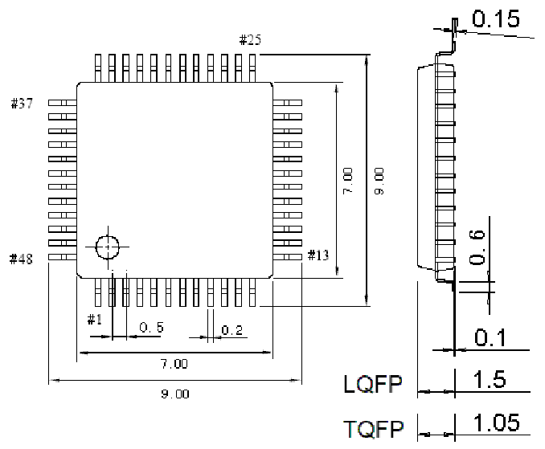
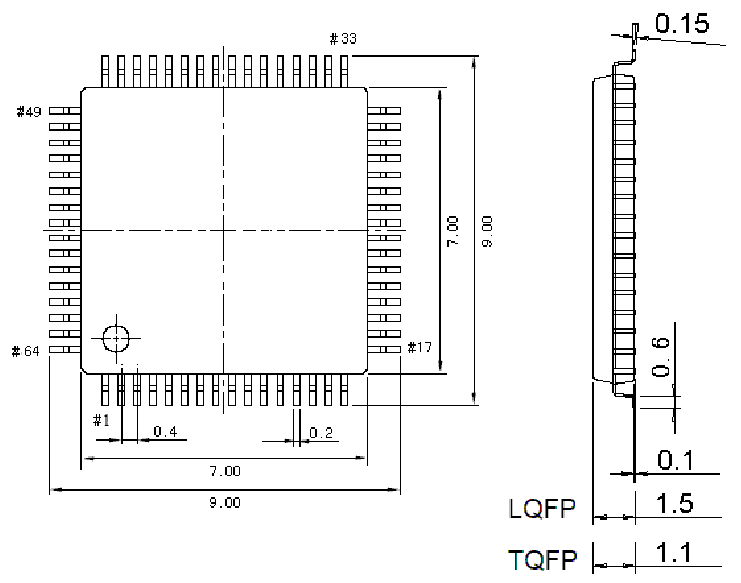

<!-- source-page: 76 -->

[← p.75](0075.md) · [index](../README.md) · [PDF p.76](https://ch32-riscv-ug.github.io/CH32V205/datasheet_en/CH32V205DS0.PDF#page=76) · [p.77 →](0077.md)

<!-- header: CH32V205/V203 Datasheet http://wch-ic.com -->
<em>Note: All dimensions are in millimeters. The pin center spacing values are nominal values, with no error.</em>  
<em>Other than that, the dimensional error is not greater than the greater of ±0.2mm or ±10%.</em>  

## 4.1 LQFP48 Package

 <!-- p76-draw-image-00002 rendered from the PDF -->

## 4.2 LQFP64 Package

 <!-- p76-draw-image-00003 rendered from the PDF -->

<!-- image: p76-draw-image-00001 bbox=[518.4, 783.36, 537.84, 793.92] -->
<!-- footer: V1.3 73 -->
