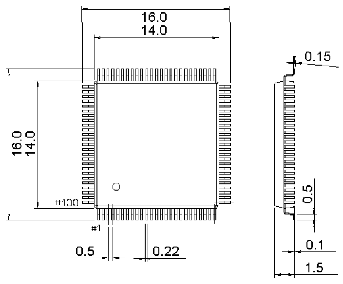

<!-- source-page: 77 -->

[← p.76](0076.md) · [index](../README.md) · [PDF p.77](https://ch32-riscv-ug.github.io/CH32V205/datasheet_en/CH32V205DS0.PDF#page=77) · [p.78 →](0078.md)

<!-- header: CH32V205/V203 Datasheet http://wch-ic.com -->

## 4.3 LQFP100 Package

 <!-- p77-draw-image-00002 rendered from the PDF -->

<!-- image: p77-draw-image-00001 bbox=[518.4, 783.36, 537.84, 793.92] -->
<!-- footer: V1.3 74 -->
