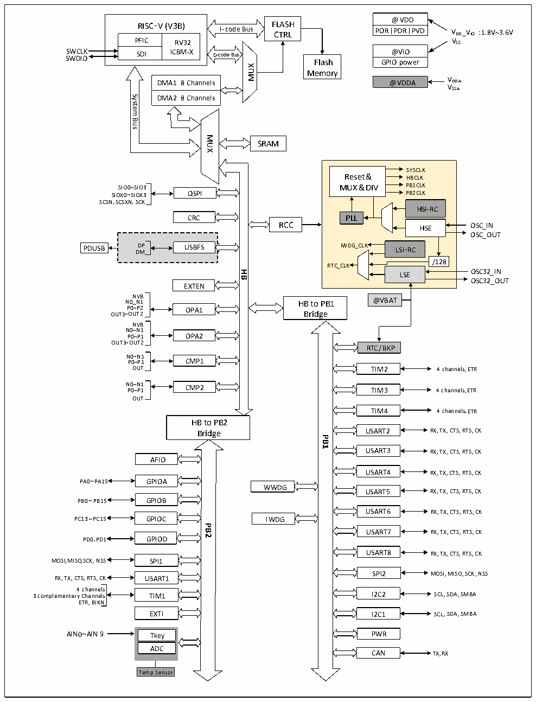

<!-- source-page: 4 -->

[← p.3](0003.md) · [index](../README.md) · [PDF p.4](https://ch32-riscv-ug.github.io/CH32V205/datasheet_zh/CH32V205DS0.PDF#page=4) · [p.5 →](0005.md)

<!-- header: CH32V205、V203数据手册 https://wch.cn -->

图1-1-2 CH32V203系统框图  
 <!-- rendered from the PDF; verify at https://ch32-riscv-ug.github.io/CH32V205/datasheet_zh/CH32V205DS0.PDF#page=4 -->

🖼 Text parsed from the figure above

RISC-V ( V3B)  PFIC  RV32ICBM-X  SDI  SDI  
@VDD  POR  PDR  PVD  
<!-- image: p4-draw-image-00002 inside the figure -->
RISC-V ( V3B) FLASH  
I-code Bus  
: 1.8V~3.6V  
CTRL  
VSS  
@VIO  GPIO power  
SWCLK @VIO SWDIO  
SDI ICBM-XD-codeBus Flash  
MUX  
Memory  
DMA1 8 Channels @VDDA VDDA  
DMA1 8 Channels  DMA2 8 Channels  
VSSA  
System  
Bus  
MUX  
SRAM  
SYSCLK  
Reset &amp; HBCLK  
SIO0~SIO3 MUX &amp; DIV PB1CLK  
SIOX0~SIOX3 QSPI PB2CLK  
, ,  
SCSNSCSXNSCK  
HSI-RC  
PLL  
CRC  
RCC  
HSE OSC_IN  
OSC_OUT  
D  
P IWDG_CLK LSI-RC  
USBFS  
PDUSB  
LSI-RC  LSE  
D  
M  
/128  
RTC_CLK  
LSE OSC32_IN  
<strong>HB</strong>  
OSC32_OUT  
EXTEN  
NVB  
N P 0 0~ ~ N P2 1 OPA1 @VBAT  
HB to PB1  
Bridge  
OUT1~OUT2  
NVB  
N0~N1  
P0~P1 OPA2  
OUT1~OUT2  
RTC/BKP  
N P 0 0 ~ ~ N P1 1 CMP1  
OUT 4 channels,ETR  
TIM2  
N P 0 0 ~ ~ N P 1 1 CMP2 4 channels,ETR  
TIM3  
OUT  
4 channels,ETR  
TIM4  
HB to PB2  
Bridge USART2 RX, TX, CTS, RTS, CK  
<strong>PB1</strong>  
USART3 RX, TX, CTS, RTS, CK  
AFIO  
USART4 RX, TX, CTS, RTS, CK  
PA0 ~ PA15 GPIOA  
WWDG  
USART5 RX, TX, CTS, RTS, CK  
PB0 ~ PB15 GPIOB  
USART6  
RX, TX, CTS, RTS, CK  
PC13 ~ PC15 GPIOC  
IWDG  
<strong>PB2</strong>  
USART7  
RX, TX, CTS, RTS, CK  
PD0、 PD1 GPIOD  
USART8 RX, TX, CTS, RTS, CK  
MOSI,MISO,SCK, NSS SPI1  
SPI2 MOSI,MISO,SCK, NSS  
RX, TX, CTS, RTS, CK USART1  
4 channels  
I2C2 SCL, SDA,SMBA  
3 complementary Channels TIM1  
ETR, BIKN  
EXTI  
I2C1 SCL, SDA,SMBA  
PWR  
AIN0 ~ AIN9 Tkey  
ADC  
CAN TX,RX  
Temp Sensor  

<!-- image: p4-draw-image-00001 bbox=[496.32, 779.28, 515.76, 789.6] -->
<!-- footer: V1.3 2 -->
