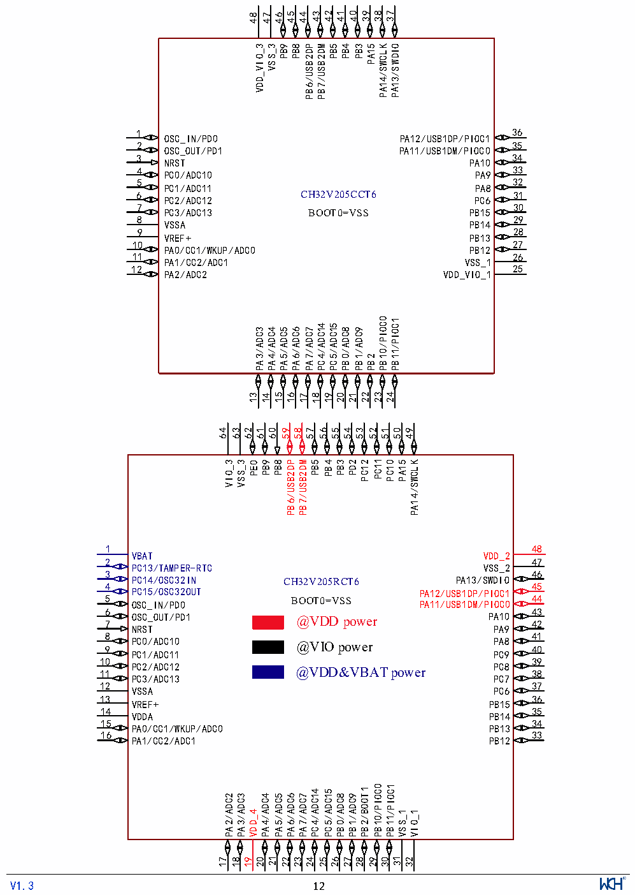

<!-- source-page: 14 -->

[← p.13](0013.md) · [index](../README.md) · [PDF p.14](https://ch32-riscv-ug.github.io/CH32V205/datasheet_zh/CH32V205DS0.PDF#page=14) · [p.15 →](0015.md)

<!-- header: CH32V205、V203数据手册 https://wch.cn -->

# 第 2 章 引脚信息

## 2.1 引脚排列

### 2.1.1 CH32V205引脚排列

 <!-- p14-cluster-01 uncaptioned graphics, rendered from the PDF; verify at https://ch32-riscv-ug.github.io/CH32V205/datasheet_zh/CH32V205DS0.PDF#page=14 -->

🖼 Text parsed from the figure above

37  
42  
41  
40  
39  
38  
43  
45  
44  
48  
46  
47  
VDD_VIO_3  
VSS_3  
PB9  
PB8  
PB6/USB2DP  
PB7/USB2DM  
PB5  
PB4  
PB3  
PA15  
PA14/SWCLK  
PA13/SWDIO  
36  
1  
PA12/USB1DP/PIOC1  
OSC_IN/PD0  
35  
2  
OSC_OUT/PD1  
PA11/USB1DM/PIOC0  
34  
3  
NRST  
PA10  
33  
4  
PC0/ADC10  
PA9  
32  
5  
PC1/ADC11  
PA8  
CH32V205CCT6 31  
6  
PC2/ADC12  
PC6  
30  
7  
PC3/ADC13  
PB15  
BOOT0=VSS  
29  
8  
VSSA  
PB14  
28  
9  
VREF+  
PB13  
27  
10  
PA0/CC1/WKUP/ADC0  
PB12  
11  
26  
PA1/CC2/ADC1  
VSS_1  
25  
12  
PA2/ADC2  
VDD_VIO_1  
/PIOC0 /PIOC1  
PC4/ADC14  
PC5/ADC15  
PA3/ADC3 PA4/ADC4 PA5/ADC5  
PA6/ADC6  
PA7/ADC7  
PB0/ADC8  
PB1/ADC9  
PB10  
PB11  
PB2  
24  
13 14 15  
22  
23  
21  
18  
19  
20  
16  
17  
64  
63  
62 61  
60  
59  
58  
57  
56  
55  
54  
53  
52  
51  
50  
49  
PC11  
VIO_3  
VSS_3  
PB6/USB2DP  
PB7/USB2DM  
PB5  
PB4  
PB3  
PD2  
PC12  
PC10  
PA15  
PA14/SWCLK  
PB9  
PB8  
PE0  
48  
1  
VBAT  
VDD_2  
2  
47  
PC13/TAMPER-RTC  
VSS_2  
3  
46  
PC14/OSC32IN  
PA13/SWDIO  
CH32V205RCT6  
4  
45  
PC15/OSC32OUT  
PA12/USB1DP/PIOC1  
5 OSC_IN/PD0  
44 PA11/USB1DM/PIOC0  
BOOT0=VSS  
6  
43  
PA10  
OSC_OUT/PD1  
@VDD power  
7  
42  
NRST  
PA9  
8  
41  
PC0/ADC10  
PA8  
@VIO power  
9  
40  
PC1/ADC11  
PC9  
10  
39  
PC2/ADC12  
PC8  
@VDD&amp;VBAT power 38  
11  
PC3/ADC13  
PC7  
12  
37  
VSSA  
PC6  
13  
36  
VREF+  
PB15  
14  
35  
VDDA  
PB14  
15  
34  
PA0/CC1/WKUP/ADC0  
PB13  
16  
33  
PA1/CC2/ADC1  
PB12  
/PIOC0 /PIOC1  
PB2/BOOT1  
PC4/ADC14  
PC5/ADC15  
PA2/ADC2  
PA3/ADC3  
PA4/ADC4  
PA5/ADC5  
PA6/ADC6  
PA7/ADC7  
PB0/ADC8  
PB1/ADC9  
VDD_4  
VSS_1  
VIO_1  
PB11  
PB10  
18  19  20  21  22  23  24  25  26  27  28  29  30  31  32  
17  
<!-- image: p14-draw-image-00001 inside the figure -->
<!-- footer: V1.3 12 -->

