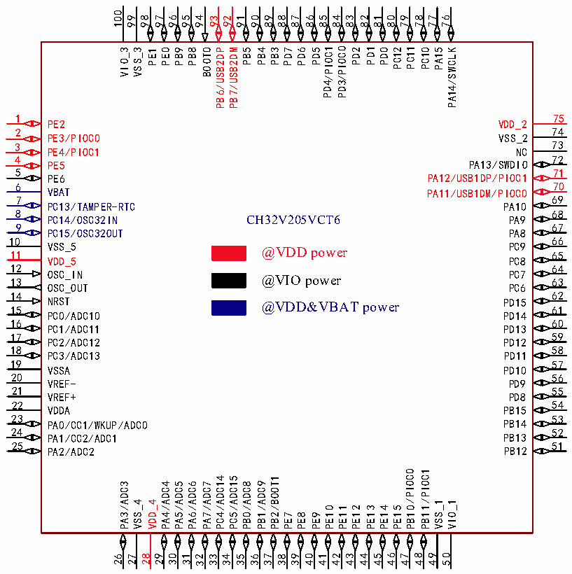
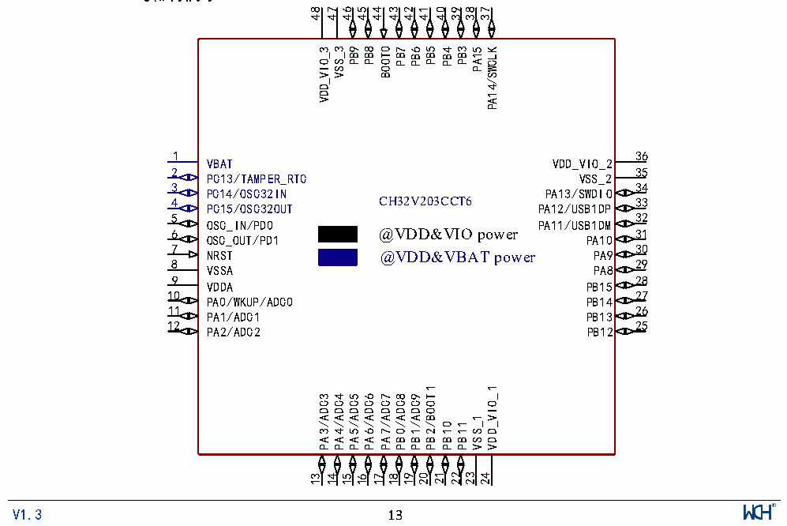

<!-- source-page: 15 -->

[← p.14](0014.md) · [index](../README.md) · [PDF p.15](https://ch32-riscv-ug.github.io/CH32V205/datasheet_zh/CH32V205DS0.PDF#page=15) · [p.16 →](0016.md)

<!-- header: CH32V205、V203数据手册 https://wch.cn -->

 <!-- p15-cluster-01 uncaptioned graphics, rendered from the PDF; verify at https://ch32-riscv-ug.github.io/CH32V205/datasheet_zh/CH32V205DS0.PDF#page=15 -->

🖼 Text parsed from the figure above

100  
99  
98  
97  
96  
95  
94  
91  
90  
89  
88  
87  
86  
85  
84  
83  
82  
81  
80  
79  
78  
77  
76  
93  
92  
PD1  
PC11  
/PIOC1  
/PIOC0  
VIO_3  
VSS_3  
PE0  
PB9  
PB8  
BOOT0  
PB5  
PD0  
PC12  
PC10  
PA15  
PA14/SWCLK  
PB4  
PB3  
PD7  
PD6  
PD5  
PD2  
PB6/USB2DP  
PB7/USB2DM  
PE1  
PD4  
PD3  
1  
75  
VDD_2  
PE2  
74  
2  
PE3/PIOC0  
VSS_2  
73  
3  
PE4/PIOC1  
NC  
4  
72  
PA13/SWDIO  
PE5  
5  
71  
PA12/USB1DP/PIOC1  
PE6  
70  
6  
VBAT  
PA11/USB1DM/PIOC0  
69  
7  
PC13/TAMPER-RTC  
PA10  
8  
68  
CH32V205VCT6  
PC14/OSC32IN  
PA9  
9  
67  
PC15/OSC32OUT  
PA8  
66  
10  
VSS_5  
PC9  
@VDD power 65  
11  
VDD_5  
PC8  
12  
64  
OSC_IN  
PC7  
@VIO power 63  
13  
OSC_OUT  
PC6  
62  
14  
NRST 15  
PD15 61  
@VDD&amp;VBAT power  
PC0/ADC10  
PD14  
60  
16  
PC1/ADC11  
PD13  
59  
17  
PC2/ADC12  
PD12  
18  
58  
PD11  
PC3/ADC13  
19  
57  
VSSA  
PD10  
20  
56  
VREF-  
PD9  
21  
55  
VREF+  
PD8  
54  
22  
PB15  
VDDA  
23  
53  
PB14  
PA0/CC1/WKUP/ADC0  
24  
52  
PB13  
PA1/CC2/ADC1  
25  
51  
PB12  
PA2/ADC2  
/PIOC0 /PIOC1  
PC4/ADC14  
PC5/ADC15  
PB2/BOOT1  
PB1/ADC9  
PB0/ADC8  
PA3/ADC3  
PA4/ADC4  
PA5/ADC5  
PA6/ADC6  
PA7/ADC7  
VSS_4  
VDD_4  
VSS_1  
VIO_1  
PE10  
PE11  
PE12  
PE13  
PE14  
PE15  
PB10  
PB11  
PE7  
PE8  
PE9  
49  
48  
46  
50  
30  
27 28  
31  
29  
37  
39  
40  
41  
42  
43  
44  
45  
47  
26  
32  
35  
36  
38  
33  
34  

### 2.1.2 CH32V203引脚排列

 <!-- p15-cluster-02 uncaptioned graphics, rendered from the PDF; verify at https://ch32-riscv-ug.github.io/CH32V205/datasheet_zh/CH32V205DS0.PDF#page=15 -->

🖼 Text parsed from the figure above

48  
47  
46  
45  
44  
43  
42  
41  
40  
39  
38  
37  
VDD_VIO_3  
VSS_3  
PB9  
PB8  
BOOT0  
PB7  
PB6  
PB5  
PB4  
PB3  
PA15  
PA14/SWCLK  
1  
36  
VBAT  
VDD_VIO_2  
2  
35  
PC13/TAMPER_RTC  
VSS_2  
3  
34  
PC14/OSC32IN  
PA13/SWDIO  
CH32V203CCT6  
4  
33  
PC15/OSC32OUT  
PA12/USB1DP  
32  
5  
OSC_IN/PD0  
PA11/USB1DM  
@VDD&amp;VIO power  
31  
6  
OSC_OUT/PD1  
PA10  
7  
30  
NRST  
PA9  
@VDD&amp;VBAT power  
8  
29  
VSSA  
PA8  
9  
28  
VDDA  
PB15  
10  
27  
PA0/WKUP/ADC0  
PB14  
11  
26  
PA1/ADC1  
PB13  
12  
25  
PA2/ADC2  
PB12  
PB2/BOOT1  
VDD_VIO_1  
PA3/ADC3  
PA4/ADC4  
PA5/ADC5  
PA6/ADC6  
PA7/ADC7  
PB0/ADC8  
PB1/ADC9  
VSS_1  
PB10  
PB11  
21  
23  
22  
19  
20  
24  
13  
14  
15  
17  
18  
16  
<!-- image: p15-draw-image-00001 inside the figure -->
<!-- footer: V1.3 13 -->

