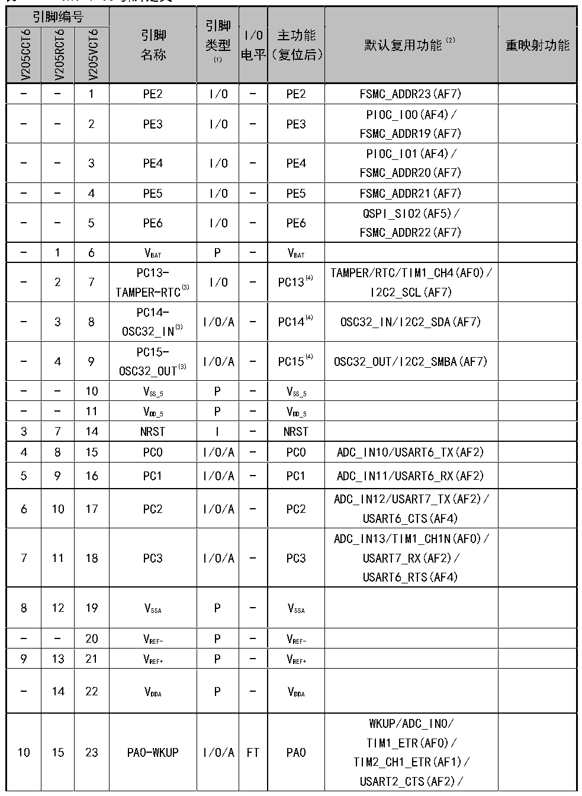

<!-- source-page: 17 -->

[← p.16](0016.md) · [index](../README.md) · [PDF p.17](https://ch32-riscv-ug.github.io/CH32V205/datasheet_zh/CH32V205DS0.PDF#page=17) · [p.18 →](0018.md)

<!-- header: CH32V205、V203数据手册 https://wch.cn -->

## 2.2 引脚描述

注意，下表中的引脚功能描述针对的是所有功能，不涉及具体型号产品。不同型号之间外设资源有差  
异，查看前请先根据产品型号资源表确认是否有此功能。  

 <!-- p17-cluster-01 uncaptioned graphics, rendered from the PDF; verify at https://ch32-riscv-ug.github.io/CH32V205/datasheet_zh/CH32V205DS0.PDF#page=17 -->

🖼 Text parsed from the figure above

<!-- p17-table-001 (table-2-1-1@1) pages 17-24 -->
<table><caption>表2-1-1 CH32V205引脚定义</caption><tr><th colspan="3">引脚编号</th><th rowspan="3">引脚</th><th rowspan="2">引脚</th><th rowspan="7" style="text-align:left">I/O电平</th><th rowspan="3">主功能</th><th rowspan="7" style="text-align:left">默认复用功能（2） ）</th><th rowspan="7">重映射功能</th></tr><tr><td rowspan="6">V205CCT6</td><td rowspan="6">V205RCT6</td><td rowspan="6">V205VCT6</td></tr><tr><td rowspan="2">类型</td></tr><tr><td rowspan="2">名称</td><td rowspan="2">（复位后）</td></tr><tr><td rowspan="2">(1)</td></tr><tr><td rowspan="2"></td><td rowspan="2"></td></tr><tr><td></td></tr><tr><td>-</td><td>-</td><td>1</td><td>PE2</td><td>I/O</td><td>-</td><td>PE2</td><td>FSMC_ADDR23(AF7)</td><td></td></tr><tr><td>-</td><td>-</td><td>2</td><td>PE3</td><td>I/O</td><td>-</td><td>PE3</td><td style="text-align:left">PIOC_IO0(AF4)/ FSMC_ADDR19(AF7)</td><td></td></tr><tr><td>-</td><td>-</td><td>3</td><td>PE4</td><td>I/O</td><td>-</td><td>PE4</td><td style="text-align:left">PIOC_IO1(AF4)/ FSMC_ADDR20(AF7)</td><td></td></tr><tr><td>-</td><td>-</td><td>4</td><td>PE5</td><td>I/O</td><td>-</td><td>PE5</td><td>FSMC_ADDR21(AF7)</td><td></td></tr><tr><td>-</td><td>-</td><td>5</td><td>PE6</td><td>I/O</td><td>-</td><td>PE6</td><td style="text-align:left">QSPI_SIO2(AF5)/ FSMC_ADDR22(AF7)</td><td></td></tr><tr><td>-</td><td>1</td><td>6</td><td style="text-align:left">VBAT</td><td>P</td><td>-</td><td style="text-align:left">VBAT</td><td></td><td></td></tr><tr><td>-</td><td>2</td><td>7</td><td style="text-align:left">PC13- TAMPER-RTC(3)</td><td>I/O</td><td>-</td><td>PC13(4)</td><td style="text-align:left">TAMPER/RTC/TIM1_CH4(AF0)/ I2C2_SCL(AF7)</td><td></td></tr><tr><td>-</td><td>3</td><td>8</td><td style="text-align:left">PC14- OSC32_IN(3)</td><td>I/O/A</td><td>-</td><td>PC14(4)</td><td>OSC32_IN/I2C2_SDA(AF7)</td><td></td></tr><tr><td>-</td><td>4</td><td>9</td><td style="text-align:left">PC15- OSC32_OUT(3)</td><td>I/O/A</td><td>-</td><td>PC15(4)</td><td>OSC32_OUT/I2C2_SMBA(AF7)</td><td></td></tr><tr><td>-</td><td>-</td><td>10</td><td style="text-align:left">VSS_5</td><td>P</td><td>-</td><td style="text-align:left">VSS_5</td><td></td><td></td></tr><tr><td>-</td><td>-</td><td>11</td><td style="text-align:left">VDD_5</td><td>P</td><td>-</td><td style="text-align:left">VDD_5</td><td></td><td></td></tr><tr><td>3</td><td>7</td><td>14</td><td>NRST</td><td>I</td><td>-</td><td>NRST</td><td></td><td></td></tr><tr><td>4</td><td>8</td><td>15</td><td>PC0</td><td>I/O/A</td><td>-</td><td>PC0</td><td>ADC_IN10/USART6_TX(AF2)</td><td></td></tr><tr><td>5</td><td>9</td><td>16</td><td>PC1</td><td>I/O/A</td><td>-</td><td>PC1</td><td>ADC_IN11/USART6_RX(AF2)</td><td></td></tr><tr><td>6</td><td>10</td><td>17</td><td>PC2</td><td>I/O/A</td><td>-</td><td>PC2</td><td style="text-align:left">ADC_IN12/USART7_TX(AF2)/ USART6_CTS(AF4)</td><td></td></tr><tr><td>7</td><td>11</td><td>18</td><td>PC3</td><td>I/O/A</td><td>-</td><td>PC3</td><td style="text-align:left">ADC_IN13/TIM1_CH1N(AF0)/ USART7_RX(AF2)/ USART6_RTS(AF4)</td><td></td></tr><tr><td>8</td><td>12</td><td>19</td><td style="text-align:left">VSSA</td><td>P</td><td>-</td><td style="text-align:left">VSSA</td><td></td><td></td></tr><tr><td>-</td><td>-</td><td>20</td><td style="text-align:left">VREF-</td><td>P</td><td>-</td><td style="text-align:left">VREF-</td><td></td><td></td></tr><tr><td>9</td><td>13</td><td>21</td><td style="text-align:left">VREF+</td><td>P</td><td>-</td><td style="text-align:left">VREF+</td><td></td><td></td></tr><tr><td>-</td><td>14</td><td>22</td><td style="text-align:left">VDDA</td><td>P</td><td>-</td><td style="text-align:left">VDDA</td><td></td><td></td></tr><tr><td>10</td><td>15</td><td>23</td><td>PA0-WKUP</td><td>I/O/A</td><td>FT</td><td>PA0</td><td style="text-align:left">WKUP/ADC_IN0/ TIM1_ETR(AF0)/ TIM2_CH1_ETR(AF1)/ USART2_CTS(AF2)/</td><td></td></tr><tr><td colspan="3">引脚编号</td><td rowspan="3">引脚</td><td rowspan="2">引脚</td><td rowspan="7" style="text-align:left">I/O电平</td><td rowspan="3">主功能</td><td rowspan="7" style="text-align:left">默认复用功能（2） ）</td><td rowspan="7">重映射功能</td></tr><tr><td rowspan="6">V205CCT6</td><td rowspan="6">V205RCT6</td><td rowspan="6">V205VCT6</td></tr><tr><td rowspan="2">类型</td></tr><tr><td rowspan="2">名称</td><td rowspan="2">（复位后）</td></tr><tr><td rowspan="2">(1)</td></tr><tr><td rowspan="2"></td><td rowspan="2"></td></tr><tr><td></td></tr><tr><td></td><td></td><td></td><td></td><td></td><td></td><td></td><td>QSPI_SIO2(AF5)/CC1(AF7)</td><td></td></tr><tr><td>11</td><td>16</td><td>24</td><td>PA1</td><td>I/O/A</td><td>FT</td><td>PA1</td><td style="text-align:left">ADC_IN1/TIM2_CH2(AF1)/ USART2_RTS(AF2)/ QSPI_SIO3(AF5)/CC2(AF7)</td><td></td></tr><tr><td>12</td><td>17</td><td>25</td><td>PA2</td><td>I/O/A</td><td>-</td><td>PA2</td><td style="text-align:left">ADC_IN2/OPA2_OUT2/ CMP1_CHP0/TIM2_CH3(AF1)/ USART2_TX(AF2)/ QSPI_SIO0(AF5)</td><td></td></tr><tr><td>13</td><td>18</td><td>26</td><td>PA3</td><td>I/O/A</td><td>-</td><td>PA3</td><td style="text-align:left">ADC_IN3/OPA1_OUT2/ TIM2_CH4(AF1)/ USART2_RX(AF2)/ QSPI_SIO1(AF5)</td><td></td></tr><tr><td>-</td><td>-</td><td>27</td><td style="text-align:left">VSS_4</td><td>P</td><td>-</td><td style="text-align:left">VSS_4</td><td></td><td></td></tr><tr><td>-</td><td>19</td><td>28</td><td style="text-align:left">VDD_4</td><td>P</td><td>-</td><td style="text-align:left">VDD_4</td><td></td><td></td></tr><tr><td>14</td><td>20</td><td>29</td><td>PA4</td><td>I/O/A</td><td>-</td><td>PA4</td><td style="text-align:left">ADC_IN4/OPA2_OUT1/ USART2_CK(AF2)/ SPI1_NSS(AF5)</td><td></td></tr><tr><td>15</td><td>21</td><td>30</td><td>PA5</td><td>I/O/A</td><td>-</td><td>PA5</td><td style="text-align:left">ADC_IN5/OPA2_CHN1/ USART1_CTS(AF2)/ USART1_CK(AF3)/ USART7_CK(AF4)/ SPI1_SCK(AF5)</td><td></td></tr><tr><td>16</td><td>22</td><td>31</td><td>PA6</td><td>I/O/A</td><td>-</td><td>PA6</td><td style="text-align:left">ADC_IN6/OPA1_CHN1/ TIM1_BK(AF0)/ TIM3_CH1(AF1)/ USART1_TX(AF2)/ USART7_TX(AF3)/ USART7_CTS(AF4)/ SPI1_MISO(AF5)</td><td></td></tr><tr><td>17</td><td>23</td><td>32</td><td>PA7</td><td>I/O/A</td><td>-</td><td>PA7</td><td style="text-align:left">ADC_IN7/OPA2_CHP1/ TIM1_CH1N(AF0)/ TIM3_CH2(AF1)/ USART1_RX(AF2)/ USART7_RX(AF3)/ USART7_RTS(AF4)/ SPI1_MOSI(AF5)</td><td></td></tr><tr><td>18</td><td>24</td><td>33</td><td>PC4</td><td>I/O/A</td><td>-</td><td>PC4</td><td style="text-align:left">ADC_IN14/TIM1_CH2N(AF0)/ USART1_CTS(AF2)/ USART8_TX(AF3)</td><td></td></tr><tr><td>19</td><td>25</td><td>34</td><td>PC5</td><td>I/O/A</td><td>-</td><td>PC5</td><td style="text-align:left">ADC_IN15/TIM1_CH3N(AF0)/ USART1_RTS(AF2)/</td><td></td></tr><tr><td colspan="3">引脚编号</td><td rowspan="3">引脚</td><td rowspan="2">引脚</td><td rowspan="7" style="text-align:left">I/O电平</td><td rowspan="3">主功能</td><td rowspan="7" style="text-align:left">默认复用功能（2） ）</td><td rowspan="7">重映射功能</td></tr><tr><td rowspan="6">V205CCT6</td><td rowspan="6">V205RCT6</td><td rowspan="6">V205VCT6</td></tr><tr><td rowspan="2">类型</td></tr><tr><td rowspan="2">名称</td><td rowspan="2">（复位后）</td></tr><tr><td rowspan="2">(1)</td></tr><tr><td rowspan="2"></td><td rowspan="2"></td></tr><tr><td></td></tr><tr><td></td><td></td><td></td><td></td><td></td><td></td><td></td><td>USART8_RX(AF3)</td><td></td></tr><tr><td>20</td><td>26</td><td>35</td><td>PB0</td><td>I/O/A</td><td>-</td><td>PB0</td><td style="text-align:left">ADC_IN8/OPA1_CHP1/ TIM1_CH2N(AF0)/ TIM3_CH3(AF1)/ USART4_TX(AF2)/ QSPI_SCSN(AF5) USART8_CTS(AF3)/</td><td></td></tr><tr><td>21</td><td>27</td><td>36</td><td>PB1</td><td>I/O/A</td><td>-</td><td>PB1</td><td style="text-align:left">ADC_IN9/USART8_RTS(AF3)/ OPA1_OUT1/TIM1_CH3N(AF0)/ TIM3_CH4(AF1)/ USART4_RX(AF2)/ CMP1_CHN0/QSPI_SCSXN(AF5)</td><td></td></tr><tr><td>-</td><td rowspan="2">28</td><td rowspan="2">37</td><td>BOOT1</td><td>I</td><td>-</td><td>BOOT1</td><td></td><td></td></tr><tr><td>22</td><td>PB2</td><td>I/O/A</td><td>-</td><td>PB2</td><td style="text-align:left">CMP1_CHP1/USART5_TX(AF3)/ QSPI_SCK(AF5)</td><td></td></tr><tr><td>-</td><td>-</td><td>38</td><td>PE7</td><td>I/O</td><td>-</td><td>PE7</td><td style="text-align:left">TIM1_ETR(AF0)/ QSPI_SIOX0(AF5)/ FSMC_D4(AF7)</td><td></td></tr><tr><td>-</td><td>-</td><td>39</td><td>PE8</td><td>I/O</td><td>-</td><td>PE8</td><td style="text-align:left">TIM1_CH1N(AF0)/ USART5_TX(AF2)/ QSPI_SIOX1(AF5)/ FSMC_D5(AF7)</td><td></td></tr><tr><td>-</td><td>-</td><td>40</td><td>PE9</td><td>I/O</td><td>-</td><td>PE9</td><td style="text-align:left">TIM1_CH1(AF0)/ USART5_RX(AF2)/ QSPI_SIOX2(AF5)/ FSMC_D6(AF7)</td><td></td></tr><tr><td>-</td><td>-</td><td>41</td><td>PE10</td><td>I/O</td><td>-</td><td>PE10</td><td style="text-align:left">TIM1_CH2N(AF0)/ USART6_TX(AF2)/ QSPI_SIOX3(AF5)/ FSMC_D7(AF7)</td><td></td></tr><tr><td>-</td><td>-</td><td>42</td><td>PE11</td><td>I/O</td><td>FT</td><td>PE11</td><td style="text-align:left">TIM1_CH2(AF0)/ USART6_RX(AF2)/ FSMC_D8(AF7)</td><td></td></tr><tr><td>-</td><td>-</td><td>43</td><td>PE12</td><td>I/O</td><td>FT</td><td>PE12</td><td style="text-align:left">TIM1_CH3N(AF0)/ USART7_TX(AF2)/ FSMC_D9(AF7)</td><td></td></tr><tr><td>-</td><td>-</td><td>44</td><td>PE13</td><td>I/O</td><td>FT</td><td>PE13</td><td style="text-align:left">TIM1_CH3(AF0)/ USART7_RX(AF2)/ FSMC_D10(AF7)</td><td></td></tr><tr><td>-</td><td>-</td><td>45</td><td>PE14</td><td>I/O</td><td>FT</td><td>PE14</td><td>TIM1_CH4(AF0)/</td><td></td></tr><tr><td colspan="3">引脚编号</td><td rowspan="3">引脚</td><td rowspan="2">引脚</td><td rowspan="7" style="text-align:left">I/O电平</td><td rowspan="3">主功能</td><td rowspan="7" style="text-align:left">默认复用功能（2） ）</td><td rowspan="7">重映射功能</td></tr><tr><td rowspan="6">V205CCT6</td><td rowspan="6">V205RCT6</td><td rowspan="6">V205VCT6</td></tr><tr><td rowspan="2">类型</td></tr><tr><td rowspan="2">名称</td><td rowspan="2">（复位后）</td></tr><tr><td rowspan="2">(1)</td></tr><tr><td rowspan="2"></td><td rowspan="2"></td></tr><tr><td></td></tr><tr><td></td><td></td><td></td><td></td><td></td><td></td><td></td><td style="text-align:left">USART8_TX(AF2)/ FSMC_D11(AF7)</td><td></td></tr><tr><td>-</td><td>-</td><td>46</td><td>PE15</td><td>I/O</td><td>FT</td><td>PE15</td><td style="text-align:left">TIM1_BK(AF0)/ USART8_RX(AF2)/ FSMC_D12(AF7)</td><td></td></tr><tr><td>23</td><td>29</td><td>47</td><td>PB10</td><td>I/O/A</td><td>-</td><td>PB10</td><td style="text-align:left">OPA2_CHN0/TIM2_CH3(AF1)/ USART3_TX(AF2)/ PIOC_IO0(AF4)/ QSPI_SIOX2(AF5)/ I2C2_SCL(AF7)</td><td></td></tr><tr><td>24</td><td>30</td><td>48</td><td>PB11</td><td>I/O/A</td><td>-</td><td>PB11</td><td style="text-align:left">OPA1_CHN0/CMP2_CHN1/ TIM2_CH4(AF1)/ USART3_RX(AF2)/ PIOC_IO1(AF4)/ I2C2_SDA(AF7)/ QSPI_SIOX3(AF5)</td><td></td></tr><tr><td>26</td><td>31</td><td>49</td><td style="text-align:left">VSS_1</td><td>P</td><td>-</td><td style="text-align:left">VSS_1</td><td></td><td></td></tr><tr><td>-</td><td>32</td><td>50</td><td style="text-align:left">VIO_1</td><td>P</td><td>-</td><td style="text-align:left">VIO_1</td><td></td><td></td></tr><tr><td>25</td><td>-</td><td>-</td><td style="text-align:left">V V DD_ IO_1</td><td>P</td><td>-</td><td style="text-align:left">V V DD_ IO_1</td><td></td><td></td></tr><tr><td>27</td><td>33</td><td>51</td><td>PB12</td><td>I/O/A</td><td>-</td><td>PB12</td><td style="text-align:left">OPA1_CHP2/TIM1_BK(AF0)/ CMP1_OUT(AF1)/ USART3_CK(AF2)/ USART4_CTS(AF3)/ SPI2_NSS(AF5)/ I2C2_SMBA(AF7)</td><td></td></tr><tr><td>28</td><td>34</td><td>52</td><td>PB13</td><td>I/O/A</td><td>-</td><td>PB13</td><td style="text-align:left">OPA1_CHNVB/ TIM1_CH1N(AF0)/ USART3_CTS(AF2)/ SPI2_SCK(AF5)</td><td></td></tr><tr><td>29</td><td>35</td><td>53</td><td>PB14</td><td>I/O/A</td><td>-</td><td>PB14</td><td style="text-align:left">OPA2_CHP0/TIM1_CH2N(AF0)/ USART3_RTS(AF2)/ SPI2_MISO(AF5)</td><td></td></tr><tr><td>30</td><td>36</td><td>54</td><td>PB15</td><td>I/O/A</td><td>-</td><td>PB15</td><td style="text-align:left">OPA2_CHNVB/ TIM1_CH3N(AF0)/ USART1_TX(AF2)/ USART4_RTS(AF3)/ USART6_CK(AF4)/ SPI2_MOSI(AF5)</td><td></td></tr><tr><td>-</td><td>-</td><td>55</td><td>PD8</td><td>I/O</td><td>FT</td><td>PD8</td><td style="text-align:left">USART3_TX(AF2)/ FSMC_D13(AF7)</td><td></td></tr><tr><td>-</td><td>-</td><td>56</td><td>PD9</td><td>I/O</td><td>FT</td><td>PD9</td><td>USART3_RX(AF2)/</td><td></td></tr><tr><td colspan="3">引脚编号</td><td rowspan="3">引脚</td><td rowspan="2">引脚</td><td rowspan="7" style="text-align:left">I/O电平</td><td rowspan="3">主功能</td><td rowspan="7" style="text-align:left">默认复用功能（2） ）</td><td rowspan="7">重映射功能</td></tr><tr><td rowspan="6">V205CCT6</td><td rowspan="6">V205RCT6</td><td rowspan="6">V205VCT6</td></tr><tr><td rowspan="2">类型</td></tr><tr><td rowspan="2">名称</td><td rowspan="2">（复位后）</td></tr><tr><td rowspan="2">(1)</td></tr><tr><td rowspan="2"></td><td rowspan="2"></td></tr><tr><td></td></tr><tr><td></td><td></td><td></td><td></td><td></td><td></td><td></td><td>FSMC_D14(AF7)</td><td></td></tr><tr><td>-</td><td>-</td><td>57</td><td>PD10</td><td>I/O</td><td>FT</td><td>PD10</td><td style="text-align:left">USART3_CK(AF2)/ FSMC_D15(AF7)</td><td></td></tr><tr><td>-</td><td>-</td><td>58</td><td>PD11</td><td>I/O</td><td>-</td><td>PD11</td><td style="text-align:left">USART3_CTS(AF2)/ QSPI_SIO0(AF5)/ FSMC_ADDR16(AF7)</td><td></td></tr><tr><td>-</td><td>-</td><td>59</td><td>PD12</td><td>I/O</td><td>-</td><td>PD12</td><td style="text-align:left">TIM4_CH1(AF1)/ USART3_RTS(AF2)/ QSPI_SIO1(AF5)/ FSMC_ADDR17(AF7)</td><td></td></tr><tr><td>-</td><td>-</td><td>60</td><td>PD13</td><td>I/O</td><td>-</td><td>PD13</td><td style="text-align:left">TIM4_CH2(AF1)/ QSPI_SIO3(AF5)/ FSMC_ADDR18(AF7)</td><td></td></tr><tr><td>-</td><td>-</td><td>61</td><td>PD14</td><td>I/O</td><td>FT</td><td>PD14</td><td style="text-align:left">TIM4_CH3(AF1)/ FSMC_D0(AF7)</td><td></td></tr><tr><td>-</td><td>-</td><td>62</td><td>PD15</td><td>I/O</td><td>FT</td><td>PD15</td><td style="text-align:left">TIM4_CH4(AF1)/ FSMC_D1(AF7)</td><td></td></tr><tr><td>31</td><td>37</td><td>63</td><td>PC6</td><td>I/O</td><td>FT</td><td>PC6</td><td style="text-align:left">TIM1_CH1(AF0)/ TIM3_CH1(AF1)/ USART7_TX(AF4)</td><td></td></tr><tr><td>-</td><td>38</td><td>64</td><td>PC7</td><td>I/O</td><td>FT</td><td>PC7</td><td style="text-align:left">TIM1_CH2(AF0)/ TIM3_CH2(AF1)/ USART7_RX(AF4)</td><td></td></tr><tr><td>-</td><td>39</td><td>65</td><td>PC8</td><td>I/O</td><td>FT</td><td>PC8</td><td style="text-align:left">TIM1_CH3(AF0)/ TIM3_CH3(AF1)/ USART5_CK(AF4)</td><td></td></tr><tr><td>-</td><td>40</td><td>66</td><td>PC9</td><td>I/O</td><td>-</td><td>PC9</td><td style="text-align:left">TIM1_CH4(AF0)/ TIM3_CH4(AF1)/ USART8_TX(AF4)/ QSPI_SIO0(AF5)</td><td></td></tr><tr><td>32</td><td>41</td><td>67</td><td>PA8</td><td>I/O/A</td><td>-</td><td>PA8</td><td style="text-align:left">CMP2_CHP1/TIM1_CH1(AF0)/ USART1_CK(AF2)/ USART1_RX(AF3)/MCO(AF6)</td><td></td></tr><tr><td>33</td><td>42</td><td>68</td><td>PA9</td><td>I/O/A</td><td>-</td><td>PA9</td><td style="text-align:left">CMP2_CHN0/TIM1_CH2(AF0)/ USART1_TX(AF2)/ USART1_RTS(AF3)</td><td></td></tr><tr><td>34</td><td>43</td><td>69</td><td>PA10</td><td>I/O</td><td>FT</td><td>PA10</td><td style="text-align:left">TIM1_CH3(AF0)/ USART1_RX(AF2)/ USART1_CK(AF3)</td><td></td></tr><tr><td>35</td><td>44</td><td>70</td><td>PA11</td><td>I/O</td><td>FT</td><td>PA11</td><td>USBFS_DM/TIM1_CH4(AF0)/</td><td></td></tr><tr><td colspan="3">引脚编号</td><td rowspan="3">引脚</td><td rowspan="2">引脚</td><td rowspan="7" style="text-align:left">I/O电平</td><td rowspan="3">主功能</td><td rowspan="7" style="text-align:left">默认复用功能（2） ）</td><td rowspan="7">重映射功能</td></tr><tr><td rowspan="6">V205CCT6</td><td rowspan="6">V205RCT6</td><td rowspan="6">V205VCT6</td></tr><tr><td rowspan="2">类型</td></tr><tr><td rowspan="2">名称</td><td rowspan="2">（复位后）</td></tr><tr><td rowspan="2">(1)</td></tr><tr><td rowspan="2"></td><td rowspan="2"></td></tr><tr><td></td></tr><tr><td></td><td></td><td></td><td></td><td></td><td></td><td></td><td style="text-align:left">USART1_CTS(AF2)/ USART1_TX(AF3)/ PIOC_IO0(AF4)/CAN_RX(AF6)</td><td></td></tr><tr><td>36</td><td>45</td><td>71</td><td>PA12</td><td>I/O</td><td>FT</td><td>PA12</td><td style="text-align:left">USBFS_DP/TIM1_ETR(AF0)/ CMP2_OUT(AF1)/ USART1_RTS(AF2)/ USART6_TX(AF3)/ PIOC_IO1(AF4)/ QSPI_SCK(AF5)/CAN_TX(AF6)</td><td></td></tr><tr><td>37</td><td>46</td><td>72</td><td>PA13</td><td>I/O</td><td>FT</td><td>PA13</td><td style="text-align:left">SWDIO/TIM1_CH1N(AF0)/ TIM2_CH3(AF1)/ USART3_TX(AF2)/ I2C1_SDA(AF7)</td><td></td></tr><tr><td>-</td><td>-</td><td>73</td><td>NC.</td><td>-</td><td>-</td><td>-</td><td></td><td></td></tr><tr><td>-</td><td>47</td><td>74</td><td style="text-align:left">VSS_2</td><td>P</td><td>-</td><td style="text-align:left">VSS_2</td><td></td><td></td></tr><tr><td>-</td><td>48</td><td>75</td><td style="text-align:left">VDD_2</td><td>P</td><td>-</td><td style="text-align:left">VDD_2</td><td></td><td></td></tr><tr><td>38</td><td>49</td><td>76</td><td>PA14</td><td>I/O</td><td>FT</td><td>PA14</td><td style="text-align:left">SWCLK/TIM1_CH2N(AF0)/ TIM2_CH4(AF1)/ USART8_TX(AF2)/ USART3_RX(AF3)/ USART4_TX(AF4)/ I2C1_SCL(AF7)</td><td></td></tr><tr><td>39</td><td>50</td><td>77</td><td>PA15</td><td>I/O</td><td>-</td><td>PA15</td><td style="text-align:left">TIM1_CH3N(AF0)/ TIM2_CH1_ETR(AF1)/ USART8_RX(AF2)/ USART8_CK(AF3)/ USART4_RX(AF4)/ SPI1_NSS(AF5)</td><td></td></tr><tr><td>-</td><td>51</td><td>78</td><td>PC10</td><td>I/O</td><td>-</td><td>PC10</td><td style="text-align:left">TIM1_CH1(AF0)/ USART3_TX(AF2)/ USART4_TX(AF3)/ QSPI_SIO1(AF5)</td><td></td></tr><tr><td>-</td><td>52</td><td>79</td><td>PC11</td><td>I/O</td><td>-</td><td>PC11</td><td style="text-align:left">TIM1_CH2(AF0)/ USART3_RX(AF2)/ USART4_RX(AF3)/ QSPI_SCSXN(AF5)</td><td></td></tr><tr><td>-</td><td>53</td><td>80</td><td>PC12</td><td>I/O</td><td>FT</td><td>PC12</td><td style="text-align:left">TIM1_CH3(AF0)/ USART3_CK(AF2)/ USART5_TX(AF3)/ USART8_RX(AF4)</td><td></td></tr><tr><td>1</td><td>5</td><td>12</td><td>OSC_IN</td><td>I/A</td><td>-</td><td>OSC_IN</td><td></td><td>PD0（6）</td></tr><tr><td colspan="3">引脚编号</td><td rowspan="3">引脚</td><td rowspan="2">引脚</td><td rowspan="7" style="text-align:left">I/O电平</td><td rowspan="3">主功能</td><td rowspan="7" style="text-align:left">默认复用功能（2） ）</td><td rowspan="7">重映射功能</td></tr><tr><td rowspan="6">V205CCT6</td><td rowspan="6">V205RCT6</td><td rowspan="6">V205VCT6</td></tr><tr><td rowspan="2">类型</td></tr><tr><td rowspan="2">名称</td><td rowspan="2">（复位后）</td></tr><tr><td rowspan="2">(1)</td></tr><tr><td rowspan="2"></td><td rowspan="2"></td></tr><tr><td></td></tr><tr><td></td><td></td><td>81</td><td>PD0(6)(7)</td><td>I/O</td><td>FT</td><td>PD0</td><td style="text-align:left">USART4_CK(AF3)/ CAN_RX(AF6)/ FSMC_D2(AF7)</td><td></td></tr><tr><td rowspan="2">2</td><td rowspan="2">6</td><td>13</td><td>OSC_OUT</td><td>O/A</td><td>-</td><td>OSC_OUT</td><td></td><td>PD1（6）</td></tr><tr><td>82</td><td>PD1(6)</td><td>I/O</td><td>FT</td><td>PD1</td><td style="text-align:left">USART8_CK(AF3)/ CAN_TX(AF6)/ FSMC_D3(AF7)</td><td></td></tr><tr><td>-</td><td>54</td><td>83</td><td>PD2</td><td>I/O</td><td>FT</td><td>PD2</td><td style="text-align:left">TIM3_ETR(AF1)/ USART5_RX(AF3)/ USART4_CK(AF4)/ FSMC_NADV(AF7)</td><td></td></tr><tr><td>-</td><td>-</td><td>84</td><td>PD3</td><td>I/O</td><td>FT</td><td>PD3</td><td style="text-align:left">USART2_CTS(AF2)/ USART6_CK(AF3)/ PIOC_IO0(AF4)/ FSMC_CLK(AF7)</td><td></td></tr><tr><td>-</td><td>-</td><td>85</td><td>PD4</td><td>I/O</td><td>FT</td><td>PD4</td><td style="text-align:left">USART2_RTS(AF2)/ USART7_CK(AF3)/ PIOC_IO1(AF4)/ FSMC_NOE(AF7)</td><td></td></tr><tr><td>-</td><td>-</td><td>86</td><td>PD5</td><td>I/O</td><td>FT</td><td>PD5</td><td style="text-align:left">USART2_TX(AF2)/ FSMC_NWE(AF7)</td><td></td></tr><tr><td>-</td><td>-</td><td>87</td><td>PD6</td><td>I/O</td><td>FT</td><td>PD6</td><td style="text-align:left">USART2_RX(AF2)/ FSMC_NWAIT(AF7)</td><td></td></tr><tr><td>-</td><td>-</td><td>88</td><td>PD7</td><td>I/O</td><td>FT</td><td>PD7</td><td style="text-align:left">USART2_CK(AF2)/ FSMC_NE1_NCE2(AF7)</td><td></td></tr><tr><td>40</td><td>55</td><td>89</td><td>PB3</td><td>I/O/A</td><td>-</td><td>PB3</td><td style="text-align:left">CMP1_CHN1/TIM2_CH2(AF1)/ USART5_RX(AF3)/ SPI1_SCK(AF5)</td><td></td></tr><tr><td>41</td><td>56</td><td>90</td><td>PB4</td><td>I/O</td><td>-</td><td>PB4</td><td style="text-align:left">TIM3_CH1(AF1)/ USART5_TX(AF2)/ USART5_CTS(AF3)/ SPI1_MISO(AF5)/ USART1_RTS(AF4)</td><td></td></tr><tr><td>42</td><td>57</td><td>91</td><td>PB5</td><td>I/O/A</td><td>-</td><td>PB5</td><td style="text-align:left">OPA1_CHP0/TIM3_CH2(AF1)/ USART5_RX(AF2)/ USART5_RTS(AF3)/ USART1_CTS(AF4)/ I2C1_SMBA(AF7)/ SPI1_MOSI(AF5)</td><td></td></tr><tr><td>44</td><td>59</td><td>93</td><td>PB6</td><td>I/O</td><td>-</td><td>PB6</td><td style="text-align:left">USBHS_DP/TIM1_CH1(AF0)/ TIM4_CH1(AF1)/</td><td></td></tr><tr><td colspan="3">引脚编号</td><td rowspan="3">引脚</td><td rowspan="2">引脚</td><td rowspan="7" style="text-align:left">I/O电平</td><td rowspan="7" style="text-align:left">主功能 （复位后）</td><td rowspan="7" style="text-align:left">默认复用功能（2） ）</td><td rowspan="7">重映射功能</td></tr><tr><td rowspan="6">V205CCT6</td><td rowspan="6">V205RCT6</td><td rowspan="6">V205VCT6</td></tr><tr><td rowspan="2">类型</td></tr><tr><td rowspan="2">名称</td></tr><tr><td rowspan="2">(1)</td></tr><tr><td rowspan="2"></td></tr><tr><td></td></tr><tr><td></td><td></td><td></td><td></td><td></td><td></td><td></td><td style="text-align:left">USART1_TX(AF2)/ QSPI_SCSN(AF5)/ I2C1_SCL(AF7)</td><td></td></tr><tr><td>43</td><td>58</td><td>92</td><td>PB7</td><td>I/O</td><td>-</td><td>PB7</td><td style="text-align:left">USBHS_DM/TIM1_CH2(AF0)/ TIM4_CH2(AF1)/ USART1_RX(AF2)/ FSMC_NADV(AF6)/ I2C1_SDA(AF7)</td><td></td></tr><tr><td>-</td><td>-</td><td>94</td><td>BOOT0(5)</td><td>I</td><td>-</td><td>BOOT0</td><td></td><td></td></tr><tr><td>45</td><td>60</td><td>95</td><td>PB8</td><td>I/O/A</td><td>-</td><td>PB8</td><td style="text-align:left">CMP2_CHP0/TIM1_CH3(AF0)/ TIM4_CH3(AF1)/ USART6_TX(AF2)/ USART4_RTS(AF3)/ CAN_RX(AF6)/ USART6_RTS(AF4)/ I2C1_SCL(AF7)/ QSPI_SIOX0(AF5)</td><td></td></tr><tr><td>46</td><td>61</td><td>96</td><td>PB9</td><td>I/O</td><td>-</td><td>PB9</td><td style="text-align:left">TIM1_BK(AF0)/ TIM4_CH4(AF1)/ USART6_RX(AF2)/ USART4_CTS(AF3)/ USART6_CTS(AF4)/ CAN_TX(AF6)/ QSPI_SIOX1(AF5)/ I2C1_SDA(AF7)</td><td></td></tr><tr><td>-</td><td>62</td><td>97</td><td>PE0</td><td>I/O</td><td>FT</td><td>PE0</td><td style="text-align:left">TIM4_ETR(AF1)/ USART4_TX(AF2)/ USART5_CK(AF3)/ FSMC_NBL0(AF7)</td><td></td></tr><tr><td>-</td><td>-</td><td>98</td><td>PE1</td><td>I/O</td><td>FT</td><td>PE1</td><td style="text-align:left">USART4_RX(AF2)/ FSMC_NBL1(AF7)</td><td></td></tr><tr><td>47</td><td>63</td><td>99</td><td style="text-align:left">VSS_3</td><td>P</td><td>-</td><td style="text-align:left">VSS_3</td><td></td><td></td></tr><tr><td>-</td><td>64</td><td>100</td><td style="text-align:left">VIO_3</td><td>P</td><td>-</td><td style="text-align:left">VIO_3</td><td></td><td></td></tr><tr><td>48</td><td>-</td><td>-</td><td style="text-align:left">V V DD_ IO_3</td><td>P</td><td>-</td><td style="text-align:left">V V DD_ IO_3</td><td></td><td></td></tr></table>

1 6 VBAT P - VBAT  

<!-- image: p17-draw-image-00001 bbox=[502.92, 779.28, 522.36, 789.6] -->
<!-- footer: V1.3 15 -->
