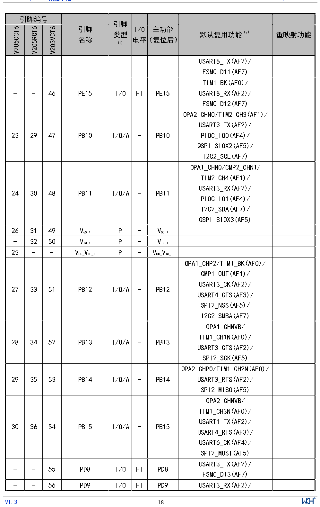

<!-- source-page: 20 -->

[← p.19](0019.md) · [index](../README.md) · [PDF p.20](https://ch32-riscv-ug.github.io/CH32V205/datasheet_zh/CH32V205DS0.PDF#page=20) · [p.21 →](0021.md)

<!-- header: CH32V205、V203数据手册 https://wch.cn -->

 <!-- p20-cluster-01 uncaptioned graphics, rendered from the PDF; verify at https://ch32-riscv-ug.github.io/CH32V205/datasheet_zh/CH32V205DS0.PDF#page=20 -->

🖼 Text parsed from the figure above

> ⬆ **Table continued** — rendered in full at [page 17](0017.md). <!-- p20-table-001 -->

<!-- image: p20-draw-image-00001 inside the figure -->
<!-- footer: V1.3 18 -->

